# Nova command


# MỤC LỤC
- [Nova command](#)
	- [1.nova command](#1)
		- [1.1.Nova flavor](#1.1)
		- [1.2.Nova keypair](#1.2)
		- [1.3.Nova security group](#1.3)
		- [1.4.Nova instance](#1.4)
		- [1.5.Nova interface](#1.5)
	- [2.openstack-client command](#2)
		- [2.1.Nova flavor](#2.1)
		- [2.2.Nova keypair](#2.2)
		- [2.3.Nova security group](#2.3)
		- [2.4.Nova instance](#2.4)
	- [3.Sử dụng Nova API](#3)


<a name="1"></a>
## 1.nova command
\- Để sử dụng lệnh nova, ta phải cài đặt gói python-novaclient  
\- Tham khảo: https://docs.openstack.org/cli-reference/nova.html  
\- Mapping giữa nova command và openstack command: https://docs.openstack.org/python-openstackclient/latest/cli/decoder.html  
<a name="1.1"></a>
### 1.1.Nova flavor
\- List flavor  
```
nova flavor-list
# or
nova flavor-list --all
```

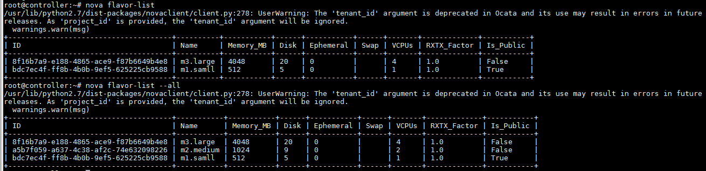

\- Create flavor
- Cú pháp:  
```
usage: nova flavor-create [--ephemeral <ephemeral>] [--swap <swap>]
                          [--rxtx-factor <factor>] [--is-public <is-public>]
                          <name> <id> <ram> <disk> <vcpus>
```

- Ví dụ:  
```
nova flavor-create m4.max 12 8096 40 4
```

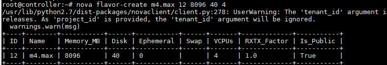

\- Delete flavor:  
```
nova flavor-delete m4.max
```

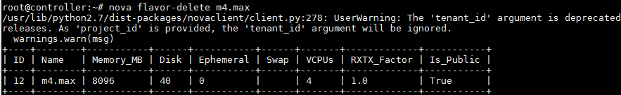

\- Show thông tin flavor:  
```
nova flavor-show m2.medium
```

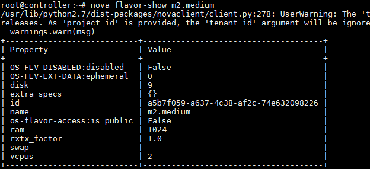

\- List access flavor  
```
nova flavor-access-list --flavor m3.large
```

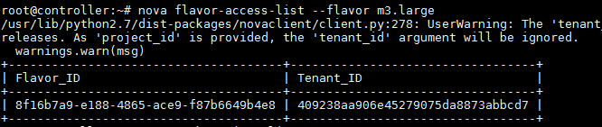

\- Add access flavor  
```
nova flavor-access-add m3.large demo
```

\- Delete access flavor  
```
nova flavor-access-remove m3.large demo
```

<a name="1.2"></a>
### 1.2.Nova keypair
\- List keypair  
- Cú pháp:  
```
nova keypair-list [--user <user-id>] [--marker <marker>]
                         [--limit <limit>]
```

- Ví dụ:  
```
nova keypair-list
```

\- Show keypair  
- Cú pháp:  
```
nova keypair-show [--user <user-id>] <keypair>
```

- Ví dụ:  
```
nova keypair-show key-test
```

\- Add keypair  
- Cú pháp:  
```
nova keypair-add [--pub-key <pub-key>] [--key-type <key-type>]
                        [--user <user-id>]
                        <name>
```

- Ví dụ:  
```
nova keypair-add --key-type ssh key-test
```

\- Delete keypair  
Cú pháp:  
```
nova keypair-delete [--user <user-id>] <name>
```

<a name="1.3"></a>
### 1.3.Nova security group
\- List security group  
```
nova list-secgroup ubuntu-test
```

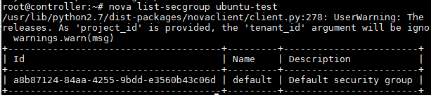

\- Add security group  
- Cú pháp  
```
nova add-secgroup <server> <secgroup>
```

- Ví dụ:  
```
nova add-secgroup ubuntu-test default
```

\- Remove security group  
Cú pháp:  
```
nova remove-secgroup ubuntu-test default
```

<a name="1.4"></a>
### 1.4.Nova instance
\- List instamce  
```
nova list
```

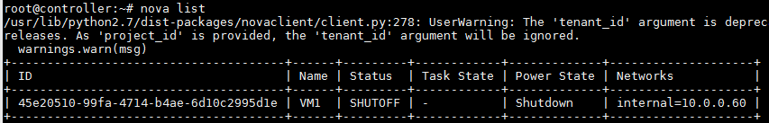

\- Show thoon tin instance  
```
nova show VM1
```

\- Thay đổi thông tin instance  
```
nova update [--name <name>] [--description <description>] <server>
```

\- Console instance  
```
nova get-vnc-console ubuntu-test novnc
```

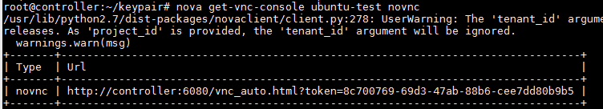

\- Boot instance  
- Boot từ image:  
```
nova boot --flavor m2.medium --image ubuntu-16.04 --nic net-name=internal --security-groups default --key-name key-test ubuntu-test
```

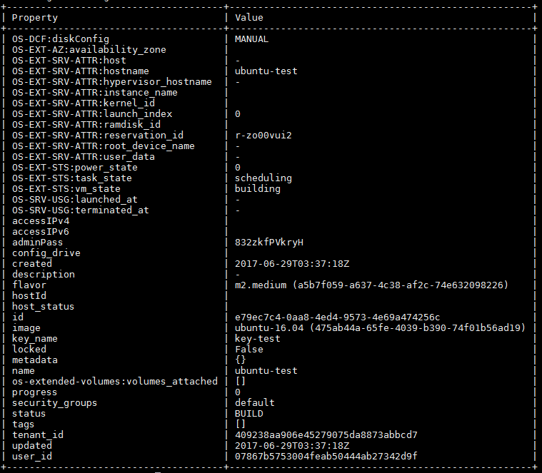

- Boot từ volume:  
```
nova boot --flavor m2.medium --boot-volume <volume_id> --nic net-name=internal --security-groups default --key-name key-test ubuntu-test
```

- Attach volume đến instance:  
```
nova volume-attach <server-name_or_server-id> <volume-id> [<device>]
```

- Detach volume khỏi instance:  
```
nova volume-detach <server-name_or_server-id> <volume-id>
```


\- Delete instance  
```
nova delete ubuntu-test
```

\- Start instance  
```
nova start ubuntu-test
```

\- Stop instance (Shuftoff)  
```
nova stop ubuntu-test
```

\- Suspend instance  
```
nova suspend ubuntu-test
```

\- Resume instance  
```
nova resume ubuntu-test
```

\- Reboot instance  
Cú pháp:  
```
nova reboot [--hard] [--poll] <server> [<server> ...]\
```

\- Resize instance  
Cú pháp:  
```
nova resize [--poll] <server> <flavor>
```

\- Tạo bản snapshot  
Cú pháp:  
```
nova image-create [--metadata <key=value>] [--show] [--poll]
                         <server> <name>
```

<a name="1.5"></a>
### 1.5.Nova interface
\- List interface  
Cú pháp:  
```
nova interface-list <server>
```

\- Attach interface  
Cú pháp:  
```
nova interface-attach [--port-id <port_id>] [--net-id <net_id>]
                             [--fixed-ip <fixed_ip>]
                             <server>
```

\- Detach interface  
Cú pháp:  
```
nova interface-detach <server> <port_id>
```

<a name="2"></a>
## 2.openstack-client command
\- Tham khảo:  
https://docs.openstack.org/python-openstackclient/latest/cli/command-list.html  
\- Mapping giữa nova command và openstack command: https://docs.openstack.org/python-openstackclient/latest/cli/decoder.html  

<a name="2.1"></a>
### 2.1.Nova flavor
\- List flavor  
```
openstack flavor list
# or
openstack flavor list --all
```

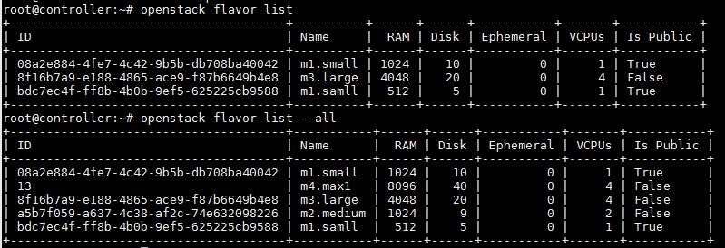

\- Create flavor  
- Cú pháp:  
```
openstack flavor create
    [--id <id>]
    [--ram <size-mb>]
    [--disk <size-gb>]
    [--ephemeral-disk <size-gb>]
    [--swap <size-mb>]
    [--vcpus <num-cpu>]
    [--rxtx-factor <factor>]
    [--public | --private]
    [--property <key=value> [...] ]
    [--project <project>]
    [--project-domain <project-domain>]
    <flavor-name>
```

- Ví dụ:  
```
openstack flavor create --ram 1024 --disk 1 --vcpus 2 m5.test
```

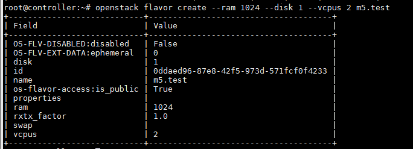

\- Delete flavor:  
```
openstack flavor delete m5.test
```

\- Show thông tin flavor:  
```
openstack flavor show m5.test
```

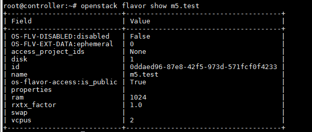

<a name="2.2"></a>
### 2.2.Nova keypair
\- List keypair  
```
openstack keypair list
```

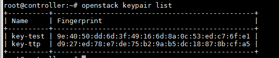

\- Show keypair  
```
openstack keypair show key-test
```

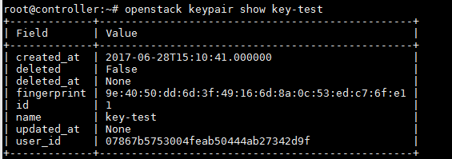

\- Add keypair  
- Cú pháp:  
```
openstack keypair create
    [--public-key <file> | --private-key <file>]
    <name>
```

- Ví dụ:  
```
openstack keypair create key-test
```

\- Delete keypair  
Cú pháp:  
```
openstack keypair delete key-test
```

<a name="2.3"></a>
### 2.3.Nova security group
\- List security group  
```
openstack security group list
```

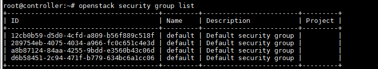

\- Add security group  
- Cú pháp  
```
openstack server add security group
    <server>
    <group>
```

- Ví dụ:  
```
openstack server add security group ubuntu-test default
```

\- Remove security group  
Cú pháp:  
```
openstack server remove security group ubuntu-test default
```

<a name="2.4"></a>
### 2.4.Nova instance
\- List instamce  
```
openstack server list
```

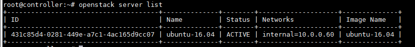

\- Show thông tin instance  
```
openstack server show ubuntu-16.04
```

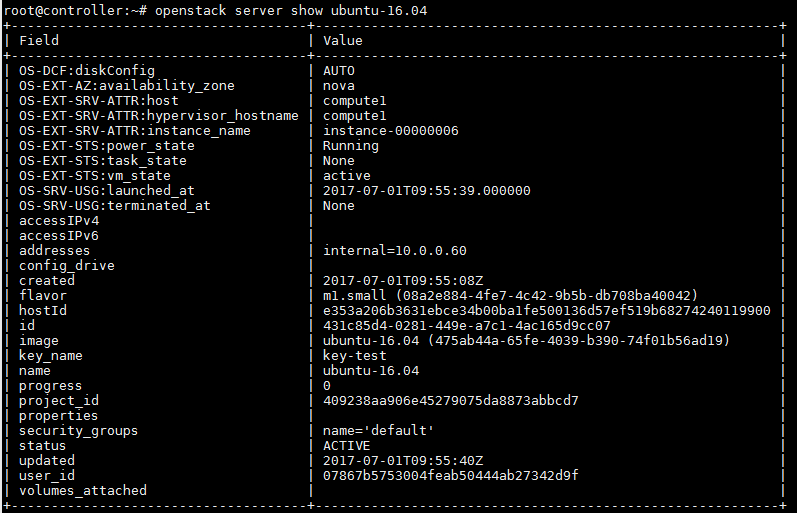

\- Thay đổi thông tin instance  
```
openstack server set
    --name <new-name>
    --property <key=value>
    [--property <key=value>] ...
    --root-password
    --state <state>
    <server>
```

\- Console instance  
```
openstack console url show --novnc ubuntu-16.04
```

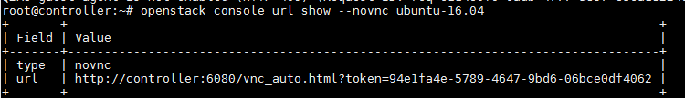

\- Boot instance  
- Boot từ image:  
```
openstack server create --image cirros --flavor m1.samll --nic net-id=10a233d8-bb3e-4ead-a6ae-04efc336ec09 --security-group default --key-name key-test ubuntu-test
```

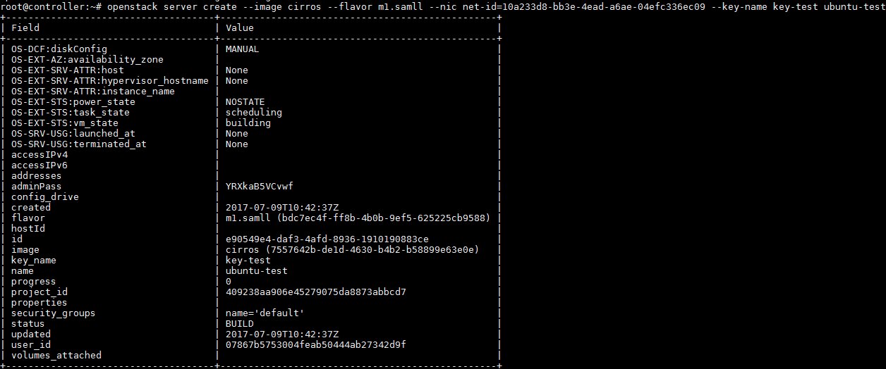

- Boot từ volume:  
```
openstack server create --volume <volume> --flavor m1.samll --nic net-id=10a233d8-bb3e-4ead-a6ae-04efc336ec09 --security-group default --key-name key-test ubuntu-test
```

- Attach volume đến instance:  
```
openstack server add volume [-h] [--device <device>] <server> <volume>
```

- Dettach volume đến instance:  
```
openstack server remove volume <server> <volume>
```

\- Delete instance  
```
openstack server delete ubuntu-test
```

\- Start instance  
```
openstack server start ubuntu-test
```

\- Stop instance (Shuftoff)  
```
openstack server stop ubuntu-test
```

\- Suspend instance  
```
openstack server suspend ubuntu-test
```

\- Resume instance  
```
openstack server resume ubuntu-test
```

\- Reboot instance  
Cú pháp:  
```
openstack server reboot
    [--hard | --soft]
    [--wait]
    <server>
```

\- Resize instance  
Cú pháp:  
```
openstack server resize
    --flavor <flavor>
    [--wait]
    <server>
```

\- Tạo bản snapshot  
Cú pháp:  
```
openstack server image create
    [--name <image-name>]
    [--wait]
    <server>
```

<a name="3"></a>
## 3.Sử dụng Nova API
\- Tham khảo: https://developer.openstack.org/api-ref/compute/?expanded=list-servers-detail  


