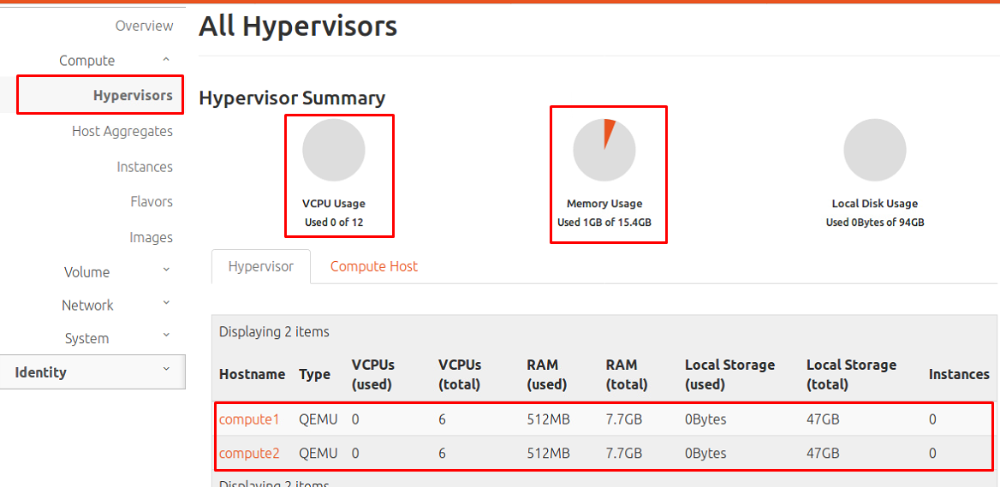

# Overcommit

# MỤC LỤC


<a name="1"></a>
# 1.Khái niệm
\- Overcommit được hiểu là việc mapping CPU, RAM, DISK lên vài lần hoặc vài chục lần.  
\- OpenStack cho phép bạn overcommit CPU và RAM trên node compute. Điều này cho phép tăng số instance chạy trên cloud của bạn.  
\- Ví dụ:  
- CPU allocation ratio: 16:1
- RAM allocation ratio: 1.5:1

\- CPU allocation ratio: 16:1 có nghĩa là scheduler phân bổ đến 16 virtual cores trên mỗi physical core.  
Và tổng số CPU gắn với instances nhỏ hơn 16 lần tổng số CPU trên physical node.  
VD: nếu mỗi physical node có 12 cores, scheduler nhìn thấy tồn tại 192 virtual cores.. Với loại flavor định nghĩa 4 virtual cores cho mỗi instance, ratio sẽ cung cấp được 48 instance trên mỗi physical node.  
\- Công thức tính số lượng các ví dụ ảo trên compute node là (OR*PC)/VC, ở đây:  
- OR: CPU overcommit ratio (virtual cores tương ứng với mỗi physical core)
- PC: Số physical cores.
- VC: Số virtual cores mỗi instance.

\- Tương tự, default RAM chỉ định ratio là 1,5:1 nghĩa là scheduler phần bổ 1.5GB virtual ram trên mỗi 1GB physical ram. Và tổng lượng RAM gắn với instances nhỏ hơn 1.5 lần tổng số RAM trên physical node.  
VD: Nếu physical node có 48GB RAM, scheduler phân bổ RAM đến instance cho đến khi tổng RAM gắn trên instances đạt 72GB (nếu có 9 instance thì mỗi instance có 8GB RAM).  
\- Bạn phải chỉ định chỉ số ratio của CPU và RAM thích hợp cho trường hợp cụ thể của bạn.  
\- OpenStack cho phép bạn overcommit DISK trên node compute.  

>Chú ý: Không phụ thuộc  vào overcommit ratio, instance không thể được đặt trên bất kỳ node physical với tài nguyên raw ít hơn flavor của instace yêu cầu.

<a name="1"></a>
# 2.Mặc định ratio của OpenStack
\- Ở phiên bản Ocata và Pike, mặc định chỉ số ratio của CPU là 16, của RAM là 1.5, của DISK là 1.0.  

<a name="1"></a>
# 3.Cấu hình
\- Cấu hình chỉ số ratio cho CPU và RAM ở file `/etc/nova/nova.conf` trên node Controller.  
VD:  
```
[DEFAULT]
cpu_allocation_ratio = 0.0
ram_allocation_ratio = 0.0
disk_allocation_ratio = 0.0
```

Nếu thiết lập ratio của cpu, ram. disk là `0.0` thì chính là chỉ số ratio mặc định: 16 , 1.5 và 1.0.  

\- Sau khi cấu hình, restart lại dịch vụ của nova:  
```
systemctl restart nova-scheduler
systemctl restart nova-consoleauth
systemctl restart nova-conductor
```

\- Chú ý:  
- OpenStack chỉ hiển thị thống số tài nguyên thật, không hiển thị thông số tài nguyên ảo:  


- Thông RAM và DISK sử dụng được sẽ ít hơn tổng RAM 1 chút.  
VD: Như hình trên, tổng RAM là 15.4GB thì sẽ sử dụng được tầm 15GB.  
Như vậy nếu chỉ ratio là 2 thì chỉ sử dụng được tâm 30GB.  


