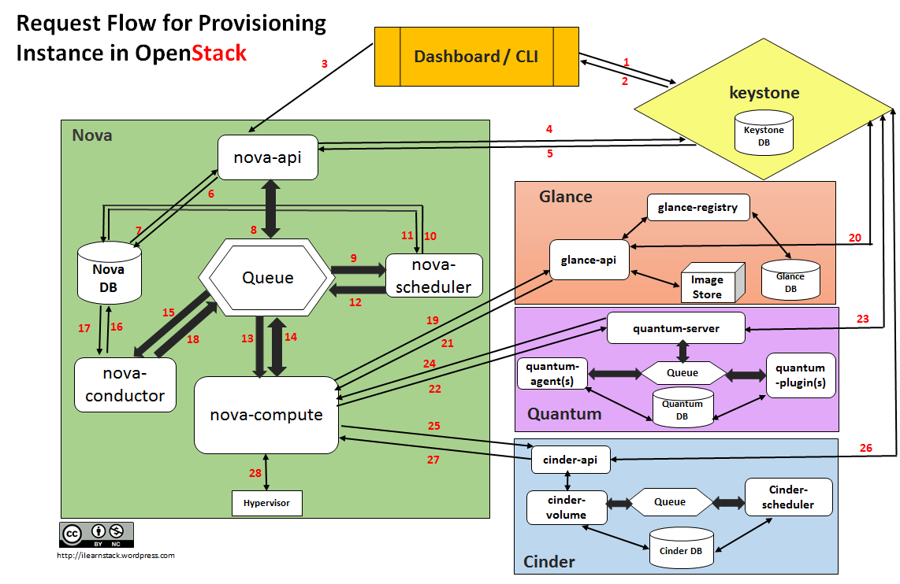

# Quá trình boot một VM trong OpenStack

# MỤC LỤC
- [1.Cách trình bày thứ 1](#1)
- [2.Cách trình bày thứ 2](#2)
  - [2.1. Một số component tham gia vào quá trình khởi tạo và dự phòng cho máy ảo](#2.1)
  - [2.2. Request flow trong quá trình tạo máy ảo](#2.2)

# 1.Cách trình bày thứ 1
  

**Trong ví dụ này, 2 hosts sử dụng là: compute node và controller node. Các bước boot 1 instance là:**  
	1. Client (trong ví dụ client là Horizon web client nhưng nó cũng có thể là nova CLI command ) nói với keystone-api để xác nhận và xin token truy cập.  
	2. Nếu xác thực thành công, client gửi yêu cầu để chạy instance đến nova-api. Nó tương tự như lệnh nova boot.  
	3. Nova service xác thực token và nhận headers với roles và permission từ keystone-api.  
	4. Nova check database xem có tên VM đã tồn tại hay chưa? Nếu chưa thì tạo một entry mới cho instance trong database.  
	5. Nova-api gửi RPC cho scheduling instance đến nova-scheduler service.  
	6. Nova-scheduler service chọn request từ message queue.  
	7. Nova-scheduler service tìm một compute host thích hợp thông qua database. Sau đó scheduler gửi RPC call đến nova-compute service và launch VM.  
	8. Nova compute service chọn request từ message queue.  
	9. Nova-compute serrvice yêu cầu nova-conductor để tìm thông tin về instance, ví dụ: host ID, flavor , etc.  
    10. Nova-condutor service chọn request thích đáng từ message queue.  
	11. Nova-condutor service lấy thông tin về instance từ database.  
	12. Nova-compute service lấy thông tin instance từ queue. Tại thời điểm này, compute host sẽ biết image nào sẽ được sử dụng cho instance. Nova-compute yêu cầu glance-api service cung cấp image URL.  
	13.Glance-api xác thực token và return metadata của image bao gồm URL.  
	14. Nova-compute service chuyển token đến neutron-api và yêu cầu nó cấu hình network cho instance.  
	15. Neutron xác thực token và cấu hình network.  
	16. Nova-compute tác động đến cinder-api để gắn volume đến instance.  
	17. Nova-compute sinh data cho Hypervisor và thực thi yêu cầu thông qua libvirt.  

# 2.Cách trình bày thứ 2

## 2.1. Một số component tham gia vào quá trình khởi tạo và dự phòng cho máy ảo
- CLI: Command Line Interpreter - là giao diện dòng lệnh để thực hiện các command gửi tới OpenStack Compute
- Dashboard (Horizon): cung cấp giao diện web cho việc quản trị các dịch vụ trong OpenStack
- Compute(Nova): quản lý vòng đời máy ảo, từ lúc khởi tạo cho tới lúc ngừng hoạt động, tiếp nhận yêu cầu tạo máy ảo từ người dùng.
- Network - Quantum (hiện tại là Neutron): cung cấp kết nối mạng cho Compute, cho phép người dùng tạo ra mạng riêng của họ và kết nối các máy ảo vào mạng riêng đó.
- Block Storage (Cinder): Cung cấp khối lưu trữ bền vững cho các máy ảo
- Image(Glance): lưu trữ đĩa ảo trên Image Store
- Identity(Keystone): cung cấp dịch vụ xác thưc và ủy quyền cho toàn bộ các thành phần trong OpenStack.
- Message Queue(RabbitMQ): thực hiện việc giao tiếp giữa các component trong OpenStack như Nova, Neutron, Cinder.

## 2.2. Request flow trong quá trình tạo máy ảo
- Bước 1: Từ Dashboard hoặc CLI, nhập thông tin chứng thực (ví dụ: user name và password) và thực hiện lời gọi REST tới Keystone để xác thực
- Bước 2: Keystone xác thực thông tin người dùng và tạo ra một token xác thực gửi trở lại cho người dùng, mục đích là để xác thực trong các bản tin request tới các dịch vụ khác thông qua REST
- Bước 3: Dashboard hoặc CLI sẽ chuyển yêu cầu tạo máy ảo mới thông qua thao tác "launch instance" trên openstack dashboard hoặc "nova-boot" trên CLI, các thao tác này thực hiện REST API request và gửi yêu cầu tới nova-api
- Bước 4: nova-api nhận yêu cầu và hỏi lại keystone xem auth-token mang theo yêu cầu tạo máy ảo của người dùng có hợp lệ không và nếu có thì hỏi quyền hạn truy cập của người dùng đó.
- Bước 5: Keystone xác nhận token và update lại trong header xác thực với roles và quyền hạn truy cập dịch vụ lại cho nova-api
- Bước 6: nova-api tương tác với nova-database
- Bước 7: Dababase tạo ra entry lưu thông tin máy ảo mới
- Bước 8: nova-api gửi rpc.call request tới nova-scheduler để cập cập entry của máy ảo mới với giá trị host ID (ID của máy compute mà máy ảo sẽ được triển khai trên đó). C(Chú ý: yêu cầu này lưu trong hàng đợi của Message Broker - RabbitMQ)
- Bước 9: nova-scheduler lấy yêu cầu từ hàng đợi
- Bước 10: nova-scheduler tương tác với nova-database để tìm host compute phù hợp thông qua việc sàng lọc theo cấu hình và yêu cầu cấu hình của máy ảo
- Bước 11: nova-database cập nhật lại entry của máy ảo mới với host ID phù hợp sau khi lọc.
- Bước 12: nova-scheduler gửi rpc.cast request tới nova-compute, mang theo yêu cầu tạo máy ảo mới với host phù hợp.
- Bước 13: nova-compute lấy yêu cầu từ hàng đợi.
- Bước 14: nova-compute gửi rpc.call request tới nova-conductor để lấy thông tin như host ID và flavor(thông tin về RAM, CPU, disk) (chú ý, nova-compute lấy các thông tin này từ database thông qua nova-conductor vì lý do bảo mật, tránh trường hợp nova-compute mang theo yêu cầu bất hợp lệ tới instance entry trong database)
- Bước 15: nova-conductor lấy yêu cầu từ hàng đợi
- Bước 16: nova-conductor tương tác với nova-database
- Bước 17: nova-database trả lại thông tin của máy ảo mới cho nova-conductor, nova condutor gửi thông tin máy ảo vào hàng đợi.
- Bước 18: nova-compute lấy thông tin máy ảo từ hàng đợi
- Bước 19: nova-compute thực hiện lời gọi REST bằng việc gửi token xác thực tới glance-api để lấy Image URI với Image ID và upload image từ image storage.
- Bước 20: glance-api xác thực auth-token với keystone
- Bước 21: nova-compute lấy metadata của image(image type, size, etc.)
- Bước 22: nova-compute thực hiện REST-call mang theo auth-token tới Network API để xin cấp phát IP và cấu hình mạng cho máy ảo
- Bước 23: quantum-server (neutron server) xác thực auth-token với keystone
- Bước 24: nova-compute lấy thông tin về network
- Bước 25: nova-compute thực hiện Rest call mang theo auth-token tới Volume API để yêu cầu volumes gắn vào máy ảo
- Bước 26: cinder-api xác thực auth-token với keystone
- Bước 27: nova-compute lấy thông tin block storage cấp cho máy ảo
- Bước 28: nova-compute tạo ra dữ liệu cho hypervisor driver và thực thi yêu cầu tạo máy ảo trên Hypervisor (thông qua libvirt hoặc api - các thư viện tương tác với hypervisor)

