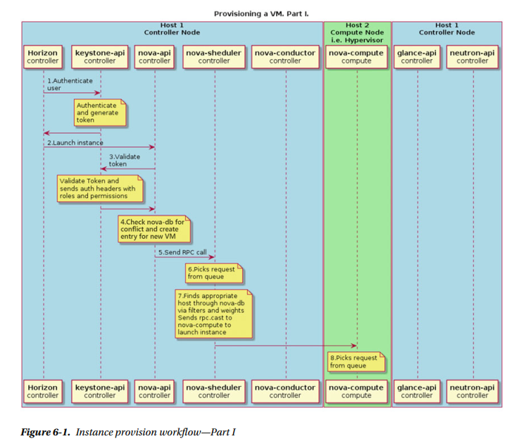
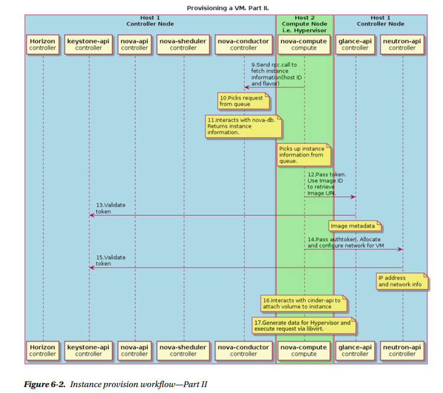

# Nova- Quá trình boot một VM trong OpenStack

# 5.Quá trình boot một VM trong OpenStack
  

**Trong ví dụ này, 2 hosts sử dụng là: compute node và controller node. Các bước boot 1 instance là:**  
	1. Client (trong ví dụ client là Horizon web client nhưng nó cũng có thể là nova CLI command ) nói với keystone-api để xác nhận và xin token truy cập.  
	2. Nếu xác thực thành công, client gửi yêu cầu để chạy instance đến nova-api. Nó tương tự như lệnh nova boot.  
	3. Nova service xác thực token và nhận headers với roles và permission từ keystone-api.  
	4. Nova check database xem có tên VM đã tồn tại hay chưa? Nếu chưa thì tạo một entry mới cho instance trong database.  
	5. Nova-api gửi RPC cho scheduling instance đến nova-scheduler service.  
	6. Nova-scheduler service chọn request từ message queue.  
	7. Nova-scheduler service tìm một compute host thích hợp thông qua database. Sau đó scheduler gửi RPC call đến nova-compute service và launch VM.  
	8. Nova compute service chọn request từ message queue.  
	9. Nova-compute serrvice yêu cầu nova-conductor để tìm thông tin về instance, ví dụ: host ID, flavor , etc.  
    10. Nova-condutor service chọn request thích đáng từ message queue.  
	11. Nova-condutor service lấy thông tin về instance từ database.  
	12. Nova-compute service lấy thông tin instance từ queue. Tại thời điểm này, compute host sẽ biết image nào sẽ được sử dụng cho instance. Nova-compute yêu cầu glance-api service cung cấp image URL.  
	13.Glance-api xác thực token và return metadata của image bao gồm URL.  
	14. Nova-compute service chuyển token đến neutron-api và yêu cầu nó cấu hình network cho instance.  
	15. Neutron xác thực token và cấu hình network.  
	16. Nova-compute tác động đến cinder-api để gắn volume đến instance.  
	17. Nova-compute sinh data cho Hypervisor và thực thi yêu cầu thông qua libvirt.  

