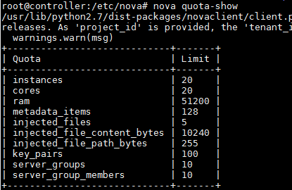
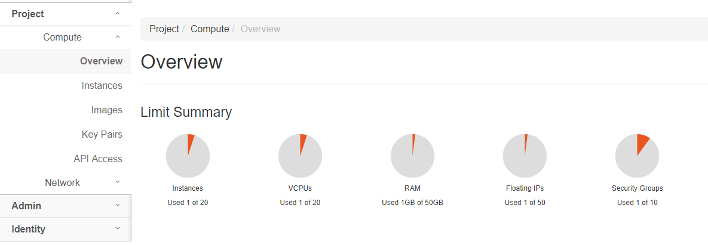
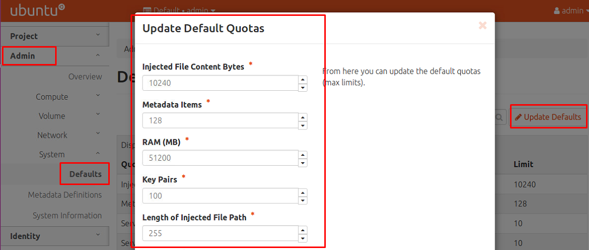

# Quản lý quotas

# MỤC LỤC
- [1.Khái niệm](#)
- [2.Cấu hình](#)
- [3.Các command liên quan](#)
	- [3.1.Show thông tin về quota](#)
	- [3.2.Set quotas for project](#)

<a name="1"></a>
# 1.Khái niệm
\- Quota là khái niệm chỉ sự giới hạn resource.  
\- Quota tính cả các chỉ số của những VM error.
\- Nó cho biết số resource được cho phép trên mỗi project.  
\- Được định nghĩa trong file cấu hình: `/etc/nova/nova.conf` trên controller.  

<a name="2"></a>
# 2.Cấu hình
\- Từ phiên bản OpenStack Ocata trở về trước, **quota** được cấu hình trong section `[DEFAULT]`với các thông số như sau:  
```
# Number of instances allowed per project (integer value)
quota_instances=10
# Number of instance cores allowed per project (integer value)
quota_cores=20
# Megabytes of instance RAM allowed per project (integer value)
quota_ram=51200
# Number of floating IPs allowed per project (integer value)
quota_floating_ips=10
# Number of fixed IPs allowed per project (this should be at least the number
# of instances allowed) (integer value)
quota_fixed_ips=-1
# Number of metadata items allowed per instance (integer value)
quota_metadata_items=128
# Number of injected files allowed (integer value)
quota_injected_files=5
# Number of bytes allowed per injected file (integer value)
quota_injected_file_content_bytes=10240
# Length of injected file path (integer value)
quota_injected_file_path_length=255
# Number of security groups per project (integer value)
quota_security_groups=10
# Number of security rules per security group (integer value)
quota_security_group_rules=20
# Number of key pairs per user (integer value)
quota_key_pairs=100
```

\- Trong phiên bản OpenStack Ocata, **quota** được cấu hình tương tự trong section `[quota]` , tham khảo tại :  
https://docs.openstack.org/ocata/config-reference/compute/config-options.html  
https://docs.openstack.org/ocata/config-reference/tables/conf-changes/nova.html  
VD:  
```
[quota]
# Number of instances allowed per project (integer value)
instances=10
# Number of instance cores allowed per project (integer value)
cores=20
# Megabytes of instance RAM allowed per project (integer value)
ram=51200
# Number of floating IPs allowed per project (integer value)
floating_ips=10
# Number of fixed IPs allowed per project (this should be at least the number
# of instances allowed) (integer value)
fixed_ips=-1
# Number of metadata items allowed per instance (integer value)
metadata_items=128
# Number of injected files allowed (integer value)
injected_files=5
# Number of bytes allowed per injected file (integer value)
injected_file_content_bytes=10240
# Length of injected file path (integer value)
injected_file_path_length=255
# Number of security groups per project (integer value)
security_groups=10
# Number of security rules per security group (integer value)
security_group_rules=20
# Number of key pairs per user (integer value)
key_pairs=100
```

\- Nếu muốn thay đổi quota, ta phải cấu hình trong file `/etc/nova/nova.conf` và restart lại các service nova.  

<a name="3"></a>
# 3.Các command liên quan

<a name="3.1"></a>
## 3.1.Show thông tin về quota
```
openstack quota show
    [--default]
    [<project>]
```

or  
```
nova quota-show
```

\- VD:  
```
nova quota-show
```



Hoặc bạn có thể xem trong dashboard:  


<a name="3.2"></a>
## 3.2.Set quotas for project
```
openstack quota set
    # Compute settings
    [--cores <num-cores>]
    [--fixed-ips <num-fixed-ips>]
    [--floating-ips <num-floating-ips>]
    [--injected-file-size <injected-file-bytes>]
    [--injected-files <num-injected-files>]
    [--instances <num-instances>]
    [--key-pairs <num-key-pairs>]
    [--properties <num-properties>]
    [--ram <ram-mb>]
    [--server-groups <num-server-groups>]
    [--server-group-members <num-server-group-members>]
	 <project>
```

or  
```
nova quota-update
```

\- VD: Thay đổi quota cho 1 project riêng biệt:  
```
nova quota-update 16f44d2a075a4139a2a5425a42f1b447 --instances 4
```

\- Bạn có thể thay đổi default quota cho tất cả các project thông qua horizon:  



