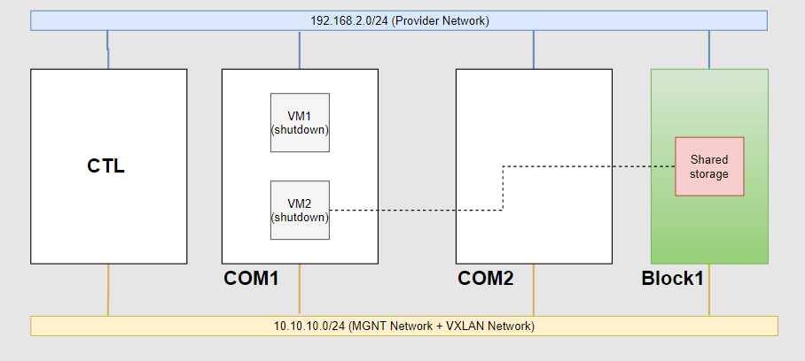
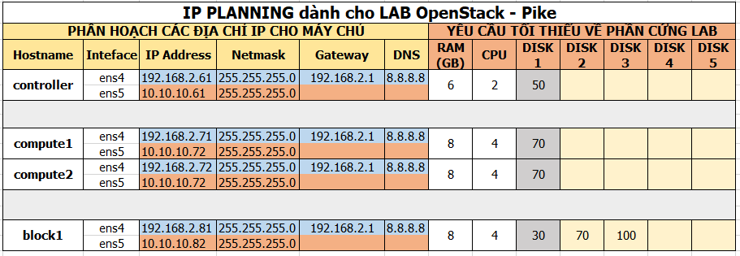
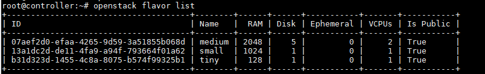

# Resize

# MỤC LỤC
- [1.Giới thiệu](#1)
- [2.LAB](#2)
- [3.Chú ý](#3)

<a name="1"></a>
# 1.Giới thiệu
\- Resize là quá trình thay đổi flavor của VM, resize có thể thực hiện trên cùng host hoặc resize đến host khác.  
\- Các đặc điểm cần chú ý:  
- Bạn phải resize VM đến flavor khác.
- Bạn không thể resize VM nếu VM đó đang ở trạng thái được  resized.
- Bạn không thể resize VM đến disk flavor có kích thước nhỏ hơn disk flavor hiện tại của VM.
- Nếu bạn resize đến cùng host, nhưng host đó không đủ tài nguyên cho flavor mới, VM sẽ không thay đổi flavor.
- Bạn có thể giảm CPU, nhưng bạn không thể giảm kích thước disk của bất kỳ VM nào.

\- Resize đến host khác yêu cầu cấu hình SSH giữa 2 host.  

<a name="2"></a>
# 2.LAB
\- Mô hình  


VM lưu trữ dạng file image.  
VM2 lưu trữ dạng volume trên Block1.  

\- IP Planning:  


\- Trong OpenStack, resize sử dụng SSH.  
\- Trên COM1 và COM2 kích hoạt tính năng đăng nhập và thiết lập passwd cho user nova:  
```
# usermod -s /bin/bash nova
# passwd nova
```

Điền passwd cho user `nova`. VD trong trường hợp này là `son123456`.  

\- Trên COM1  
- Chuyển sang user `nova`:  
```
# su - nova
```

- Sinh key pair:  
```
nova@compute1:~$ ssh-keygen -t rsa
Generating public/private rsa key pair.
Enter file in which to save the key (/var/lib/nova/.ssh/id_rsa): 
Created directory '/var/lib/nova/.ssh'.
Enter passphrase (empty for no passphrase): 
Enter same passphrase again: 
Your identification has been saved in /var/lib/nova/.ssh/id_rsa.
Your public key has been saved in /var/lib/nova/.ssh/id_rsa.pub.
The key fingerprint is:
SHA256:6zHZGpZfzWkowt9f+gukp968N2caJ/7HTp4YYMztZ7I nova@compute1
The key's randomart image is:
+---[RSA 2048]----+
|                 |
|                 |
|                 |
|          o .    |
|        S  = o   |
|       . =. =+ . |
|        @ o.o*B++|
|       o O +=oO@*|
|        o +o.EBOX|
+----[SHA256]-----+
```

- Cấu hình SSH không kiểm tra host khi ssh:  
```
echo 'StrictHostKeyChecking no' >> /var/lib/nova/.ssh/config
```

- Thay đổi quyền thư mục `.ssh`, các file bên trong và quyền hạn của các user đối với file `id_rsa` và `authorized_keys` :  
```
chown -R nova:nova /var/lib/nova/.ssh/
chmod 600 /var/lib/nova/.ssh/id_rsa /var/lib/nova/.ssh/authorized_keys
```

- Thực hiện copy public key sang node COM2:  
```
ssh-copy-id -i /var/lib/nova/.ssh/id_rsa nova@compute2
```

Điển password.  

- Đảm bảo user `nova` có thể login vào user `nova` node `COM2` mà không sử dụng password:  
```
ssh nova@compute2
```

\- Trên cả COM1 và COM2:  
```
# systemctl restart libvirtd
# systemctl restart nova-compute
```

\- Ta thực hiện resize VM1, trên COM1:  
- Shutdown VM1:  
```
openstack server stop VM1
```

- Resize VM1:  
Cú pháp:  
```
openstack server resize --flavor <flavor-name> <vm-name>
```

Các flavor hiện có:  


Trong bài lab này là:  
```
openstack server resize --flavor small VM1
```

- Chờ đến khi VM1 thay đổi trạng thái sang `VERIFY_RESIZE` (dùng `openstack server show` để xem), confirm việc resize :  
```
openstack server resize --confirm VM1
```

- Nếu muốn quay trở về sử dụng flavor cũ, sử dụng câu lệnh sau  
```
openstack server resize --revert VM1
```

\- Chú ý:  
- Bản chất ssh, SSH sẽ mặc định thử dùng file `~/.ssh/id_rsa` ( nếu cặp key pair dụng thuật toán rsa) để ssh sang <user>@<hostname> ta muốn login. Nên khi có 2 node COM, ta có thể cấu hình dùng 2 key pair khác nhau trên mỗi COM.
Nhưng nếu có nhiều hơn 2 node COM, ta không thể làm như thế được. Lúc này, ta sẽ dùng chung 1 key pair cho tất cả các node COM.
- Nếu VM1 đang running, ta vẫn có thể thực hiện resize. (Bản chất của việc này, VM1 sẽ tự động được shutdown và resize, sau đó được start).

\- Ta thực hiện resize VM2, trên COM1:  
- Shutdown VM2:  
```
openstack server stop VM1
```

- Xem danh sách các volume hiện có:  
```
openstack volume list
```

- Thay đổi trạng thái của volume muốn resize từ in-use sang available:  
```
openstack volume set --state available <volume-ID>
```

\- Tiến hành mở rộng volume (mở rộng dung lượng volume bằng flavor mới):  
```
openstack volume set --size <new-size-in-GB>  <volume-ID> 
```

\- Thay đổi volume lại về trạng thái in-use:  
```
openstack volume set --state in-use <volume-ID>
```

\- Resize máy ảo sang flavor mới :  
```
openstack server resize --flavor <flavor> <vm-name>
```

\- Confirm resize sau khi trạng thái máy ảo chuyển thành “VERIFY_RESIZE” (dùng câu lệnh “`openstack server show`” để xem)  
```
openstack server resize --confirm <vm-name>
```

<a name="3"></a>
# 3.Chú ý
\- Tùy chọn `allow_resize_to_same_host` trong file `/etc/nova/nova.conf` trên node Controller mặc định là `False`. Điều này có nghĩa là bạn không thể resize trên cùng một host. Bạn nên chỉnh thành True để có thể resize trên cùng một host.  
\- Tuy nhiên khi mình đã lab thử, mình để nguyên mặc định đó, thì VM vẫn có thể resize trên cùng 1 host.  


