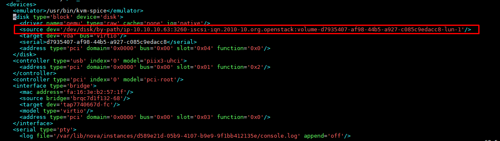

# Thư mục lưu trữ thông tin về instance

\- File lưu trữ thông tin về instance nằm bên node compute.  
- File .xml lưu trữ thông tin về instance: `/etc/libvirt/qemu/<instance_name>`
- Thư lục lưu trữ về của instance: `/var/lib/nova/instances/<instance_id>` .

Nếu instance lưu bằng dạng file thì trong thư mục này sẽ có file image của instance, đó là file disk.  
Nếu boot instance từ volume. Node compute sẽ mount tới node cinder thông qua iscsi:  

