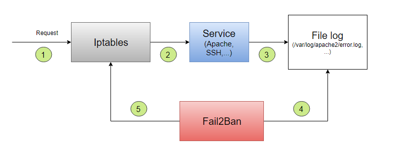

# Các thành phần và cơ chế hoạt động của Fail2Ban

# MỤC LỤC

# 1.Các thành phần
\- Fail2Ban bao gồm 3 thành phần: filter (luật lọc) , action (luật chặn) và file log cần để lọc.  

## 1.1.Filter
\- Filter là điều kiện để xác định 1 địa chỉ IP có vị phạm luật hay không. Các file filter được chứa thư mục `/etc/fail2ban/filter.d`.  

## 1.2.Action
\- Mỗi luật action được cấu hình bao gồm những lệnh iptables sau:  
- **actionstart**: Gọi ra khi khởi chạy dịch vụ fail2ban có nhiệm vụ tạo mới 1 subchain trong iptables để dễ quản lý các IP đã chặn theo từng jail.
- **actionstop**: Gọi ra khi kết thúc dịch vụ fail2ban nhằm xóa bỏ những subchain và rules iptables được thêm vào trong quá trình fail2ban chạy.
- **actioncheck**: kiểm tra xem 1 IP đã bị chặn với jail hay chưa. Tức là kiểm tra chain của jail đã có Ip đó hay chưa.
- **actionban**: lệnh iptables để chặn 1 IP.
- **actionunabn**: lệnh iptables xóa bỏ luật chặn 1 IP sau khi hết thời gian chặn.

## 1.3.File log
\- Các file log của các dịch vụ như apache (/var/log/apache2/error.log) , ssh (/var/log/auth.log).  

# 2.Cơ chế hoạt động

\- Bước 1: Request được gửi đến server, đầu tiền sẽ đi vào Iptables. Nếu Iptabes đồng ý cho request đi tiếp, thì sẽ chuyển sang bước 2.  
\- Bước 2: Request sẽ đi vào Service (Apache, SSH, …).  
\- Bước 3: Service ghi vào file log về request này.  
\- Bước 4: Fail2Ban lấy thông tin từ file log và kiểm tra xem request có vi phạm filter (bộ lọc) nào không, ví dụ như số lần vi phạm vượt quá ngưỡng cho trước. Nếu request vi phạm thì sẽ chuyển sang bước 5.  
\- Bước 5: Fail2Ban sử dụng acition để yêu cầu iptables chặn IP của request đó.  

