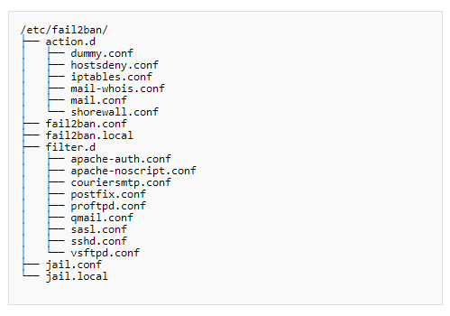

# Cấu hình Fail2Ban

# MỤC LỤC

# 1.Giới thiệu
\- Các file cấu hình được chứa trong thư mục `/etc/fail2ban`, có cấu trúc như sau:  


\- Mỗi file .conf có thể được ghi đè bằng 1 file .local. File .conf được đọc đầu tiên, sau đó file .local được đọc và các cài đặt sau được ghi đè lên. Do đó, 1 file .local không phải bao gồm mọi thứ trong file .conf tương ứng, chỉ chứa những thứ bạn muốn ghi đè.  
\- Bạn nên sửa đổi file `.local` và không nên sửa đổi file `.conf`. Điều này tránh được việc hợp nhất vấn đề khi nâng cấp.  

# 2.Cài đặt chung cho fail2ban
\- File `fail2ban.conf` chứa các các cài đặt chung cho **fail2ban-server** daemon, như cấp độ đăng nhập và mục tiêu.  

# 3.Jails
\- File quan trọng nhất là **jail.conf**, nó chứa khai báo về các của jails. Mặc định, mỗi section được viết trong file jail.conf làm mẫu, bạn phải enable section đó và cấu hình local của bạn. Sau đây là ví dụ cho section `ssh-iptables`:  
```
[ssh-iptables]
#enabled  = false
enabled  = true
filter   = sshd
action   = iptables[name=SSH, port=ssh, protocol=tcp]
#          mail-whois[name=SSH, dest=yourmail@mail.com]
#logpath  = /var/log/sshd.log
logpath  = /var/log/auth.log
maxretry = 5
```

Cài đặt này cho biết:  
- Section **ssh-iptables** được enabled.
- Filter **sshd.conf** trong thư mục con **filter.d** sẽ được xử lý.
- Action mô tả iptables.conf (trong thư mục con **action.d**) sẽ được thực thi nếu kết quả của quá trình lọc là đúng.
- File log được quét bởi bộ lọc **auth.log**.

\- Các thông số khoảng thời gian quét, ngưỡng giới hạn, thời gian chặn IP hay vị trí file log sẽ được cấu hình riêng trong từng jail.  
\- **Jail Option**  

|Tên|Mặc định|Mô tả|
|---|---|---|
|**enable**||Kích hoạt section, nếu không có option này thì section không được kích hoạt. enable bằng true hoặc false.|
|**filter**||Tên của filter sẽ được sử dụng bởi jail để phát hiện các dấu hiệu phụ hợp. Mỗi dấu hiệu phù hợp sẽ tăng bộ đếm.|
|**logpath**|/var/log/messages|Đường dẫn đến file log được cung cấp cho filter|
|**maxretry**|5|Số lượng khớp (giá trụ của bộ đếm) kích hoạt action cấm IP|
|**findtime**|600 sec|Bộ đếm được thiết lập bằng 0 nếu không tìm thấy kết quả trong **findtime** giây.|
|**bantime**|600 sec|Thời gian (tính bằng giây) đối với địa chỉ IP bị cấm. Số âm cho lệnh cấm vĩnh viễn.|
|**port**||cổng chặn kết nối đến server|
|**action**||lựa chọn 1 trong 3 chế độ: chỉ chặn IP; chặn IP và gửi mail thông báo; chặn IP, gửi mail thông báo và ghi ra log.|
|**protocol**||giao thức (icmp, tcp, udp)|

Các option maxretry, findtime, bandtime, protocol nếu không cấu hình thì mặc định sẽ sử dụng giá trị của option tương ứng ở section DEFAULT.

# 4.Filters
\- Thư mục **filter.d** chứa các biểu thức được sử dụng để phát hiện các nỗ lực đột phột, như nhập mật khẩu không đúng, …  
# 5.Action
\- Thư mục **action.d** chứa các kịch bản khác nhau xác định actions. Các actions được thực hiện tại các thời điểm xác định trong quá trình thực hiện Fail2Ban, khi starting/stoping jail, banning/unbanning host,…  
\- Ví dụ action **iptables-multiport.conf**:  
```
# Fail2Ban configuration file
#
# Author: Cyril Jaquier
# Modified by Yaroslav Halchenko for multiport banning
#

[INCLUDES]

before = iptables-common.conf

[Definition]

# Option:  actionstart
# Notes.:  command executed once at the start of Fail2Ban.
# Values:  CMD
#
actionstart = <iptables> -N f2b-<name>
              <iptables> -A f2b-<name> -j <returntype>
              <iptables> -I <chain> -p <protocol> -m multiport --dports <port> -j f2b-<name>

# Option:  actionstop
# Notes.:  command executed once at the end of Fail2Ban
# Values:  CMD
#
actionstop = <iptables> -D <chain> -p <protocol> -m multiport --dports <port> -j f2b-<name>
             <iptables> -F f2b-<name>
             <iptables> -X f2b-<name>

# Option:  actioncheck
# Notes.:  command executed once before each actionban command
# Values:  CMD
#
actioncheck = <iptables> -n -L <chain> | grep -q 'f2b-<name>[ \t]'

# Option:  actionban
# Notes.:  command executed when banning an IP. Take care that the
#          command is executed with Fail2Ban user rights.
# Tags:    See jail.conf(5) man page
# Values:  CMD
#
actionban = <iptables> -I f2b-<name> 1 -s <ip> -j <blocktype>

# Option:  actionunban
# Notes.:  command executed when unbanning an IP. Take care that the
#          command is executed with Fail2Ban user rights.
# Tags:    See jail.conf(5) man page
# Values:  CMD
#
actionunban = <iptables> -D f2b-<name> -s <ip> -j <blocktype>

[Init]
```


