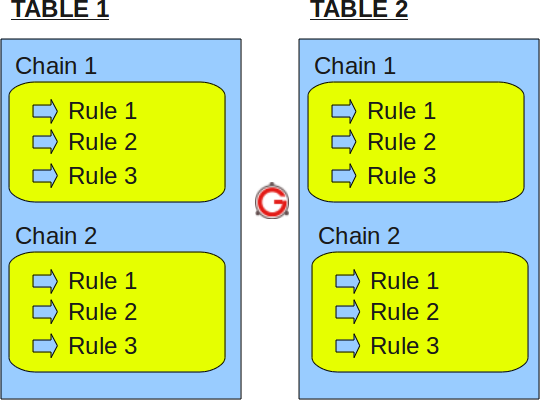
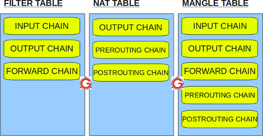

# Kiến trúc Iptables 

# MỤC LỤC
- [1.Tables](#1)
	- [1.1.Filter tables](#1.1)
	- [1.2.NAT tables](#1.2)
	- [1.3.Mangle table](#1.3)
	- [1.4.Raw table](#1.4)
- [2.Chain](#2)
- [3.Rules](#3)


\- Iptables chứa nhiều tables.  
Tables chứa nhiều chains.Chains có thể được tích hợp sẵn hoặc do người dùng định nghĩa.  
Chains chứa nhiều rules. Rules được định nghĩa cho các gói tin.  
\- Cấu trúc:  
iptables -> Tables -> Chains -> Rules.  



<a name="1"></a>
# 1.Tables
\- Iptables có 4 tables được xây dựng sẵn.  


<a name="1.1"></a>
## 1.1.Filter tables
\- Filter là table mặc định cho iptables. Nếu bạn không xác định tables, bạn sẽ sử dụng filter tables.  
\- Bảng này được sử dụng để lọc gói tin.  
\- Filter tables của iptables có các chains sau.  
- INPUT chain – Incoming đến firewall. Cho các gói tin đến local server.
- OUTPUT chain – Outgoing từ firewall. Cho các gói tin sinh ra ở local và đi ra khỏi local server. 
- FORWARD chain – Gói tin cho NIC khác trên local server. Cho gói tin được định tuyến thông qua local server.

\- Các target có trong bảng này:  
- DROP
- ACCEPT
- LOG
- REJECT

<a name="1.2"></a>
## 1.2.NAT tables
\- Bảng này được sử dụng cho chức năng NAT trên các gói tin khác nhau.  
\- NAT tables của iptables có các chains sau.  
- PREROUTING chain: thay đổi gói tin trước khi định tuyến. VD. Translation gói tin ngay sau khi gói tin đi vào hệ thống ( trước khi định tuyến). Điều này giúp translate địa chỉ IP đích của gói tin đến 1 cái gì đó phù hợp với việc định truyến trên local server. Điều này được sử dụng cho DNAT (destination NAT).
- POSTROUTING chain: Thay đổi gói tin sau khi định tuyến. VD. Translation gói tin xảy ra khi gói tin rời khỏi hệ thống. Điều này giúp dịch chuyển địa chỉ IP nguồn đến 1 cái gì đó phù hợp với việc định tuyến trên destination server. Điều này được sử dụng cho SNAT (source NAT).
- OUTPUT chain: NAT cho gói tin được sinh ra cục bộ trên firewall.

\- Các target có trong bảng này:  
- DNAT
- SNAT
- MASQUERADE

<a name="1.3"></a>
## 1.3.Mangle table
\- Mangle tables của Iptables dành cho những thay đổi gói tin đặc biệt. Điều này thay đổi bit QoS của TCP header.  
\- Mangle table có các chains sau.  
- PREROUTING chain
- OUTPUT chain
- FORWARD chain
- INPUT chain
- POSTROUTING chain

\- Các Targets trong bảng  
- TOS: Dùng để thay đổi trường Type of Service trong gói tin ipdatagram.
- TTL: Dùng để thay đổi trường Time To Live trong gói tin ipdatagram.
- MARK: Dùng để đặt giá trị special mark cho gói tin. Sau đó, bạn có thể đặt một số rules riêng cho những gói tin được đánh dấu.

<a name="1.4"></a>
## 1.4.Raw table
\- Bảng raw chủ yếu chỉ được sử dụng cho một điều, và đó là để thiết lập một đánh dấu trên gói tin rằng họ không nên được xử lý bởi các hệ thống theo dõi kết nối. Điều này được thực hiện bằng target `NOTRACK`.  
Khi sử dụng target NOTRACK, bạn không thể sử dụng các module theo dõi kết nối như `state` và `conntrack`.  
\- Raw tables có các chains sau.  
- PREROUTING chain
- OUTPUT chain

<a name="2"></a>
# 2.Chain
|Chain|Ý nghĩa|
|---|---|
|INPUT|những gói tin đi vào hệ thống|
|OUTPUT|những gói tin đi ra từ hệ thống|
|FORWARD|những gói tin đi qua hệ thống (đi vào một hệ thống khác|
|PREROUTING|sửa địa chỉ đích của gói tin trước khi nó được routing bởi bảng routing của hệ thống (destination NAT hay DNAT).|
|POSTROUTING|ngược lại với Pre-routing, nó sửa địa chỉ nguồn của gói tin sau khi gói tin đã được routing bởi hệ thống (SNAT).|

<a name="3"></a>
# 3.Rules
Sau đây là những điển chính cần ghi nhớ cho cho các rules của iptables.  
- Rules chứa criteria và target.
- Nếu các criteria là phù hợp, nó sẽ thực hiên target của rules này. 
- Nếu các criteria là không phù hợp, nó sẽ chutyển sang rules tiếp theo.

<a name="4"></a>
# 4.Target/Jumps
\- Target/Jump cho biết rule phải làm gì với packet phù hợp với phần match của rule.  
\- Jump sẽ nhảy tới 1 chain trong table. Ta có thể tạo 1 chain và thêm rule nhảy tới chain đó.  
VD: Tạo chain **tcp_packets**  
```
iptables -N tcp_packets
```

Chúng ta có thể thêm jump target:  
```
iptables -A INPUT -p tcp -j tcp_packets
```

Chúng sẽ nhảy từ chain **INPUT** đến chain **tcp_packets** và bắt đầu đi qua chain đó. Khi kết thúc chain đó, chúng sẽ được đưa trở lại chain **INPUT**.

<a name="4.1"></a>
## 4.1.ACCEPT target
\- Target này không cần thêm các option khác. Ngay khi match phù hợp, và ACCEPT là target, rule sẽ chấp nhận và không cho packet đi qua chain hiện tại hoặc bất kỳ cái nào khác trong cùng 1 tables.  
\- Chú ý: 1 packet sau khi được accepted ở 1 chain, có thể vẫn đi qua các chain của 1 table khác và vẫn có thể bị dropped.  

<a name="4.2"></a>
## 4.2.DROP target
\- **DROP** target sẽ hủy các packets và không tiến hành bất kỳ quá trình xử lý nào nữa. (kể chain của tables khác)  

<a name="4.3"></a>
## 4.3.REJECT target
\- **REJECT** target làm việc như **DROP** target, nhưng nó gửi lại 1 thông điệp lỗi đến host gửi packets bị blocked.
\- **REJECT** target chỉ có hiệu lực trong chain INPUT, FORWARD và OUTPUT hoặc subchain của chúng.  
\- **Option**  

|Option|--reject-with|
|---|---|
|VD|iptables -A FORWARD -p TCP --dport 22 -j REJECT --reject-with tcp-reset|
|Ý nghĩa|Option này sẽ nói với **REJECT** target trả lời host gửi packet mà bị reject. Với giao thức ICMP (-p imcp), mặc định là thông báo **port-unreachable**, ngoài ra còn 1 số thông báo như **icmp-net-unreachable, icmp-host-unreachable, icmp-port-unreachable, icmp-proto-unreachable, icmp-net-prohibited and icmp-host-prohibited**, các thông báo lỗi trên có thể cài đặt theo ý của bạn. Ngoài ra còn có option **echo-reply**, nhưng option chỉ có thể được sử dụng kết hợp với các rules mà sẽ phù hợp với các ICMP ping packets.  Cuối cùng, có 1 option nữa là **tcp-reset**, chỉ được sử dụng với TCP protocol. Option tcp-reset sẽ nói với **REJECT** gửi TCP RST packet để trả lời đến host. TCP RST packét được sử dụng để đóng kết nối TCP một cách ổn định.|

<a name="4.4"></a>
## 4.4.DNAT target
\- **DNAT** target là được sử dụng để **Destination Network Address Translation**, điều đó có nghĩa là nó được sử dụng để viết lại địa chỉ IP đích của packet. Nếu packet là phù hợp, target này của rule sẽ thay đổi địa chỉ IP đích và sau đó định tuyến đến đúng thiết bị, host hoặc mạng.  
\- VD:  
Khi host đang chạy web server trong 1 mạng LAN, nhưng không có IP public để cung cấp cho nó. Bạn có thể cấu hình firewall để forward tất cả packets đi đến HTTP port của web server trong mạng LAN. Chúng ta có thể chỉ định 1 dải địa chỉ IP đích, và cơ chế DNAT sẽ chọn địa chỉ IP đích một cách ngẫu nhiên cho mỗi luồng. Do đó, chúng tôi có thể đối phó với loại load balancing bằng việc này.  
\- Lưu ý:  
**DNAT target chỉ có sẵn trong chain PREROUTING và chain OUTPUT trong table nat.**  
\- Option của DNAT  
|Option|--to-destination|
|---|---|
|VD|iptables -t nat -A PREROUTING -p tcp -d 15.45.23.67 --dport 80 -j DNAT --to-destination 192.168.1.1-192.168.1.10|
|Giải thích|Option **--to-destination** nói với DNAT mechaism thay đổi địa chỉ IP đích của packet. Như ví dụ trên, sẽ gửi tất cả packets có địa chỉ IP đích là 15.45.23.67 đến dải địa chỉ IP 192.168.1.1-192.168.1.10 trong mạng LAN. Chúng ta có thể chỉ định 1 địa chỉ IP cụ thể. Lưu ý là, chúng ta có thể thêm 1 port hoặc 1 dải port mà lưu lượng sẽ được chuyển hướng tới ( **--to-destination 192.168.1.1:80 hoặc --to-destination 192.168.1.1:80-100**)|

<a name="4.5"></a>
## 4.5.SNAT target
\- **SNAT** target được sử dụng để Source Network Address Translation, điều này có nghĩa là target sẽ viêt lại Source IP address trong IP header của packet.  
\- VD: Khi muốn 1 NAT 1 IP private trong mạng LAN -> 1 IP public để kết nối Internet.  
\- **SNAT** target chỉ có hiệu lực với table nat, trong chain **POSTROUTING**.  
\- **Option**  
|Option|--to-source|
|---|---|
|VD|iptables -t nat -A POSTROUTING -p tcp -o eth0 -j SNAT --to-source 194.236.50.155-194.236.50.160:1024-32000|
|Ý nghĩa|Option **--to-source** được sử dụng để chỉ định source của packet. Nếu bạn muốn sử dụng 1 dải địa chỉ IP : 194.236.50.155-194.236.50.160. Source IP cho mỗi luồng sẽ được phân bổ ngẫu nhiên 1 địa IP, và 1 luồng duy nhất sẽ luôn sử dụng cùng 1 địa chỉ IP cho tất cả các packet thuộc luồng đó. Chúng ta cũng có thể chỉ định 1 dải port được sử dụng bởi SNAT. Tất cả source port sẽ được giới hạn trong dải ports chỉ định, như trong ví dụ trên: 1024-32000. Điều này chỉ có hiệu lực nếu -p tcp hoặc -p udp được chỉ định ở đâu đó trong match của rule. iptables luôn luôn cố gắng tránh làm bất kỳ sự thay đổi port nào nếu có thể thể, nhưng nếu 2 hosts đều sử dụng cùng 1 ports, iptables sẽ map 1 trong 2 đến port khác. Nếu dải port không được chỉ định, tất cả source port dưới 512 sẽ được mapped đến ports khác dưới 512. Các source ports giữa 512 và 1023 sẽ được mapped đến ports khác dưới 1024. Tất cả các ports khác sẽ được mapped đến 1024 và >1024.|

<a name="4.6"></a>
## 4.6.Tham khảo thêm
http://www.faqs.org/docs/iptables/targets.html


