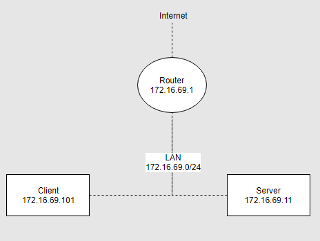
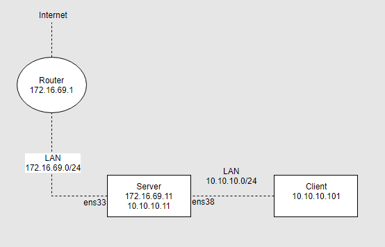
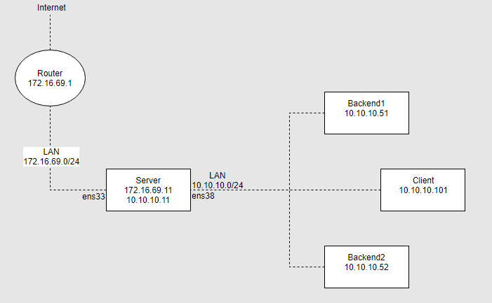
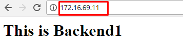
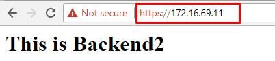
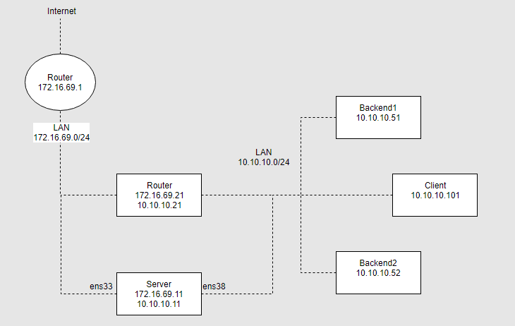
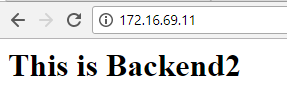
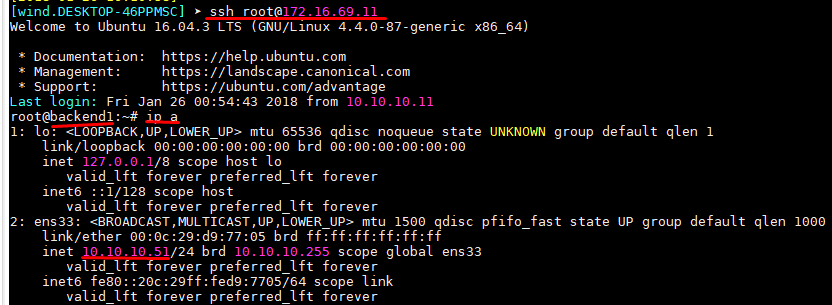

# LAB


# 1.LAB1
## 1.1.Mô hình


\- Client, Server cài hệ điều hành Ubuntu Server 16.04.  
\- Cấu hình iptables tại Server.  

## 1.2.Mục đích
\- Mặc định, DROP INPUT.  
\- Mặc định, ACCEPT OUTPUT.  
\- Mặc định, DROP FORWARD.  
\- ACCEPT Established Connection.  
\- ACCEPT kết nối từ loopback.  
\- ACCEPT kết nối Ping với 5 lần mỗi phút từ mạng LAN.  
\- ACCEPT kết nối SSH từ trong mạng LAN.  s

## 1.3.Cấu hình
\- DROP INPUT, ACCEPT OUTPUT và DROP FORWARD:  
```
iptables -P INPUT DROP
iptables -P OUTPUT ACCEPT
iptables -P FORWARD DROP
```

\- ACCEPT Established Connection.  
```
iptables -A INPUT -m state --state ESTABLISHED,RELATED -j ACCEPT
```

\- ACCEPT kết nối từ loopback:  
```
iptables -A INPUT -s 127.0.0.1 -d 127.0.0.1 -j ACCEPT
```

\- ACCEPT kết nối Ping với 5 lần mỗi phút từ mạng LAN.  
```
iptables -A INPUT -p icmp --icmp-type echo-request -m limit --limit 5/m --limit-burst 5 -s 172.16.69.0/24 -d 172.16.69.11 -j ACCEPT
```

\- ACCEPT kết nối SSH từ trong mạng LAN:  
```
iptables -A INPUT -p tcp -m state --state NEW -s 172.16.69.0/24 -d 172.16.69.11 --dport 22 -j ACCEPT
```

\- Sau khi cấu hình xong, từ Client , ta gửi bản tin icmp echo request (sử dụng lệnh ping) đến Server, ta sẽ thấy kết quả ping liên tục. Đó là do các gói tin icmp echo request bắt đầu từ gói tin tin thứ 2 sẽ được đồng ý bởi rule "ACCEPT Established Connection".  
Muốn kết nối Ping với 5 lần mỗi phút từ mạng LAN, ta phải sửa lại rule "ACCEPT Established Connection" như sau:  
```
iptables -A INPUT -p tcp -m state --state ESTABLISHED,RELATED -j ACCEPT
iptables -A INPUT -p udp -m state --state ESTABLISHED,RELATED -j ACCEPT
```

# 2.LAB 2
## 2.1.Mô hình


\- Client, Server cài hệ điều hành Ubuntu Server 16.04.  
\- Cấu hình iptables tại Server.  
## 2.2.Mục đích
\- Mặc định, DROP INPUT.  
\- Mặc định, ACCEPT OUTPUT.  
\- Mặc định, DROP FORWARD.  
\- ACCEPT Established Connection.  
\- ACCEPT kết nối từ loopback.  
\- ACCEPT kết nối Ping với 5 lần mỗi phút từ mạng LAN.  
\- ACCEPT kết nối SSH từ trong mạng LAN.  
\-  ACCEPT Outgoing gói tin thông qua Server từ mạng LAN (10.10.10.0/24) và nat địa chỉ nguồn của gói tin.  

## 2.3.Cấu hình
### a.Trên Client
- Cấu hình IP như mô hình, gateway là 10.10.10.11.
### b.Trên Server
- Kích hoạt iptables fordward packet sang máy khác, ta cần sửa file `/etc/sysctl.conf`:  
```
net.ipv4.ip_forward = 1
```

Chạy lệnh `sysctl -p /etc/sysctl.conf` để kiểm tra cài đặt.  
\- Sau đó:  
```
/etc/init.d/procps restart
```

\- DROP INPUT, ACCEPT OUTPUT và DROP FORWARD:  
```
iptables -P INPUT DROP
iptables -P OUTPUT ACCEPT
iptables -P FORWARD DROP
```

\- ACCEPT Established Connection.  
```
iptables -A FORWARD -m state --state ESTABLISHED,RELATED -j ACCEPT
iptables -A INPUT -m state --state ESTABLISHED,RELATED -j ACCEPT
```

\- ACCEPT kết nối từ loopback:  
```
iptables -A INPUT -s 127.0.0.1 -d 127.0.0.1 -j ACCEPT
```

\- ACCEPT kết nối Ping với 5 lần mỗi phút từ mạng LAN.  
```
iptables -A INPUT -p icmp --icmp-type echo-request -m limit --limit 5/m --limit-burst 5 \
	-s 10.10.10.0/24 -d 10.10.10.11 -j ACCEPT
```

\- ACCEPT kết nối SSH từ trong mạng LAN:  
```
iptables -A INPUT -p tcp -s 10.10.10.0/24 -d 10.10.10.11 --dport 22 -m state --state NEW -j ACCEPT
```

\-  ACCEPT Outgoing gói tin thông qua Server từ mạng LAN (10.10.10.0/24) và nat địa chỉ nguồn của gói tin.  
```
iptables -A FORWARD -i ens38 -o ens33 -j ACCEPT
iptables -t nat -A POSTROUTING -o ens33 -s 10.10.10.0/24 -j SNAT --to-source 10.10.10.11
```

hoặc  
```
iptables -A FORWARD -i ens38 -o ens33 -j ACCEPT
iptables -t nat -A POSTROUTING -o ens33 -s 10.10.10.0/24 -j MASQUERADE
```

# 3.LAB 3
## 3.1.Mô hình


\- Client, Server cài hệ điều hành Ubuntu Server 16.04.  
\- Cấu hình iptables tại Server.  
\- Trên Backend1, cài Web server (apache2) lắng nghê trên port 80.  
\- Trên Backend2, cài Web server (apache2) lắng nghê trên port 443.  

## 3.2.Mục đích
\- Mặc định, DROP INPUT.  
\- Mặc định, ACCEPT OUTPUT.  
\- Mặc định, DROP FORWARD.  
\- ACCEPT Established Connection.  
\- ACCEPT kết nối từ loopback.  
\- FORWARD gói tin đến port 80 trên ens33 đến port tương tự trên Backend1.  
FORWARD gói tin đến port 443 trên ens33 đến port tương tự trên Backend2.  
Nhưng DROP gói tin từ 172.16.69.2.  
\- ACCEPT kết nối Ping với 5 lần mỗi phút từ mạng LAN.  
\- ACCEPT kết nối SSH từ trong mạng LAN  
Nhưng DROP gói tin từ 10.10.10.101.  
\-  ACCEPT Outgoing Packets thông qua Server từ mạng LAN (10.10.10.0/24) và nat địa chỉ nguồn của packet.  

## 3.3.Cấu hình
### a.Trên Client
\- Cấu hình IP như mô hình, gateway là 10.10.10.11.  

### b.Trên Backend1
\- Cấu hình IP như mô hình, gateway là 10.10.10.11.  
\- Cài đặt apache2:  
```
# apt install apache2
```

\- Sửa nôi dụng file `/var/www/html/index.html` như sau:  
```
<h1>This is Backend1</h1>
```

### c.Trên Backend2
\- Cấu hình IP như mô hình, gateway là 10.10.10.11.  
\- Cài đặt apache2:  
```
# apt install apache2
```

\- Sửa nôi dụng file `/var/www/html/index.html` như sau:  
```
<h1>This is Backend2</h1>
```

\- Kích hoạt ssl:  
```
a2enmod ssl
a2ensite default-ssl.conf
systemctl restart apache2
```

### d.Trên Server 
- Kích hoạt iptables fordward packet sang máy khác, ta cần sửa file `/etc/sysctl.conf`:  
```
net.ipv4.ip_forward = 1
```

Chạy lệnh `sysctl -p /etc/sysctl.conf` để kiểm tra cài đặt.  

\- Sau đó:  
```
/etc/init.d/procps restart
```

\- Mặc định, DROP INPUT.  
Mặc định, ACCEPT OUTPUT.  
Mặc định, DROP FORWARD.  
```
iptables -P INPUT DROP
iptables -P OUTPUT ACCEPT
iptables -P FORWARD DROP
```

\- ACCEPT Established Connection.  
```
iptables -A FORWARD -m state --state ESTABLISHED,RELATED -j ACCEPT
iptables -A INPUT -m state --state ESTABLISHED,RELATED -j ACCEPT
```

\- ACCEPT kết nối từ loopback.  
```
iptables -A INPUT -s 127.0.0.1 -d 127.0.0.1 -j ACCEPT
```

\- FORWARD gói tin đến port 80 trên ens33 đến port tương tự trên Backend1.  
FORWARD gói tin đến port 443 trên ens33 đến port tương tự trên Backend2.  
Nhưng DROP gói tin từ 172.16.69.2.  
```
iptables -A FORWARD -s 172.16.69.2 -j DROP
iptables -A FORWARD -p tcp --dst 10.10.10.51 --dport 80 -j ACCEPT
iptables -A FORWARD -p tcp --dst 10.10.10.52 --dport 443 -j ACCEPT
iptables -t nat -A PREROUTING -i ens33 -p tcp -d 172.16.69.11 --dport 80 \
	-j DNAT --to-destination 10.10.10.51:80
iptables -t nat -A PREROUTING -i ens33 -p tcp -d 172.16.69.11 --dport 443 \
	-j DNAT --to-destination 10.10.10.52:443
```

\- ACCEPT kết nối Ping với 5 lần mỗi phút từ mạng LAN.  
```
iptables -A INPUT -p icmp --icmp-type echo-request -m limit --limit 5/m --limit-burst 5 \
	-s 10.10.10.0/24 -d 10.10.10.11 -j ACCEPT
```

\- ACCEPT kết nối SSH từ trong mạng LAN  
Nhưng DROP gói tin từ 10.10.10.101.  
```
iptables -A INPUT -s 10.10.10.101 -j DROP
iptables -A INPUT -p tcp -s 10.10.10.0/24 -d 10.10.10.11 --dport 22 -m state --state NEW -j ACCEPT
```

\-  ACCEPT Outgoing Packets thông qua Server từ mạng LAN (10.10.10.0/24) và nat địa chỉ nguồn của packet.  
```
iptables -A FORWARD -i ens38 -o ens33 -j ACCEPT
iptables -t nat -A POSTROUTING -o ens33 -s 10.10.10.0/24 -j SNAT --to-source 10.10.10.11
```

## 3.4.Demo
\- Truy cập vào IP 172.16.69.11, port 80 của Server  


\- Truy cập vào IP 172.16.69.11, port 443 của Server  


# 4.LAB 4
## 4.1.Mô hình


\- Client, Server cài hệ điều hành Ubuntu Server 16.04.  
\- Router, có thể giả lập là VM.  
\- Cấu hình iptables tại Server.  
\- Trên Backend1, cài SSH lắng nghê trên port 22.  
\- Trên Backend2, cài Web server (apache2) lắng nghê trên port 80.  

## 4.2.Mục đích
\- Mặc định, DROP INPUT.  
\- Mặc định, ACCEPT OUTPUT.  
\- Mặc định, DROP FORWARD.  
\- ACCEPT Established Connection.  
\- ACCEPT kết nối từ loopback.  
\- FORWARD gói tin đến port 80 trên ens33 đến port tương tự trên Backend1.  
FORWARD gói tin đến port 443 trên ens33 đến port tương tự trên Backend2.  
\- ACCEPT kết nối Ping với 5 lần mỗi phút từ mạng LAN.  
\- ACCEPT kết nối SSH từ trong mạng LAN.  
\-  ACCEPT Outgoing Packets thông qua Server từ mạng LAN (10.10.10.0/24) và nat địa chỉ nguồn của packet.  

## 4.3.Cấu hình
### a.Trên Client
\- Cấu hình IP như mô hình, gateway là 10.10.10.11.  

### b.Trên Backend1
\- Cấu hình IP như mô hình, gateway là 10.10.10.11.  
\- Cài đặt SSH daemon:  
```
# apt install ssh
```

### c.Trên Backend2
\- Cấu hình IP như mô hình, gateway là 10.10.10.11.  
\- Cài đặt apache2:  
```
# apt install apache2
```

\- Sửa nôi dụng file `/var/www/html/index.html` như sau:  
```
<h1>This is Backend2</h1>
```

### d.Trên Server 
\- Kích hoạt iptables fordward packet sang máy khác, ta cần sửa file `/etc/sysctl.conf`:  
```
net.ipv4.ip_forward = 1
```

Chạy lệnh `sysctl -p /etc/sysctl.conf` để kiểm tra cài đặt.  

\- Sau đó:  
```
/etc/init.d/procps restart
```

\- Mặc định, DROP INPUT.  
Mặc định, ACCEPT OUTPUT.  
Mặc định, DROP FORWARD.  
```
iptables -P INPUT DROP
iptables -P OUTPUT ACCEPT
iptables -P FORWARD DROP
```

\- ACCEPT Established Connection.  
```
iptables -A FORWARD -m state --state ESTABLISHED,RELATED -j ACCEPT
iptables -A INPUT -m state --state ESTABLISHED,RELATED -j ACCEPT
```

\- ACCEPT kết nối từ loopback.  
```
iptables -A INPUT -s 127.0.0.1 -d 127.0.0.1 -j ACCEPT
```

\- FORWARD gói tin đến port 80 trên ens33 đến port tương tự trên Backend1.  
FORWARD gói tin đến port 443 trên ens33 đến port tương tự trên Backend2.  
```
iptables -A FORWARD -p tcp -d 10.10.10.51 --dport 22 -j ACCEPT
iptables -A FORWARD -p tcp -d 10.10.10.52 --dport 80 -j ACCEPT
iptables -t nat -A PREROUTING -p tcp -d 172.16.69.11 --dport 22 \
	-j DNAT --to-destination 10.10.10.51
iptables -t nat -A POSTROUTING -p tcp -d 10.10.10.51 --dport 22 \
	-j SNAT --to-source 10.10.10.11
iptables -t nat -A PREROUTING -p tcp -d 172.16.69.11 --dport 80 \
	-j DNAT --to-destination 10.10.10.52
iptables -t nat -A POSTROUTING -p tcp -d 10.10.10.52 --dport 80 \
	-j SNAT --to-source 10.10.10.11
```

\- ACCEPT kết nối Ping với 5 lần mỗi phút từ mạng LAN.  
```
iptables -A INPUT -p icmp --icmp-type echo-request -m limit --limit 5/m --limit-burst 5 \
	-s 10.10.10.0/24 -d 10.10.10.11 -j ACCEPT
```

\- ACCEPT kết nối SSH từ trong mạng LAN.  
```
iptables -A INPUT -p tcp -s 10.10.10.0/24 -d 10.10.10.11 --dport 22 -m state --state NEW -j ACCEPT
```

\-  ACCEPT Outgoing Packets thông qua Server từ mạng LAN (10.10.10.0/24) và nat địa chỉ nguồn của packet.  
```
iptables -A FORWARD -i ens38 -o ens33 -j ACCEPT
iptables -t nat -A POSTROUTING -o ens33 -s 10.10.10.0/24 -j SNAT --to-source 10.10.10.11
```

## 3.4.Demo
\- Truy cập vào IP 172.16.69.11, port 80 của Server  


\- SSH vào IP 172.16.69.11, port 22 của Server  



