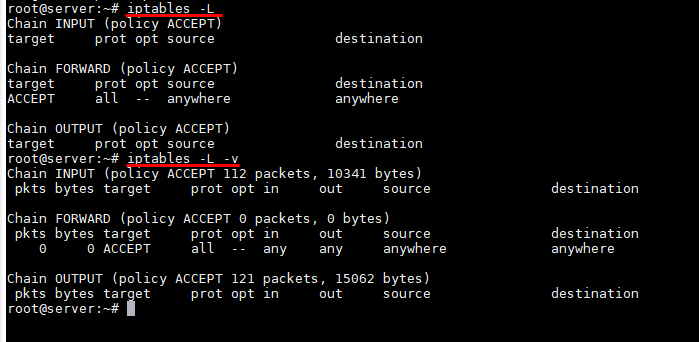
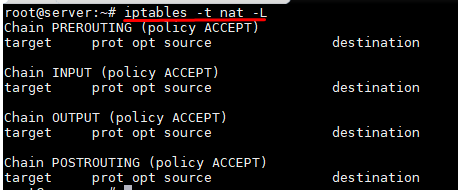
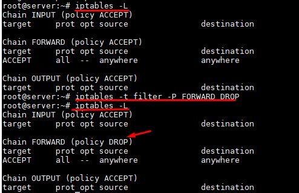
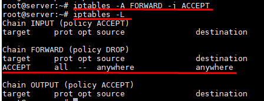
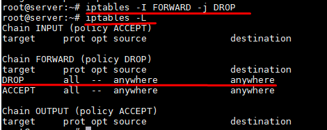
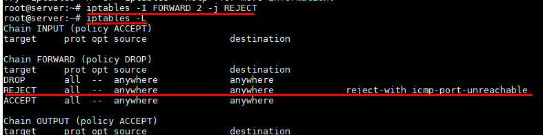
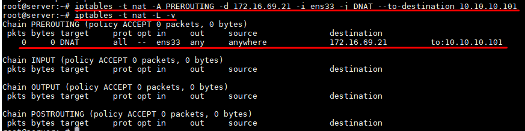

# Một số câu lệnh hay dùng


# MỤC LỤC


\- Sử dụng câu lệnh iptables yêu cầu quyền root.  
\- Liệt kê các rule của table filter  
```
iptables -L
# or
iptables -L -v
```



- target: Thể hiện giá trị của target bao gồm các giá trị: ACCEPT, DROP, REJECT, RETURN, LOG ...
- prot: Quy định protocol của rule được match với rule. Chúng bao gồm các protocol có trong /etc/protocols.
- opt: Ít khi được sử dụng, nó mô tả các tùy chọn có liên quan đến IP
- in: Chỉ ra interface input
- out: Chỉ ra interface đầu ra 
- source: Chỉ ra một địa chỉ IP nguồn của packet
- destination: Chỉ ra một địa chỉ IP đích của packet

\- Liệt kê các rule của table nat  
```
iptables -t nat -L
```



\- Đặt policy (hay rule mặc định) của chain FORWARD table FILTER là DROP  
```
iptables -t filter -P FORWARD DROP
```




- Thêm rule vào cuối chain FORWARD table FILTER  
```
iptables -A FORWARD -j ACCEPT
```



\- Thêm rule vào đầu chain FORWARD table FILTER  
```
iptables -I FORWARD -j DROP
```



\- Thêm rule làm rule thứ 2 trong chain FORWARD table FILTER  
```
iptables -I FORWARD 2 -j REJECT
```



\- Thực hiên nat địa chỉ IP nguồn 10.10.10.0/24 sang IP 172.16.69.21  
```
iptables -t nat -A POSTROUTING -s 10.10.10.0/24 -j SNAT --to-source 172.16.69.21
```

hoặc  
```
iptables -t nat -A POSTROUTING -s 10.10.10.0/24 -o ens33 -j SNAT --to-source 172.16.69.21
```

(interface ens33 có địa chỉ IP là 172.16.69.21)

\- Thực hiên nat địa chỉ IP đích 172.16.69.21 sang IP 10.10.10.101  
```
iptables -t nat -A PREROUTING -d 172.16.69.21 -i ens33 -j DNAT --to-destination 10.10.10.101
```




