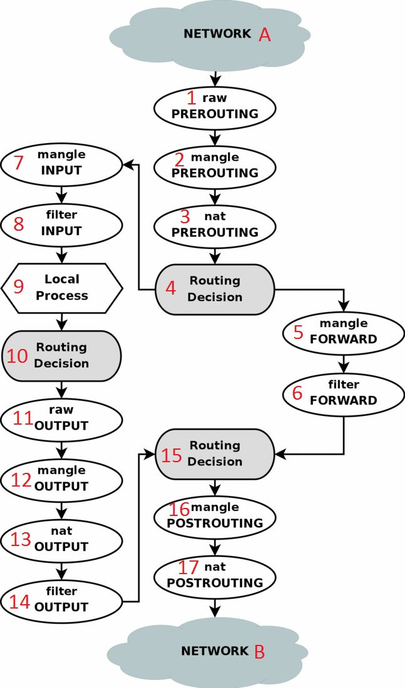
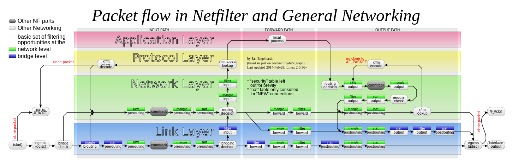

# Packet flow
- [1.Packet flow bản đơn giản](#1)
- [2.Packet flow bản chi tiết](#2)

# 1.Packet flow bản đơn giản

**1) Nếu gói tin đi từ ngoài đến**  
Đầu tiên gói tin từ mạng A đi vào hệ thống firewall sẽ phải đi qua table **Mangle** với chain là **PREROUTING** (với mục đích để thay đổi một số thông tin của gói tin trước khi đưa qua quyết định dẫn đường) sau đó gói tin đến table **NAT** với với chain **PREROUTING** tại đây địa chỉ đích của gói tin có thể bị thay đổi hoặc không, qua bộ **Routing** và sẽ quyết định xem gói tin đó thuộc firewall hay không:  
- **TH1**: gói tin đó là của firewall: gói tin sẽ đi qua table **Mangle** và đến table **Filter** với chain là **INPUT**. Tại đây gói tin sẽ được áp dụng **rule** và ứng với mỗi rule cụ thể sẽ được áp dụng với **target**. Sau đó đến **Local Prcoess** (chính là ứng dụng, VD: chương trình server/client).
- **TH2**: gói tin không phải của firewall sẽ được đưa đến table **Mangle** với chain **FORWARD** đến bảng filter với chain FORWARD. Đây là chain được sử dụng rất nhiều để bảo vệ người sử dụng mang trong lan với người sử dụng internet các gói tin thỏa mãn các **rule** đặt ra mới có thể được chuyển qua giữa các card mạng với nhau, qua đó có nhiệm vụ thực hiện chính sách với người sử dụng nội bộ nhưng không cho vào internet, giới hạn thời gian,...và bảo vệ hệ thống máy chủ đối với người dung internet bên ngoài chống các kiểu tấn công. Sau khi đi qua card mạng, gói tin phải đi lần lượt qua table **Mangle** và **NAT** với chain **POSTROUTING** để thực hiên việc chuyển đổi địa chỉ nguồn với target **SNAT** & **MASQUERADE**.  

**2) Nếu gói tin đi là của Firewall đi ra**  
\- Gói tin xuất phát từ **Local Prcoess** (chính là ứng dụng, VD: chương trình server/client). **Routing decision** được sử dụng, địa chỉ nguồn cần sử dụng, giao diện đi ra là gì, và những thông tin khác cần thu thập.  
\- Sau đó là quá trình xử lý gói tin sẽ đi đến table **Mangle** tiếp đến là table **NAT** với chain **OUTPUT** và table **FILTER** với chain **OUTPUT** được áp dụng một số rule.  
\- Sau đó đi lần lượt qua các table **Mangle** với chain **POSTROUTING** cuối cùng đi đến table **NAT** với chain **POSTROUTING** để thay đổi địa chỉ nguồn nếu cần thiết.  

# 2.Packet flow bản chi tiết

