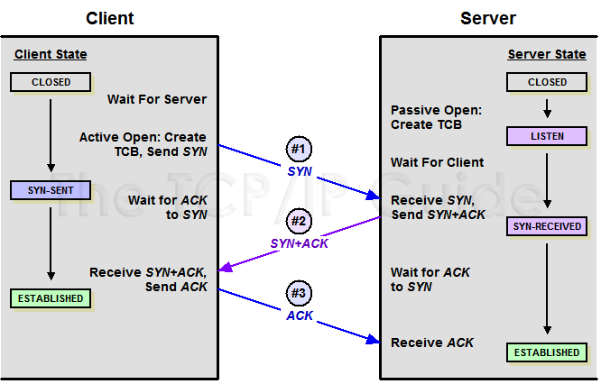
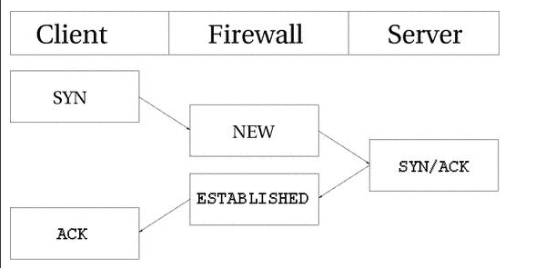
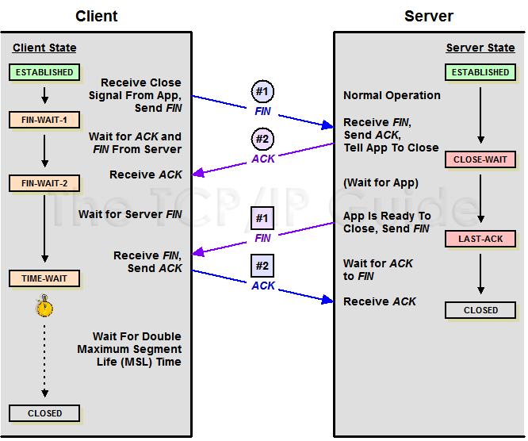
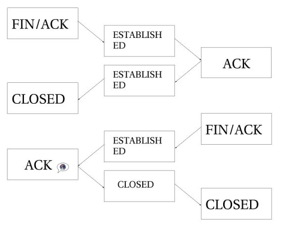
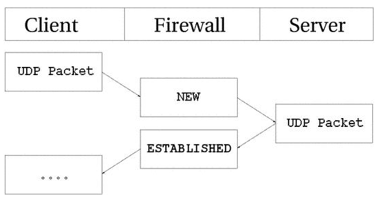
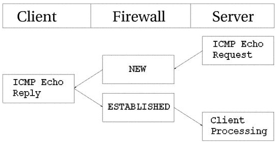
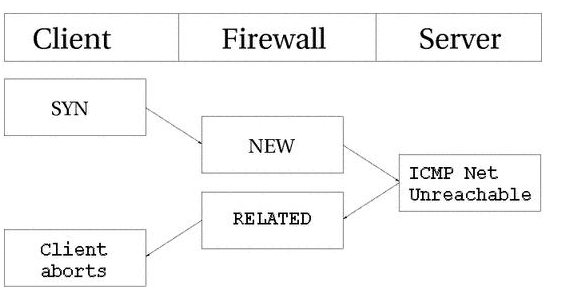
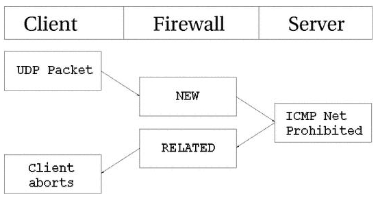
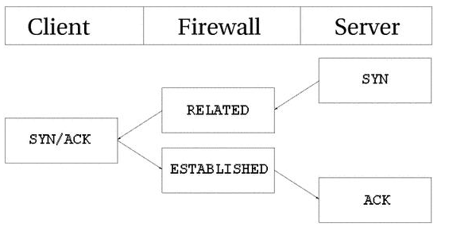
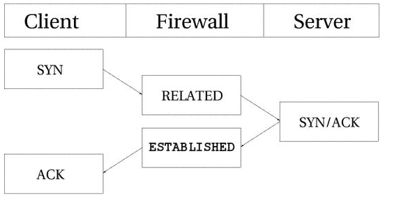

# State machine

# MỤC LỤC
- [1.Giới thiệu](#1)
- [2.Conntrack entries](#2)
- [3.User-land states](#3)
- [4.TCP connections](#4)
- [5.UDP connections](#5)
- [6.ICMP connections](#6)
- [7.Default connections](#7)
- [8.Complex protocols và connection tracking](#8)


<a name="1"></a>
# 1.Giới thiệu
\- State machine là 1 phần đặc biệt trong iptables, thực sự được gọi là connection tracking machine. Theo dõi kết nối được hoàn thành để cho Netfilter framework biết trạng thái của kết nối cụ thể. Firewall thực hiện điều này được gọi là stateful firewalls. Stateful firewall thường an toàn hơn nhiều so với non-stateful firewall vì nó cho phép chúng ta viết nhiều rules chặt chẽ hơn.  
\- Với iptables, packet có thể liên quan đến theo dõi kết nối trong bốn trạng thái khác nhau là: **NEW**, **ESTABLISHED**, **RELATED** và **INVALID**.  
\- Tất cả theo dõi kết nối được thực hiện với bởi framework đặc biệt với kernal được gọi là **conntrack**. conntrack có thể được tải như module, hoặc như 1 phần của kernel. Các modules này nắm lấy thông tin cụ thể, duy nhất từ packet, để theo dõi từng luồng dữ liệu cụ thể. Thông tin mà tập hợp conntrack sau đó được sử dụng để nói với conntrack stream ở trạng thái nào.
VD: UDP streams thường được xác định duy nhất bởi địa chỉ IP đích, địa chỉ IP nguồn, port đích và port nguồn.  
\- Trong các kernel trước, chúng ta có thể bật tắt tính năng chống phân mảnh (defragmentation). Tuy nhiên, từ khi iptables và Netfilter được giới tiệu và connection tracking là 1 phần của chúng, tùy chọn này đã bị loại bỏ. Lý do của việc này là connection trackng không thể làm việc với việc tính năng chống phân mảnh các gói dữ liệu bị tắt. Do đó, tính năng chống phân mảnh đã được kết hợp với conntrack và được bật 1 cách tự động. Nó không thể tắt, trừ khi chúng ta tắt theo dõi kết nối.  
\- Tất cả theo dõi kết nối được xử lý trong chain PREROUTING, ngoại trừ các gói được tạo ra từ local được xử lý trong chain OUTPUT.  
- Nếu bạn gửi 1 packet ban đầu trong stream, state của packet sẽ được thiết lập **NEW** với chain **OUTPUT**, và khi chúng ta nhận được packet trả về, state của packet được thay đổi trong chain **PREROUTING** là **ESTABLISHED**.
- Nếu packet không phải do chính server tạo ra, state **NEW** sẽ được thiết lập bởi chain **PREROUTING**.

<a name="2"></a>
# 2.Conntrack entries
\- Chúng ta có thể đọc conntrack entry trong file `/proc/net/ip_conntrack`, file này chứa danh sách tất cả các mục hiện tại trong cơ sở dữ liệu conntrack của bạn. Nếu bạn có module ip_conntrack được cài đặt, bạn có thể thấy file có `/proc/net/ip_conntrack` nội dung như sau:  
```
tcp      6 117 SYN_SENT src=192.168.1.6 dst=192.168.1.9 sport=32775 \
     dport=22 [UNREPLIED] src=192.168.1.9 dst=192.168.1.6 sport=22 \
     dport=32775 use=2
```

Ví dụ trên hiển thị tất cả thông tin của module conntack duy trì trạng thái 1 kết nối cụ thể. Cấu trúc như sau:  
- **protocol**: tcp, udp, icmp, …
- **giá trị trong hệ thập phân của giao thức**: có thể xem trong file /etc/protocols trong Ubuntu 16.04.
- **Thời gian sống của mục conntrack**: ở đây là 117s và được giảm liên tục cho đến khi có nhiều lưu lượng trao đỗi trong kết nối. Sau khi có nhiều lưu lượng trao đổi, giá trị này sẽ được đặt về giá trị mặc định.
- **Trạng thái hiện tại của packet**: SYN_SENT cho biết kết nối chỉ thấy 1 packet TCP SYN theo 1 hướng.
- IP đích, IP nguồn, port nguồn và port đích.
- **[UNREPLIED]**: trạng thái của kết nối
- Tiếp theo là các giá trị đảo ngược của ip nguồn, ip đích, port nguồn và port đích.

\- Khi có không có trafin, conntrack entry sẽ là flag **[UNREPLIED]** , khi có traffic trao đổi ở 2 bên, conntrack sẽ thay thế flag **[UNREPLIED]** thành flag **[ASSURED]**.  
\- conntrack entry được lưu trong RAM , nên số entry phụ thuộc vào RAM của firewall. Ví dụ, 128 RAM sẽ cho 8192 entries và 256 MB RAM sẽ cho 16376 entries.  
\- (**Chú ý**: Trên hệ điều hành Ubuntu, từ Ubuntu 12.04, **conntrack** - command line interface cho netfilter connection tracking, thay thế giao diện cũ là `/proc/net/ip_conntrack` , tool này có thể được sử dụng để tìm kiếm, liệt kê, kiểm tra và duy trì theo dõi kết nối của Linux kernel. Sử dụng **conntrack**, bạn có thể liệt kê tất cả kết nối được theo dõi, xóa kết nối từ state tables và thêm mục mới trong state tales.)  

Cài đặt **conntrack**:  
```
# apt install conntack
```

<a name="3"></a>
# 3.User-land states
\- Có 4 trạng thái **NEW**, **ESTABLISHED**, **RELATED** và **INVAILD**. Bảng dưới đây giải thích về từng trạng thái có thể dùng:  

|State|Explanation|
|---|---|
|NEW|Trạng thái NEW cho biết packet là packet đầu tiên chúng ta nhìn thấy, điều này có nghĩa là packet đầu tiên mà module conntrack nhìn thấy, với kết nối cụ thể. VD: Nếu bạn nhìn thấy packet SYN và nó là packet đầu tiên trong kết nối, nó sẽ phù hợp. Tuy nhiên, packet này có  thể cũng không là 1 packet SYN và vẫn được xem là NEW.|
|ESTABLISHED|Trạng thái ESTABLISHED cho thấy lưu lượng truy cập ở 2 hai hướng. Yêu cầu duy nhất để có trạng thái ESTABLISHED là 1 host gửi 1 packet và nhận được 1 packet trả lời từ host khác.|
|RELATED|1 kết nối là RELATED khi nó liên quan đến 1 kết nối ESTABLISHED khác. Điều này có nghĩa là, 1 kết nối được coi là RELATED, trước hết chúng ta phải có kết nối được coi là ESTABLISHED. Some good examples of connections that can be considered as RELATED are the FTP-data connections that are considered RELATED to the FTP control port, and the DCC connections issued through IRC. This could be used to allow ICMP replies, FTP transfers and DCC's to work properly through the firewall. Do note that most TCP protocols and some UDP protocols that rely on this mechanism are quite complex and send connection information within the payload of the TCP or UDP data segments, and hence require special helper modules to be correctly understood.|
|INVALID|Trạng thái INVAILD nghĩa là packet không thể xác định hoặc không có trạng thái nào. Điều này có 1 vài lý do, chẳng hạn như hệ thống hết memory hoặc thông báo lỗi ICMP không đáp ứng với bất kỳ kết nối nào đã biết.|

<a name="4"></a>
# 4.TCP connections
\- 1 kết nối TCP bắt đầu với 3 bước handshake.  


\- Như bạn xem hình dưới , conntrack theo dõi tất cả các kết nối. Khi gửi 1 packet (SYN), nó định nghĩa kết nối là NEW. Khi nhận được 1 packet (SYN/ACK). nó định nghĩa kết nối là ESTABLISHED. Bạn có thể cho phép các packet NEW và ESTABLISHED rời khỏi mạng local của bạn, chỉ cho phép kết nối ESTABLISHED quay trở lại, nó sẽ hoạt động hoàn hảo.  


Chúng ta có xem sự thay đổi trạng thái trong bảng bằng cách thực thi câu lệnh:  
```
# conntrack -L
tcp      6 117 SYN_SENT src=192.168.1.5 dst=192.168.1.35 sport=1031 \
     dport=23 [UNREPLIED] src=192.168.1.35 dst=192.168.1.5 sport=23 \
     dport=1031 use=1
```

Như bạn thấy từ bảng trên, packet SYN được gửi (flag SYN_SENT được thiết lập), và chưa có trả lời được gửi (với flag [UNREPLIED]). Trạng thái tiếp theo sẽ đạt được khi chúng ta thấy 1 packet trả lời:  
```
tcp      6 57 SYN_RECV src=192.168.1.5 dst=192.168.1.35 sport=1031 \
     dport=23 src=192.168.1.35 dst=192.168.1.5 sport=23 dport=1031 \
     use=1
```

Bây giờ, chúng ta nhận được phản hồi SYN/ACK. Ngay khi packet này được nhận, trạng thái được thay đổi 1 lần nữa (ESTABLISHED) , cũng giống như flag [UNREPLIED].  
```
tcp      6 431999 ESTABLISHED src=192.168.1.5 dst=192.168.1.35 \
     sport=1031 dport=23 src=192.168.1.35 dst=192.168.1.5 \
     sport=23 dport=1031 use=1
```

Sau 1 vài packet nữa được gửi, kết nối sẽ thay đổi trạng thái là [ASSURED].  
\- Khi 1 kết nối TCP được đóng, nó được thực hiện theo cách sau:  




Như bạn đã nhìn thấy, kết nối sẽ không bao giờ được đóng cho đến khi ACK cuối cùng được gửi. Lưu ý rằng hình ảnh này chỉ mô tả cách thức kết nối được đóng bình thường. Kết nối cũng có thể đực đóng bằng cách gửi RST(reset), nếu kết nối bị từ chối. Trong trường hợp này, kết nối được đóng sau 1 thời gian định trước.  
\- Khi kết nối TCP được đóng, kết nối sẽ có trạng thái là TIME_WAIT, mặc định được thiết lập là 2 phút. Điều này được sử dụng để tất cả các gói dữ liệu bị mắc kẹt trong các bộ định tuyến tắc nghẽn khác vẫn có thể truy cập vào firewall hoặc đến đầu kia của kết nối.  
\- Nếu kết nối được thiết lập lại bởi packet RST, trạng thái được thay đổi là CLOSE. Điều này có nghĩa là kết nối mỗi lần mặc định là 10s trước khi toàn bộ kết nối chắc chắn đóng lại.  
\- Dưới đây là danh sách các trạng thái của luồng TCP:  

|State|Timeout value|
|---|---|
|NONE|30 minutes|
|ESTABLISHED|5 days|
|SYN_SENT|2 minutes|
|SYN_RECV|60 seconds|
|FIN_WAIT|2 minutes|
|TIME_WAIT|2 minutes|
|CLOSE|10 seconds|
|CLOSE_WAIT|12 hours|
|LAST_ACK|30 seconds|
|LISTEN|2 minutes|

Các giá trị này có thể được thay đổi với các phiên bản kernel khác nhau, và chúng cũng có thể thay đổi thông qua file-system `/proc/sys/net/netfilter/*` .  
>Note:  
Phía User-land của state machine không nhìn vào TCP flag trong TCP packets. Điều này nói chung là không tốt.

<a name="5"></a>
# 5.UDP connections 
\- UDP connection không phải loại kết nối stateful, mà là kết nối stateless. Có một số lý do tại sao, chủ yếu là vì chúng không thiết lập kết nối hoặc đóng kết nối, hầu hết chúng điều thiết trình tự. Nhận 2 UDP datagrams theo trật tự không nói nên bất cứ điều gì về thứ tự mà chúng được gửi.  Tuy nhiên, vẫn có thể thiết lập trạng thái trên kết nối với kernel.  
\- Xem xét hoạt động theo dõi kết nối:  


Như bạn nhìn thấy, kết nối được đưa ra hầu như giống kết nối TCP. Đó là cái nhìn từ user-land, còn trong thông tin conntrack có vẻ hơi khác một chút, nhưng bản chất là như nhau. Trước hết, chúng ta hãy nhìn vào mục nhập sau khi gói tin UDP ban đầu được gửi.  
```
udp      17 20 src=192.168.1.2 dst=192.168.1.5 sport=137 dport=1025 \
     [UNREPLIED] src=192.168.1.5 dst=192.168.1.2 sport=1025 \
     dport=137 use=1
```

Như bạn nhìn thấy từ giá trị đầu và giá trị thứ 2, đây là packet UDP. Đầu tiên, là tên giao thức, và thứ 2 là số của giao thức. Giá trị thứ 3 cho biết thời gian (s) tồn tại của entry này. Sau đó, là địa chỉ IP nguồn, IP đích, port nguồn, port đích. Tại thời điển này, flag [UNREPLIED] cho chúng ta biết rằng không có trả lời nào với packet. Cuối cùng, chúng ta có 1 danh sách ngắn về sự mong đợi cho các packet trở lại. Chú ý, entry thứ 2 này theo thứ tự ngược lại so với entry đầu tiên.  
```
udp      17 170 src=192.168.1.2 dst=192.168.1.5 sport=137 \
     dport=1025 src=192.168.1.5 dst=192.168.1.2 sport=1025 \
     dport=137 use=1
```

Tại thời điểm này, server đã thấy trả lời cho packet đầu tiên được gửi và kết nối bây giờ được coi là **ESTABLISHED**. Điều này không hiển thị trong theo dõi kết nối như bạn thây. Sự khác biệt chính là flag [UNREPLIED] đã biến mất. Hơn nữa, thời gian timeout mặc định đã được thay đổi là 180s, nhưng trong ví dụ này đã giảm xuống còn 170s. Để có được flag [ASSURED] được đặt trong theo dõi kết nối, phải có 1 lưu lượng nhỏ truyền trên kết nối đó.  
```
udp      17 175 src=192.168.1.5 dst=195.22.79.2 sport=1025 \
     dport=53 src=195.22.79.2 dst=192.168.1.5 sport=53 \
     dport=1025 [ASSURED] use=1
```

Nếu kết nối không được sử dụng trong 180s, nó sẽ hết thời gian.  

<a name="6"></a>
# 6.ICMP connections
\- ICMP packet được sử dụng để kiểm tra các host, và không bao giờ thiết lập bất kỳ kết nối nào. Có 4 loại ICMP sẽ tạo ra packet trả lời, tuy nhiên có 2 trạng thái khác nhau. Các thông báo ICMP có thể có trạng thái NEW hoặc ESTABLISHED. Các loại ICMP mà chúng ta đang nói đến là Echo request và reply.  
\-  


\- Như bạn có thể nhìn thấy, host gửi 1 echo request đến target, được xem như là NEW bởi firewall. Target trả lời với echo reply mà firewall xem như là trạng thái **ESTABLISHED**. Khi echo request đầu tiên được gửi, entry sau đi vào ip_conntrack.  
```
icmp     1 25 src=192.168.1.6 dst=192.168.1.10 type=8 code=0 \
     id=33029 [UNREPLIED] src=192.168.1.10 dst=192.168.1.6 \
     type=0 code=0 id=33029 use=1
```

Entry có vẻ hơi khác so với trạng thái chuẩn TCP và UDP như bạn thấy. Chúng ta thấy 3 trường được gọi là **type**, **code** và **id**. Trường id chứa code ICMP. Mỗi packet ICMP nhận được 1 ID được đặt vào nó khi gửi và nhận thông báo ICMP, và khi bên nhận được thông báo ICMP, sẽ cũng sẽ đặt cùng 1 ID với thông báo ICMP mới để bên gửi có thể nhận reply và có thể kết nối với đúng yêu cầu ICMP.  
\- Trường kế tiếp, là flag [UNREPLIED] cho chúng ta biết rằng chỉ thấy lưu lượng truy cập theo 1 hướng. Cuối cùng, chúng ta sẽ thấy kỳ vọng nhận được packet ICMP reply.  
\- Packet reply được coi là **ESTABLISHED**. Tuy nhiên, chúng ta có thể biết chắc chắn rằng sau khi trả lời ICMP sẽ không có lưu lượng truy cập hợp pháp hoàn toàn trong cùng 1 kết nối. Vì lý do này, entry theo dõi kết nối bị hủy khi reply đã đi qua các cấu trúc Netfilter.  
\- Trong mỗi trường hợp trên, request được coi là **NEW**, reply được coi là **ESTABLISH**. Khi firewall gửi packet request, nó được coi là **NEW**, khi host gửi nhận được packet reply cho request, nó được coi là **ESTABLISHED**.  
\- ICMP request mặc định timeout là 30s, bạn có thay đổi trong file `/proc/sys/net/netfilter/nf_conntrack_icmp_timeout` .  
\- Nếu gửi request tới server ở trạng thái ICMP  Host unreachable hoặc ICMP Network unreachable thì packet ICMP reply nhận được được coi là packet **RELATED**.  


Trong ví dụ trên, chúng ta gửi packet SYN đến địa chỉ cụ thể. Đây được coi là kết nối **NEW** bởi firewall. Tuy nhiên, network mà packet đang cố gắng truy cập là không thể truy cập được, do đó, router trả về lỗi ICMP  network unreachable. Mã theo dõi kết nối có thể nhận là packet **RELATED**.  


Lần này packet UDP được gửi đến host. Kết nối UDP được coi là **NEW**. Tuy nhiên, mạng bị cấm bởi firewall hoặc router trên đường đi. Firewall của chúng tôi nhận được bản tin trả về ICMP Network Prohibited. Firewall biết rằng thông báo ICMP error có thể liên quan đến kết nối UDP đã được mở và gửi packet **RELATED** đến client. Tại thời điểm này, firewall hủy mục theo dõi kết nối.  

<a name="7"></a>
# 7.Default connections
Tham khảo:  
http://www.faqs.org/docs/iptables/defaultconnections.html  

<a name="8"></a>
# 8.Complex protocols và connection tracking
\- 1 số giao thức phức tạp hơn các giao thức khác. Điều này có ý nghĩa khi theo dõi kết nối, các giao thức này khó theo dõi hơn. VD điển hình như các giao thức ICQ, IRC và FTP. Mỗi giao thức mạng thông tin trong data payload của packets, và do đó, nó đòi hỏi trợ giúp để theo dõi kết nối đặc biệt để nó có thể hoạt động chính xác.  
\- VD như giao thức FTP. Giao thức FTP đầu tiên mở ra 1 kết nối duy nhất được gọi là FTP control session. Khi chúng ta sử dụng câu lệnh thông qua session, các ports sẽ được mở để truyền phần còn lại của dữ liệu liên quan đến câu lệnh cụ thể. Những kết nối này có thể được thực hiện theo 2 cách, chủ động hoặc thụ động.  
\- Khi kết nối được thực hiện tích cực, FTP client gửi server port và địa chỉ IP để nối. Sau đó, FTP client sẽ mở port và server kết nối đến port được chỉ định từ port 20 của chính nó (gọi là FTP-Data) và gửi dữ liệu qua nó.  
Vấn đề ở dây là firewall sẽ không biết về các kết nối bổ sung, vì chúng được thương lượng trong payload thực tết của dữ liệu giao thức. Bởi vì điều này, firewall sẽ không biết rằng nó nên để server kết nối đến client thông qua các port được chỉ định.  
Giải pháp cho vấn đề này là thêm hepler đặc biệt vào connection tracking module, module này sẽ quét qua data trong control connection cho các cú pháp và thông tin cụ thể. Khi nó chạy vào đúng thông tin, nó sẽ thêm thông tin cụ thể như RELATED và server sẽ có thể theo dõi kết nối, nhờ vào entry RELATED. Xem hình ảnh sau để hiểu trạng thái của FTP server đã thực hiện các kết nối quay lại đến client.  


\- Khi FTP kết nối theo cách thụ động, FTP client nói với server rằng nó muốn một số data cụ thể, server sẽ trả lời địa chỉ IP và port được mở để kết nối. Sau khi nhận được dữ liệu này, client sẽ kết nối đến port cụ thể, từ port 20 của chính nó (FTP-data port), và lấy dữ liệu đề cập đến. Nếu bạn có 1 FTP server phía sau firewall, bạn sẽ yêu cầu thêm modules này vào các modules iptables tiêu chuẩn để cho phép các clients trên Internet kết nối đến FTP server đúng cách. Điều tương tự cũng xảy ra nếu bạn muốn hạn chế người dùng và chỉ muốn cho phép họ truy cập các HTTP và FTP server trên Internet và chặn tất cả các ports khác. Xem xét hình sau đây:  


\- 1 số conntrack helpers đã có trong kernel. Cụ thể hơn, giao thức FTP và IRC có conntack helpers  
\- Trên Ubuntu Server 16.04, bạn có thể load module conntrack ftp bằng lệnh:  
```
modprobe ip_conntrack_ftp
```


