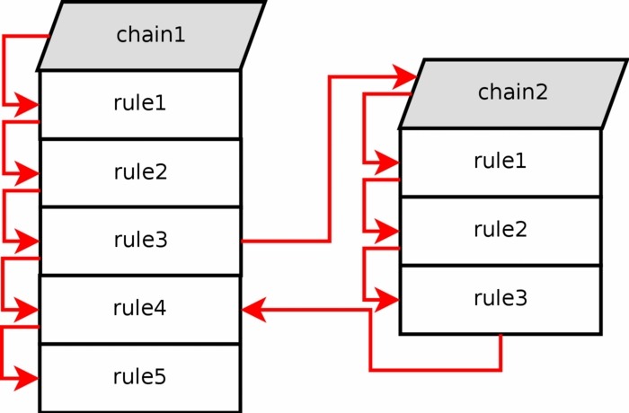

# Subchain

# MỤC LỤC
- [1.Lý thuyết](#1)
- [2.Một số câu lệnh hay dùng](#2)


<a name="1"></a>
# 1.Lý thuyết
\- Nếu packet đi qua chain (vd: chain **INPUT**) trong table **filter**, chúng ta có thể chỉ định rule jump đến chain khác trong cùng table. Chain mới phải được người sử dụng xác định, nó có thể không phải chain được xây dựng như **INPUT** hoặc **FORWARD**.  


\- Như ví dụ trên: Packet phù hợp với rule số 3 của chain 1, thực hiện nhảy từ rule số 3 đến chain 2. Packet phù hợp với rule 3 trong chain 2 và nhảy tới tới rule 4 của chain 1.  


<a name="2"></a>
# 2.Một số câu lệnh hay dùng
\- Tạo subchain mới (http) trong table filter:  
```
iptables -t filter -N http
```

\- Nhảy tên chain http:  
```
iptables -t filter -A -p tcp --dport 80 -j http
```

\- Xóa subchain http được tạo ở trên:  
```
iptables -t filter -X http
```


