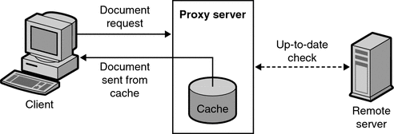
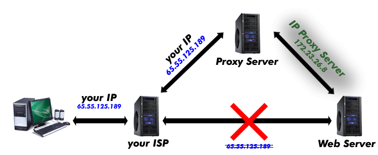
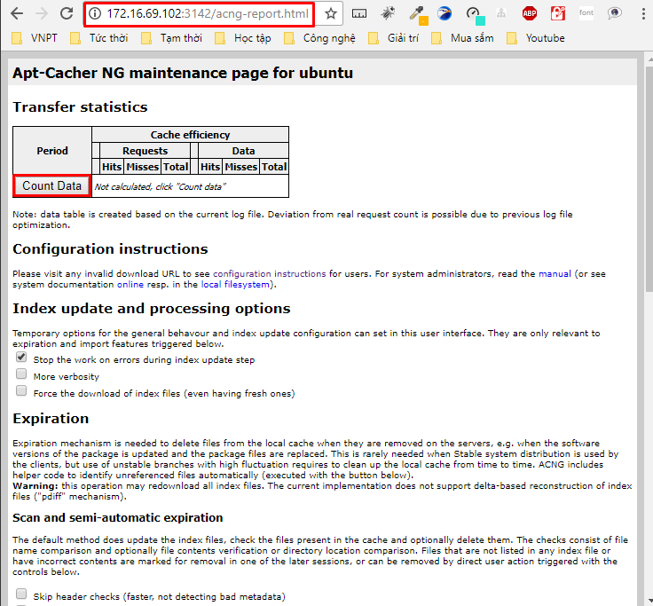
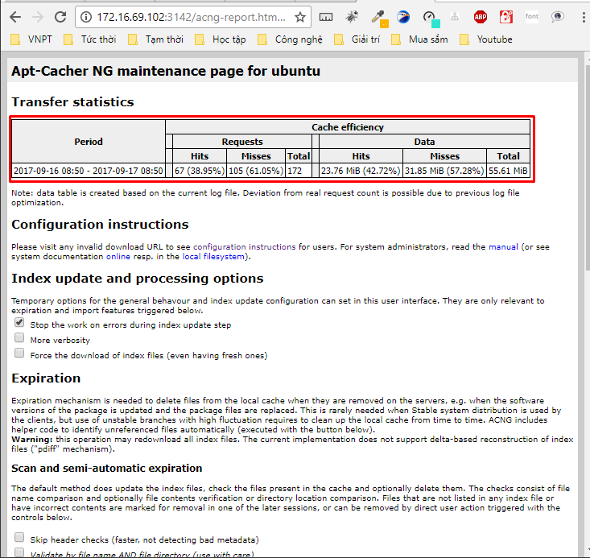
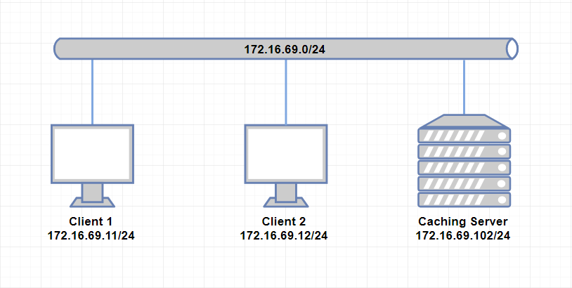
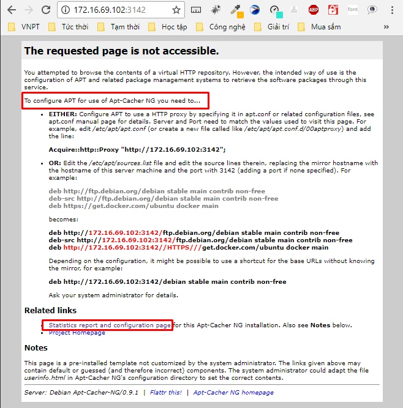
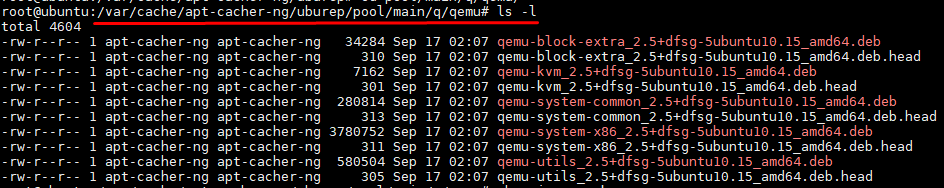

# Caching proxy


# MỤC LỤC


<a name="1"></a>
# 1.Proxy server
<a name="1.1"></a>
## 1.1.Giới thiệu
\- Proxy server là server (hệ thống máy tính hoặc ứng dụng) trung gian cho các yêu cầu từ clients tìm kiếm tài nguyên từ 1 số servers khác. 1 client kết nối đến proxy server, yêu cầu 1 vài dịch vụ như file, web page, etc từ các server khác nhau và proxy server sẽ đánh giá yêu cầu như 1 cách đơn giản hóa và kiểm soát độ phức tạp của nó.  
\- Ngày nay, hầu hết các proxy là **web proxy**, tạo điều kiện truy cập nội dung trên World Wide Web, cung cấp ẩn dung và có thể được sử dụng để vượt chặn địa chỉ IP.  


<a name="1.2"></a>
## 1.2.Nguyên tắc hoạt động của Proxy Server
Proxy server xác định những yêu cầu từ phía client và quyết định đáp ứng hay không đáp ứng, nếu yêu cầu được đáp ứng, proxy server sẽ kết nối tới server thật thay cho client và tiếp tục chuyển tiếp đến những yêu cầu từ client đến server, cũng như đáp ứng những yêu cầu của server đến client.  


<a name="1.3"></a>
## 1.3.Các loại proxy server
\- Proxy server có thể đặt tại user’s local computer hoặc ở các điểm khác nhau giữa user’s computer và server đích trên Internet.  
- Proxy server chuyển các requests và responses mà không sửa đổi được gọi là gateway hoặc đôi khi gọi là "tunneling proxy".
- Forward proxy là Internal-facing proxy được sử dụng để lấy từ dữ liệu từ nguồn tài nguyên rộng lớn (trong bất cứ nơi nào trên Internet).
- Reverse proxy thường là Internal-facing proxy được sử dụng như 1 front-end để kiểm soát và bảo vệ truy cập đến server trên private network.  
Reverse proxy cũng thường được sử dụng để làm nhiệm vụ như load-balancing, authentication, decryption hoặc caching.  

\- Ngoài cách phân loại trên, chúng ta có thể phân loại để hiểu dễ hơn như sau:  
- **Caching proxy server**  



Caching proxy server cải thiện tốc độ yêu cầu dịch vụ bằng cách tải nội dung được lưu trữ từ yêu cầu trước đó của cùng 1 client hoặc thậm chí là các client khác nhau. Caching proxy giữ các local copy các tài nguyên thường được yêu cầu, cho phép các tổ chức giảm đáng kể việc sử dụng băng thông của họ, đồng thời tăng đáng kể hiệu suất.  

- **Web proxy**  


Proxy nhắm đến mục tiêu World Wide Web được gọi là Web proxy.  
Web Proxy Server như là Web Cache.  
- **Anonymous Proxy Server**  



Anonymous Proxy Server dùng để ẩn danh khi lướt Web.  
- Ngoài ra còn 1 số loại proxy server khác, tham khảo:  https://viettelidc.com.vn/tim-hieu-ve-proxy-va-cac-loai-proxy.html 

<a name="2"></a>
# 2.Caching Proxy Server
<a name="2.1"></a>
## 2.1.Giới thiệu caching proxy server


Caching proxy server cải thiện tốc độ yêu cầu dịch vụ bằng cách tải nội dung được lưu trữ từ yêu cầu trước đó của cùng 1 client hoặc thậm chí là các client khác nhau. Caching proxy giữ các local copy các tài nguyên thường được yêu cầu, cho phép các tổ chức giảm đáng kể việc sử dụng băng thông của họ, đồng thời tăng đáng kể hiệu suất.  

<a name="2.2"></a>
## 2.2.Apt-Cacher-NG
\- **Apt-Cacher-NG** là phần mềm cho caching proxy được sử dụng trên hệ thông Unix/Linux. Server Apt-Cacher-NG lắng nghe trên port **3142**.  

<a name="2.3"></a>
## 2.3.Cài đặt và cấu hình Apt-Cacher-NG trên Ubuntu 16.04
<a name="2.3.a"></a>
### a.Trên Server  
\- Cài `apt-cacher-ng` bằng cách thực hiện câu lệnh sau:  
```
sudo apt-get install apt-cacher-ng
```

\- Cấu hình trong file `/etc/apt-cacher-ng/acng.conf` (nếu dòng đó đã được comment thì xóa bỏ dấu "#" để uncomment)  
- Cấu hình thư mục lưu trữ pachage dpkg:  
```
CacheDir: /var/cache/apt-cacher-ng
```

- Lắng nghe trên tất các địa chỉ IP:  
```
# BindAddress: localhost 192.168.7.254 publicNameOnMainInterface
BindAddress: 0.0.0.0
```

- Lắng nghe trên port 3142, nếu cần thay đổi port chúng ta thay đổi tại đây:  
```
Port:3142
```

- Định nghĩa các bản phân phối như Ubuntu, Debian, etc, tất cả cần được cached.  
```
Remap-debrep: file:deb_mirror*.gz /debian ; file:backends_debian # Debian Archives
Remap-uburep: file:ubuntu_mirrors /ubuntu ; file:backends_ubuntu # Ubuntu Archives
Remap-cygwin: file:cygwin_mirrors /cygwin # ; file:backends_cygwin # incomplete, please create this file or specify preferred mirrors here
Remap-sfnet:  file:sfnet_mirrors # ; file:backends_sfnet # incomplete, please create this file or specify preferred mirrors here
Remap-alxrep: file:archlx_mirrors /archlinux # ; file:backend_archlx # Arch Linux
Remap-fedora: file:fedora_mirrors # Fedora Linux
Remap-epel:   file:epel_mirrors # Fedora EPEL
Remap-slrep:  file:sl_mirrors # Scientific Linux
Remap-gentoo: file:gentoo_mirrors.gz /gentoo ; file:backends_gentoo # Gentoo Archives
```

- Nếu cần biên bản báo cáo về `apt-cache` trong web interface, chúng ta cần enable dòng sau:  
```
ReportPage: acng-report.html
```

- Enable log (File log này ghi lại thông tin các package được cached lại trong server)  
```
LogDir: /var/log/apt-cacher-ng
```

- Để có thêm nhiều thông tin về "log", ta uncommnet dòng sau đây:  
```
VerboseLog: 1
```

Chúng ta có thể thiết lập về “0” để chỉ ghi log về type, time, size của packages.  

- Để chạy service apt-cacher-ng, ta enable file pid:  
```
PidFile: /var/run/apt-cacher-ng/pid
```

- Enable xóa bỏ các files không được hỗ trợ:  
```
ExTreshold: 4
```

- Sau khi cấu hình xong, restart service `apt-cacher-ng`.  
```
systemctl restart apt-cacher-ng
```

\- Thử truy cập page báo cáo của apt-cacher-ng với giao diện web sử dụng URL sau:  
```
<server_IP_address>:3142
```







Hình trên show thông tin về dung lượng package được cached lại trên Server, thông số lấy từ file log `/var/log/apt-cacher-ng/apt-cacher.log` .  

<a name="2.3.b"></a>
### b.Trên Client
Có 2 cách để client sử dụng caching proxy:  
- **Cách 1**  
Tạo file `00aptproxy` trong thư mục `/etc/apt/apt.conf.d` và ghi nội dung sau vào:  
```
Acquire::http::Proxy "http://<IP_address>:3142";
```


- **Cách 2**  
Sửa file `/etc/apt/sources.list` và sửa các dòng source, thay thế mirror hostname với hostname của caching server và port 3142. Ví dụ:  
```
deb http://ftp.debian.org/debian stable main contrib non-free
deb-src http://ftp.debian.org/debian stable main contrib non-free
deb https://get.docker.com/ubuntu docker main
```

trở thành:  
```
deb http://172.16.69.102:3142/ftp.debian.org/debian stable main contrib non-free
deb-src http://172.16.69.102:3142/ftp.debian.org/debian stable main contrib non-free
deb http://172.16.69.102:3142//HTTPS///get.docker.com/ubuntu docker main
```

Tùy thuộc vào cấu hình, có thể sử dụng shortcut cho URLs không có mirror, ví dụ:  
```
deb http://172.16.69.102:3142/debian stable main contrib non-free
```

<a name="3"></a>
# 3.LAB về Caching Proxy Server
<a name="3.1"></a>
## 3.1.Mô hình



\- Mục tiêu bài lab: Kiểm tra khả năng tăng tốc độ cài package khi sử dụng Caching Proxy Server.  
\- Mô hình:  
- Client 1, Client 2 và Server đều cài hệ điều hành Ubuntu Server 16.04.
- Caching Server được cấu hình thành Caching Proxy Server.

\- Kiểm tra: Thử cài gói qemu-kvm trên Client 1. Sau đó cài gói qemu-kvm trên Client xem có nhanh hơn không?

<a name="3.2"></a>
## 3.2.Cài đặt và cấu hình
<a name="3.2.a"></a>
### a.Trên Caching Server
\- Cài `apt-cacher-ng` bằng cách thực hiện câu lệnh sau:  
```
sudo apt-get install apt-cacher-ng
```

\- Cấu hình trong file `/etc/apt-cacher-ng/acng.conf` (nếu dòng đó đã được comment thì xóa bỏ dấu "#" để uncomment)  
- Cấu hình thư mục lưu trữ pachage dpkg:  
```
CacheDir: /var/cache/apt-cacher-ng
```

- Lắng nghe trên tất các địa chỉ IP:  
```
# BindAddress: localhost 192.168.7.254 publicNameOnMainInterface
BindAddress: 0.0.0.0
```

- Lắng nghe trên port 3142, nếu cần thay đổi port chúng ta thay đổi tại đây:  
```
Port:3142
```

- Định nghĩa các bản phân phối như Ubuntu, Debian, etc, tất cả cần được cached.  
```
Remap-debrep: file:deb_mirror*.gz /debian ; file:backends_debian # Debian Archives
Remap-uburep: file:ubuntu_mirrors /ubuntu ; file:backends_ubuntu # Ubuntu Archives
Remap-cygwin: file:cygwin_mirrors /cygwin # ; file:backends_cygwin # incomplete, please create this file or specify preferred mirrors here
Remap-sfnet:  file:sfnet_mirrors # ; file:backends_sfnet # incomplete, please create this file or specify preferred mirrors here
Remap-alxrep: file:archlx_mirrors /archlinux # ; file:backend_archlx # Arch Linux
Remap-fedora: file:fedora_mirrors # Fedora Linux
Remap-epel:   file:epel_mirrors # Fedora EPEL
Remap-slrep:  file:sl_mirrors # Scientific Linux
Remap-gentoo: file:gentoo_mirrors.gz /gentoo ; file:backends_gentoo # Gentoo Archives
```

- Nếu cần biên bản báo cáo về `apt-cache` trong web interface, chúng ta cần enable dòng sau:  
```
ReportPage: acng-report.html
```

- Enable log (File log này ghi lại thông tin các package được cached lại trong server)  
```
LogDir: /var/log/apt-cacher-ng
```

- Để có thêm nhiều thông tin về "log", ta uncommnet dòng sau đây:  
```
VerboseLog: 1
```

Chúng ta có thể thiết lập về “0” để chỉ ghi log về type, time, size của packages.  

- Để chạy service apt-cacher-ng, ta enable file pid:  
```
PidFile: /var/run/apt-cacher-ng/pid
```

- Enable xóa bỏ các files không được hỗ trợ:  
```
ExTreshold: 4
```

- Sau khi cấu hình xong, restart service `apt-cacher-ng`.  
```
systemctl restart apt-cacher-ng
```

\- Thử truy cập page báo cáo của apt-cacher-ng với giao diện web sử dụng URL sau:  
```
172.16.69.102:3142
```



<a name="3.2.b"></a>
### b.Trên Client 1 và Client 2
\- Tạo file `00aptproxy` trong thư mục `/etc/apt/apt.conf.d` và ghi nội dung sau vào:  
```
Acquire::http::Proxy "http://172.16.69.102:3142";
```


<a name="3.3"></a>
## 3.3.Kiểm tra
\- Cài đặt gói qemu-kvm trên Client 1:  
```
# apt-get install qemu-kvm
```

\- Sau khi cài đặt hoàn tất, kiểm tra thư mục cached trên Caching Server, ta thấy gói `qemu-kvm` đã được lưu vào Caching Server.  


- Thử cài gói `qemu-kvm` trên Client 2, ta thấy nhanh hơn hẳn!  
Vậy sử dụng Caching Server làm tăng hiệu suất cài gói phần mềm trên các client.  

<a name="tailieuthamkhao"></a>
# Tài liệu tham khảo
https://en.wikipedia.org/wiki/Proxy_server  
https://viettelidc.com.vn/tim-hieu-ve-proxy-va-cac-loai-proxy.html  
https://github.com/hocchudong/thuctap012017/blob/master/TamNT/Tim_hieu_apt-cacher-ng.md  
https://www.unix-ag.uni-kl.de/~bloch/acng/html/index.html  
https://www.tecmint.com/apt-cache-server-in-ubuntu/  


