# DAS - NAS - SAN và iSCSI protocol


# MỤC LỤC
- [1.DAS](#1)
- [2.NAS](#2)
- [3.SAN](#3)
	- [3.1.Tổng quan](#3.1)
	- [3.2.iSCSI protocol](#3.2)
	- [3.3.LAB iSCSI protocol](#3.3)
		- [3.3.1.Tổng quan](#3.3.1)
		- [3.3.2.Thực hành](#3.3.2)
			- [a.Trên iSCSI Target](#a)
			- [b.Trên iSCSI Initiator](#b)
- [4.So sánh NAS và SAN](#4)
- [Tài liệu tham khảo](#tailieuthamkhao)

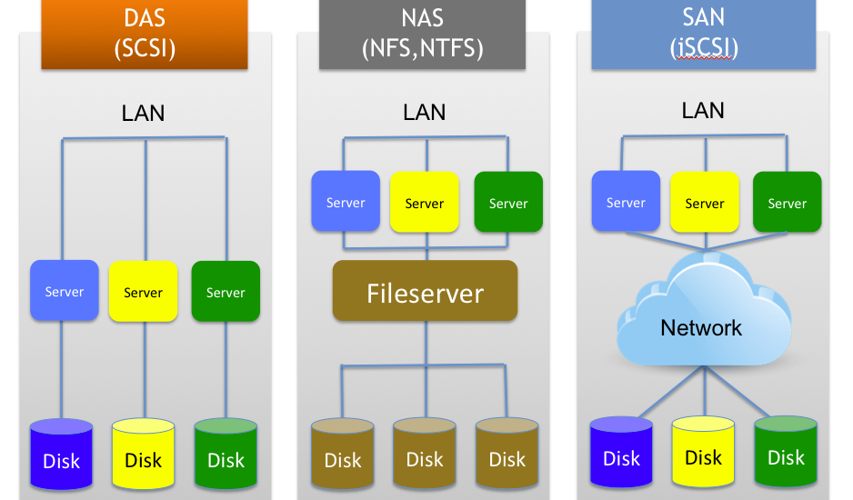

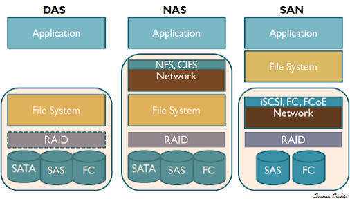

<a name="1"></a>
# 1.DAS
\- Direct-attached storage (DAS) là kỹ thuật lưu trữ được attach trực tiếp với computer truy cập vào nó.   
\- Hệ thống DAS điển hình được làm bằng thiết bị lưu trữ dữ liệu ( ví dụ: một things chứa các hard disk drives) kết nối trực tiếp đến computer thông qua host bus adapter (HBA). Giữa 2 điểm này không tồn tại network device (như hub, switch hoặc router).  
\- Ví dụ: DAS bao gồm: hard drives, solid-state drives, optical disc drives, and storage on external drives.  
\- Giao thức chính được dụng cho DAS để kết nối là ATA, SATA, SCSI, USB, USB 3.0, Fibre Channel.  

<a name="2"></a>
# 2.NAS
<a name="2.1"></a>
## 2.1.Tổng quan về NAS
\- NAS (Network-attached storage) là kỹ thuật lưu trữ dữ liệu dạng file-level thông qua kết nối mạng.  
\- Một đơn vị NAS là 1 computer được kết nối network cung cấp dịch vụ lưu trữ dữ liệu dựa trên file đến 1 thiết bị khác trên network.  
\- Hệ thống NAS chứa 1 hoặc nhiều hard disk drives, thường được sawxp xếp hợp lý thành các kho lưu trữ dự phòng hoặc RAID.  
\- NAS sử dụng giao thức dựa trên file như NFS (phổ biến trên hệ thống UNIX), SMB/CIFS (Server Message Block/Common Internet File System) ( được sử dụng trên hệ thống MS Windows), AFP ( được sử dụng trên Apple Macintosh computers), hoặc NCP ( được sử dụng với OES và Novell NetWare)  

<a name="2.2"></a>
## 2.2.NFS protocol
<a name="2.2.1"></a>
### 2.2.1.Giới thiệu
\- Network File System (NFS) là giao thức distributed file system được phát triển bởi Sun Microsystems vào năm 1984, cho phép người dùng trên máy client truy cập files thông qua mạng máy tính như lưu trữ local.  
\- NFS xây dựng trên hệ thống Open Network Computing Remote Procedure Call (ONC RPC).  
\- Cho đến nay, NFS đã có 4 phiên bản:  
- NFSv1: phát hành năm 1984 với mục đích thí nghiệm
- NFSv2: phát hành năm 1989, được đưa ra thị trường. Ban đầu chỉ sử dụng giao thức UDP. Về sau một số nhà cung cấp đã thêm hỗ trợ NFSv2 với TCP.
- NFSv3: phát hành năm 1995 với nhiều cải tiến như hỗ trợ file 64bit, xử lý các file > 2GB. Sun Microsystems bổ dung hỗ trợ TCP vào NFSv3. Sử dụng TCP như 1 phương tiện vận tải để sử dụng NFS qua mạng WAN khả thi hơn.
- NFSv4 năm 2000, version 4.1 năm 2010 và version 4.2 năm 2016

\- Từ Linux kernel 2.6.0 trở đi, Linux hỗ trợ cả 4 version NFS.  
\- NFS hoạt động theo mô hình client/server. Một server đóng vai trò storage system, cho phép nhiều client kết nối tới để sử dụng dịch vụ.  
\- Client và Server sử dụng RPC (Remote Procedure Call) để giao tiếp với nhau.  
\- NFS sử dụng cổng 2049.  
\- Cho phép bạn quản lý không gian lưu trữ ở một nơi khác và ghi vào không gian lưu trữ này từ nhiều clients.  
\- NFS cung cấp một cách tương đối nhanh chóng và dễ dàng để truy cập vào các hệ thống từ xa qua mạng và hoạt động tốt trong các tình huống mà các tài nguyên chia sẻ sẽ được truy cập thường xuyên.  
\- Dung lượng file mà NFS cho phép client truy cập lớn hơn 2GB.  

<a name="2.2.2"></a>
### 2.2.2.Lab
<a name="2.2.2.1"></a>
#### 2.2.2.1.Mô hình
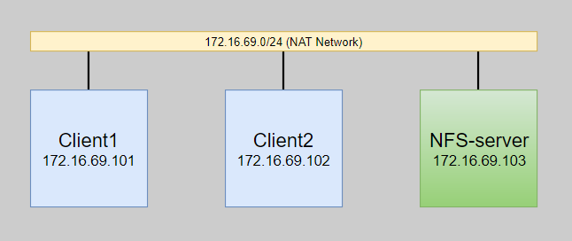

\- Client1, Client2 và NFS-server đều cài hệ điều hành Ubuntu Server 16.04.  
\- Client1: có 2 user là root và client1.  
\- Client2: có 2 user là root và client2.  
\- NFS-server: có 2 user là root và wind.  

<a name="2.2.2.2"></a>
##### 2.2.2.2.Cài đặt và cấu hình
##### a.Trên NFS-server
\- Cài đặt phần mềm `nfs-kernel-server` :  
```
# apt-get update -y
# apt-get install nfs-kernel-server -y
```

\- Tạo thư mục chia sẻ.  
Superuser có thể làm bất kỳ điều gì trên hệ thống cảu họ. Tuy nhiên, thư mục NFS-mounted không phải là 1 phần hệ thống của họ, do đó, mặc định NFS server từ chối thực hiện các thao tác yêu cầu quyền ưu tiên của superuser.  Hạn chế này có nghĩa là superusers trên client không thể ghi files có chủ sở hữu như user root.  
Tuy nhiên, có những user đáng tin cậy trên client, những user này cần có khả năng làm những việc trên hệ thống files được mounted mà không phải truy cập superuser trên NFS server. NFS server  có thể được cấu hình để cho phép điều này.  
- Tạo thư mục general  
```
# mkdir /var/nfs/general -p
```

Thư mục `/var/nfs` và `/var/nfs/general` sẽ có quyền sở hữu là `root:root`.  
NFS sẽ tự động chuyển hoạt động của root user trên client đến user và group `nobody:nogroup` để bảo mật. Vì vậy ta cần thay đổi quyền sở hữu của thư mục `/var/nfs/general` :  
```
# chown nobody:nogroup /var/nfs/general
```

\- Cấu hình NFS exports. Mở file `/etc/exports` và sửa với quyền `root`:  
```
/var/nfs/general    172.16.69.101(rw,sync,no_subtree_check)
/var/nfs/general    172.16.69.102(rw,sync,no_subtree_check)
/home       172.16.69.101(rw,sync,no_root_squash,no_subtree_check)
/home       172.16.69.102(rw,sync,no_root_squash,no_subtree_check)
```

- `rw`: Tùy chọn cho phép client cả 2 quyền đọc và ghi.
- `sync`: Tùy chọn này bắt buộc phải ghi các tahy đổi vào disk trước ghi reply. Điều này dẫn đến môi trường ổn định hơn và nhất quán vì ns phản ánh tình trạng thức tế của remote volume. Tuy nhiên, nó cũng làm giàm tốc độ của hoạt động file.
- `no_subtree_check`: Tùy chọn ngăn việc kiểm tra subtree, đó là tiến trình mà NFS server phải kiếm tra xem liệu tệp đó có thực sự vẫn còn trong exported tree cho mọi request hay không. Điều này gây ra nhiều vấn đề khi file được đổi tên trong khi client đã mở nó. Trong hầu hết mọi trường hợp, ta nên disable kiểm tra subtree.
- `no_root_squash`: Mặc định, NFS chuyển yêu cầu từ root user remotely đến non-privileged user trên server. Điều này được dự định như tính năng bảo mật để ngăn chặn root user trên client để sử dụng file system của NFS server như root. no_root_squash disable hành vi.

\- Sau khi kết thay thay đổi, restart service `nfs-kernel-server`.  
```
# systemctl restart nfs-kernel-server
```

##### b.Trên Client1
\- Cài phần mềm nfs-common:  
```
# apt-get update -y
# apt-get install nfs-common -y
```

\- Tạo 2 thư mục:  
```
# mkdir -p /nfs/general
# mkdir -p /nfs/home
```

\- Mount thư mục:  
```
sudo mount 172.16.69.103:/var/nfs/general /nfs/general
sudo mount 172.16.69.103:/home /nfs/home
```

Sau khi mount, quyền sở hữu thư mục bị thay đổi:  
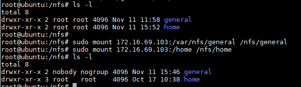

Viết vào file `/etc/fstab` với quyền `root`:  
```
[...]
172.16.69.103:/var/nfs/general    /nfs/general   nfs auto,nofail,noatime,nolock,intr,tcp,actimeo=1800 0 0
172.16.69.103:/home       /nfs/home      nfs auto,nofail,noatime,nolock,intr,tcp,actimeo=1800 0 0
```

\- Kiểm tra:  
```
# df -h
```

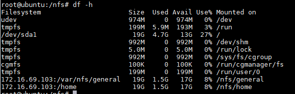

\- Kiểm tra quyền truy cập NFS  
- VD1: Tạo file `/nfs/general/test.txt` :  
```
# touch /nfs/general/test.txt
```

Kiểm tra quyền:  
```
root@ubuntu:/nfs/general# ls -l test.txt
-rw-r--r-- 1 nobody nogroup 0 Nov 11 16:00 test.txt
```

Bởi mặc định, NFS chuyển root user thành `nobody:nogroup`.  

- VD2: Tạo file `/nfs/home/home.test`:  
```
# touch /nfs/home/home.test
```

Kiểm tra quyền:  
```
root@ubuntu:~# ls -l /nfs/home/home.test
-rw-r--r-- 1 root root 0 Nov 11 16:04 /nfs/home/home.test
```


##### c.Trên Client2
\- Cài phần mềm nfs-common:  
```
# apt-get update -y
# apt-get install nfs-common -y
```

\- Tạo 2 thư mục:  
```
# mkdir -p /nfs/general
# mkdir -p /nfs/home
```

\- Mount thư mục:  
```
sudo mount 172.16.69.103:/var/nfs/general /nfs/general
sudo mount 172.16.69.103:/home /nfs/home
```

Viết vào file `/etc/fstab` với quyền `root`:  
```
[...]
172.16.69.103:/var/nfs/general    /nfs/general   nfs auto,nofail,noatime,nolock,intr,tcp,actimeo=1800 0 0
172.16.69.103:/home       /nfs/home      nfs auto,nofail,noatime,nolock,intr,tcp,actimeo=1800 0 0
```

\- Kiểm tra:  
```
# df -h
```

<a name="2.2.2.3"></a>
### 2.2.2.3.Chú ý
Trong quá trình vận hành có thể xảy ra một số trường hợp sau:  
- Có 2 client đồng thời mount cùng một thư mục trên server: cả 2 đều có thể đồng thời chỉnh sửa cùng một file => hệ thống sẽ thông báo cho client sử dụng sau biết rằng có một client khác đang chỉnh sửa file. Nếu client này thực hiện sửa thì file sẽ lưu lại theo client nào thực hiện lưu cuối cùng.
- NFS server bị shutdown hoặc dịch vụ tắt. Client sẽ bị treo máy và chờ đến khi được kết nối trở lại. Việc kết nối được thực hiện ngầm, trong suốt với người dùng.


<a name="3"></a>
# 3.SAN
<a name="3.1"></a>
## 3.1.Tổng quan
\- SAN (Storage area network) là kỹ thuật lưu trữ dữ liệu dạng block-level thông qua kết nối mạng.  
\- SAN được sử dụng để tăng khả năng lưu trữ của thiết bị, như disk arrays, tape libraries, etc.  
\- SAN thường có mạng lưới lưu trữ riêng mà không thông qua mạng LAN với các thiết bị khác.  
\- SAN sử dụng các giao thức sau: Fibre Channel, iSCSI, ATA over Ethernet (AoE) and HyperSCSI.  

<a name="3.2"></a>
## 3.2.iSCSI protocol
\- iSCSI (Internet Small Computer  Systems Interface) là là giao thức Internet thuộc tầng application để lưu trữ thông qua Internet. Nó cung cấp truy cập block-level để truy cập thiết bị lưu trữ.  
\- iSCSI được sử dụng để truyền data qua LAN, WAN hoặc Internet.  
\- Một số khái niệm:  
- Initiator: là 1 iSCSI client.
- Target: là nơi chứa thiết bị lưu trữ data gọi – iSCSI server.

\- iSCSI sử dụng giao thức TCP (tiêu biểu là port 860 và 3260)  

<a name="3.3"></a>
## 3.3.LAB iSCSI protocol

<a name="3.3.1"></a>
### 3.3.1.Tổng quan
\- Mô hình:  

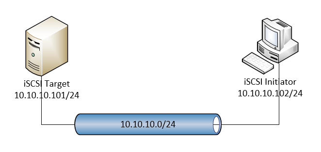

\- Trong đó:  
- iSCSI Initiator: là Client sử dụng giao thức iSCSI để giao tiếp và sử dụng thiết bị lưu trữ bên Target.
- iSCSI Target: là Server chứa thiết bị lưu trữ và được truy cập bởi client.
- 2 máy đều cài hệ điều hành Ubuntu Server 16.04

\- Cài đặt:  
- iSCSI Initiator : Dùng gói “open-iscsi”.  
  - File cấu hình trong thư mục /etc/iscsi gồm:  
    - iscsid.conf: File cấu hình cho iscsi daemon. Nó đọc để startup.
    - initiatorname.iscsi: Tên của initator, daemon reds at the startup.
    - nodes directory: Thư mục chứa nodes và targets của họ.
    - send_targets directory: Thư mục chứa các targets được discovered.

open-iscsi được điều khiển bởi câu lệnh iscsiadm. Câu lệnh có thể discover các target, login/logout các target, display thông tin các session.

- iSCSI target: Dùng gói “iscsitarget”
  - File cấu hình bao gồm:  
    - Các file trong thư mục /etc/iet
    - File /etc/default/iscsitarget


<a name="3.3.2"></a>

### 3.3.2.Thực hành
<a name="a"></a>
#### a.Trên iSCSI Target
*) Cài package `iscisitarget`:  
```
apt-get install iscsitarget
```

*) Mở file `/etc/default/iscsitarget`:  
```
vi /etc/default/iscsitarget
```

và thiết lập:  
```
ISCSITARGET_ENABLE=true
```

*) Tiếp theo, ta cần tạo thiết bị lưu trữ, ta có thể sử dụng logical volume, image files, hard drive (/dev/sdb), hard drive partition (/dev/sdb1) hoặc RAID device (/dev/md0).  
Trong bài lab này, mình sử dụng image file:  
```
mkdir /storage
dd if=/dev/zero of=/storage/lun1.img bs=1024k count=1000
```

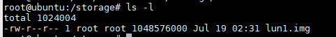


( Nếu bạn muốn dụng logical volume, bạn có thể tạo logical volume storage_lun1trong volume group vg0 như sau:  
```
lvcreate -L 1G -n storage_lun1 vg0
```

)

*) Tiếp theo chúng ta sửa trong file `/etc/iet/ietd.conf`:  
Comment tất cả các dòng trong file và thêm vào những dòng sau:  
```
Target iqn.2017-07.com.example:storage.lun1
        IncomingUser client 123
        OutgoingUser
        Lun 0 Path=/storage/lun1.img,Type=fileio
        Alias LUN1
        #MaxConnections  6
```

\- Trong đó tên của target (iSCSI naming) phải là unique và được định nghĩa như sau:  
RFC document có quy định về iSCSI names.iSCSI name gồm 2 phần: type string và unique name string.  
type string có 2 loại như sau:  
- iqn. : iscsi qualifiled name
- eui. : eui-64 bit identifier

Hầu hết đều sử dụng iqn format. Ví dụ về tên initiator của mình: iqn.2017-07.com.example:storage.lun1  
- iqn : sử dụng iSCSI qualified name adress.
- 2017-07: the year of the month on which the naming authority acquired the domain name which is used in the iSCSI name. 
- com.example: reversed dns name which defines the organizational naming authority.
- storage.lun1: String này ta đặt sao cho dễ nhớ với file image (hoặc logical volume) tương ứng

\- Dòng IncomingUser chứa username và password cung cấp cho initiators (client) để chỉ những username và password này có thể log in và sử dụng thiết bị lưu trữ, nếu bạn không cần authentication thì không cần chỉ định username và password trong dòng IncomingUser.  
\- Trong dòng Lun, ta phải chỉ định full path đến thiết bị lưu trữ (VD: /dev/vg0/storage_lun1, /storage/lun1.img, /dev/sdb, etc.).  

*) Ta chỉ định những initiator được phép truy cập vào thiết bị lưu trữ này (tên của thiết bị lưu trữ lúc này là `iqn.2017-07.com.example:storage.lun1`).  
Mở file `/etc/iet/initiators.allow` và comment out dòng `ALL ALL` , bởi vì nó đồng ý cho tất cả cac initiators kết nối đến tất cả các target. Tiếp đó, thêm dòng:  
```
iqn.2017-07.com.example:storage.lun1 172.16.69.102
```

Trong đó `172.16.69.102` là **IP của Initiator**.

\- Restart iSCSI target:  
```
service iscsitarget restart
```

<a name="b"></a>

#### b.Trên iSCSI Initiator

*) Cài package `open-iscsi`:  
```
apt-get install open-iscsi
```

*) Mở file `/etc/iscsi/iscsid.conf` và thiết lập:  
```
node.startup = automatic
```

*) Restart lại `open-iscsi`:  
```
service open-iscsi restart
```

*) Check xem những thiết bị lưu trữ nào Target có thể cung cấp:  
```
iscsiadm -m discovery -t st -p 172.16.69.101
```

trong đó `172.16.69.101` là **IP của iSCSI Target**.

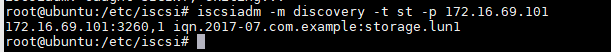

*) Xem các node đã khám phá được:  
```
iscsiadm –m node
```


*) Thiết lập về các thiết bị được lưu trữ trong thư mục `/etc/iscsi/nodes` .Trong bài lab này, nó được lưu trữ trong file `/etc/iscsi/nodes/iqn.2017-07.com.example:storage.lun1/172.16.69.101,3260,1/default` .  
Ta có sửa trong file default bằng cách thiết lập các dòng như sau:  
```
node.session.auth.authmethod = CHAP
node.session.auth.username = client
node.session.auth.password = 123
```

hoặc chúng ta có sửa file bằng câu lệnh:  
```
iscsiadm -m node --targetname "iqn.2017-07.com.example:storage.lun1" --portal "172.16.69.101:3260" --op=update --name node.session.auth.authmethod --value=CHAP
iscsiadm -m node --targetname "iqn.2017-07.com.example:storage.lun1" --portal "172.16.69.101:3260" --op=update --name node.session.auth.username --value=client
iscsiadm -m node --targetname "iqn.2017-07.com.example:storage.lun1" --portal "172.16.69.101:3260" --op=update --name node.session.auth.password --value=123
```

*) Login vào thiết bị:  
```
iscsiadm -m node --targetname "iqn.2017-07.com.example:storage.lun1" --portal "172.16.69.101:3260" --login
```

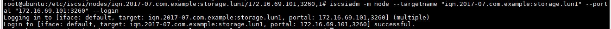

( Ta có thể logout:  
```
iscsiadm -m node --targetname "iqn.2017-07.com.example:storage.lun1" --portal "172.16.69.101:3260" --logout
```

)

*) Sau khi login thành công, ta kiểm tra ổ cứng mới có được:  

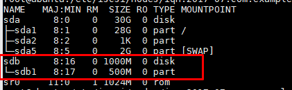

\- Do ở đây mình đã thiết lập phân vùng sdb1 từ trước.
\- Sau khi đã có ổ cứng, ta có thể tạo phân dùng, format phân vùng và mount để dùng bình thường.


<a name="4"></a>
# 4.So sánh NAS và SAN
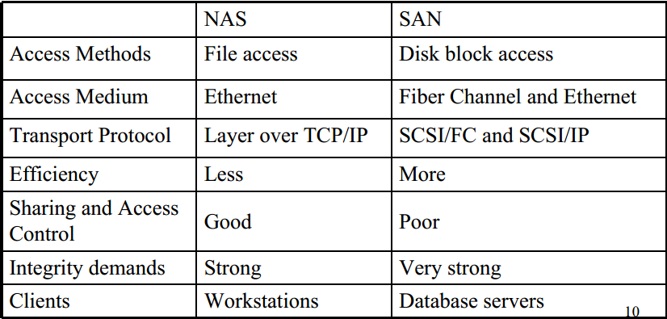


<a name="tailieuthamkhao"></a>
# Tài liệu tham khảo
https://en.wikipedia.org/wiki/Direct-attached_storage
https://en.wikipedia.org/wiki/Network-attached_storage
https://en.wikipedia.org/wiki/Storage_area_network
 https://en.wikipedia.org/wiki/ISCSI
https://www.howtoforge.com/iscsi_on_linux
https://www.howtoforge.com/using-iscsi-on-ubuntu-10.04-initiator-and-target
https://github.com/hocchudong/Ghichep-Storage/blob/master/TriMQ/Lab-iSCSI.md


