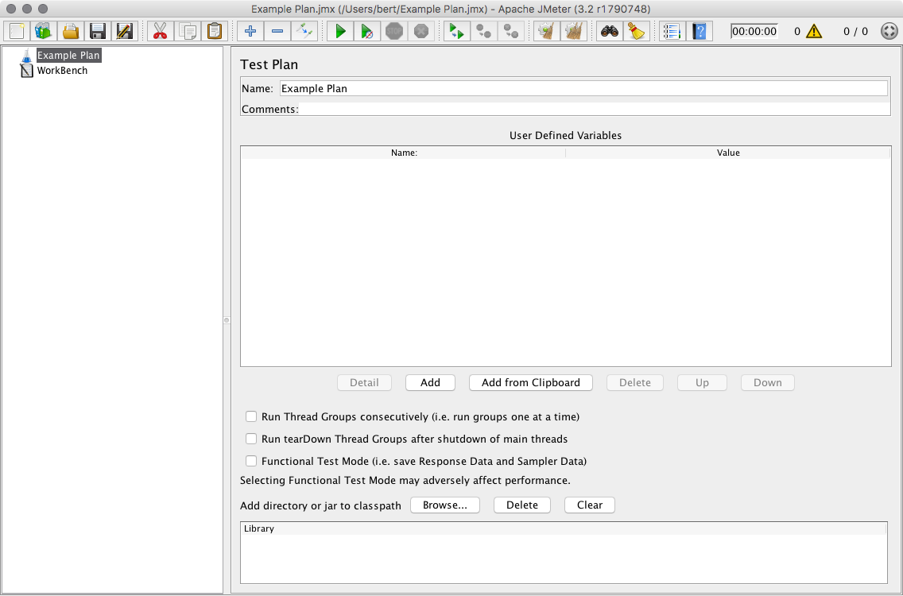
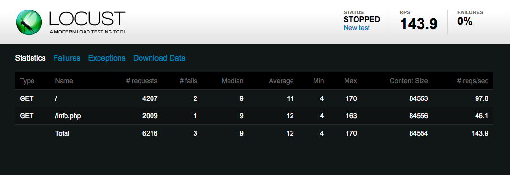

# Giới thiệu về Load Testing


# Giới thiệu
\- Web sites và ứng dụng web ngày càng có nhiều tính năng phong phú và phức tạp, vì vậy hiệu suất trở thành mối quan tâm lớn của các nhà phát triển và người sử dụng. Nghiên cứu cho thấy rằng các web site nhanh hơn thì có nhiều người dùng tham gia, bán hàng nhiều hơn, tăng lưu lượng truy cập và điều quan trọng cần chú là tốc độ phân phối web của bạn đến trình duyệt web của người dùng.  
\- Thuật ngữ chung cho lĩnh vực này gọi là **web performance optimization**, và trong vài năm qua đã có nhiều phương pháp hay về kỹ thật và công nghệ để cải thiện trải nghiệm web của người dùng. Các kỹ thuật này tập trung vào việc giảm kích thước tải xuống của các trang web, tối ưu hóa JavaScript, và giới hạn số lượng yêu cầu HTTP riêng lẻ mà trang cần.  
\- Trong bài viết này, tôi giới thiệu về khía cạnh khác của **web performance**: **tốc độ server đáp ứng yêu cầu của người dùng như thế nào?** Tôi xem xét về **loads testing**, thông qua 1 dự án để tìm số lượng tối đa yêu cầu mà server của bạn có thể đáp ứng và thảo luận về 1 số phần mềm **load testing** mã nguồn mở.  

# Bảng chú giải
**Một số thuật ngữ và khái niệm liên quan:**  
- **Latency** là thước đo tốc độ server đáp ứng các yêu cầu từ client. Thông thường được tính bằng milliseconds (ms), **latency** thường được gọi là **response time**. Con số thấp cho thấy thời gian đáp ứng nhanh. **Latency** được đo ở phía client, từ thời điểm yêu cầu được gửi đến khi nhận được phản hồi.
- **Throughput** là bao nhiêu yêu cầu server có thể xử lý được trong 1 khoảng thời gian cụ thể, thường được tính bằng số yêu cầu mỗi giây.
- **Percentiles** là cách để nhóm kết quả theo tỷ phần trăm của toàn bộ mẫu. Nếu thời gian đáp ứng 50% của bạn là 100ms, nghĩa là 50% yêu cầu đã được trả lại trong 100ms hoặc nhỏ hơn.Biểu đồ dưới đây cho thấy lý do tại sao nên xem các phép đo theo **percentiles**:  


\- Biểu đồ trên cho biết **latency** của web server trong 1 khoảng thời gian. Mặc dù thời gian đáp ứng trung bình khá phù hợp, nhưng có 1 sự tăng đột biến trong phân đoạn thứ 99. Điều này có nghĩa 1% yêu cầu của người dùng hoặc hơn thế nữa có độ trễ quá lớn, trong khu mức trung bình vẫn tương đối ổn. Vì lý do này, bạn nên xem xét **percentiles** để có cảm giác chính xác hơn về những gì mfa người dùng đang thực sự trải nghiệm.

# Cơ bản về Load Testing
\- Load testing là sự gửi lưu lượng truy cập HTTP mô phỏng đến server để đo hiệu suất và trả lời 1 số câu hỏi quan trọng, như:  
- Server có đủ tài nuyên (CPU, memory, etc) để xử lý hay không?
- Liệu server có đáp ứng nhanh chóng yêu cầu từ phía người dùng hay không?
- Ứng dụng của tôi có đang chạy hiệu quả hay không?
- Có lời gọi pages hoặc API nào đặc biệt về tài nguyên hay không?

\- **Load testing** được thực hiện bằng cách chạy phần mềm **load testing** chạy 1 máy (hoặc cụm máy) để tạo ra 1 lượng lớn yêu cầu đến web server trên máy thứ 2 (hoặc cơ sở hạ tầng phục vụ dịch vụ web phức tạp). Có rất nhiều công cụ có sẵn như vậy. Sau đây, chúng ta sẽ thảo luận về việc **load testing** theo các điều khoản phù hợp bất kể bạn chọn phần mềm nào.  
\- Việc sử dụng chung phần mềm **load testing** để tìm số lượng yêu cầu tối đa mỗi giây mà server có thể xử lý. Điều này được thực hiện bằng cách gửi càng nhiều yêu cầu đến server càng tốt và xem có bao nhiêu yêu cầu được đáp ứng.  
\- Điều này cho ta biết được dung lượng tối đa mà server có thể đáp ứng, nhưng nó không cung cấp cho chúng ta thông tin về **latency** và hiệu suất hàng ngày thực tế mà người dùng trải nghiệm. Server có phần cứng mạnh có thể trả về hàng ngàn yêu cầu mỗi giây, nhưng nếu phản hồi mất 10 giây, người dùng sẽ cảm thấy không vui.
\- Biểu đồ dưới đây cho thấy mối quan hệ giữa **throughput**(phản hồi/giây) và **latency**:  


Đây chỉ là ví dụ, tuy nhiên xu hướng chung là tải cao hơn (yêu cầu nhiều hơn / giây) dẫn đến độ trễ cao hơn. Để có được ý tưởng thực tế về đỗ trễ của máy chủ ở tải nhất nhất định, chúng ta cần phải thử nghiệm nhiều lần theo các mức giá yêu cầu khác nhau. Không phải tất cả các phần mềm **load testing** đều có khả năng này, nhưng sau này chúng ta sẽ thảo luận về công cụ kiểm tra tải `wrk2`, câu lệnh thực hiện chúc này này.  

>Mức độ trễ hợp lý là gì?
Mặc dù thời gian tải website trong 2-5 giây là phổ biến, phần thời gian do độ trễ của server thường là khaongr 50-200 mili giây. Điều gì phù hợp với bạn và trang web của bạn phụ thuộc và quá nhiều yếu tố (khách hàng, thị trường, mục đích cảu trang web, là trang web dành cho người dùng hoặc API service, etc.) để đưa ra 1 số mục tiêu cụ thể hơn, nhưng hãy nhớ hầu hết các nghiên cứu đều cho thấy rằng mọi tốc độ đếm bit đều được tính và thậm chí những cái tiến "imperceptible" sẽ mang lại những kết quả tốt hơn khi được xem xét tổng thể.  

# Kế hoạch load testing
Có 1 vài bược chung bạn có thể thực hiện để cảm nhận cách server và ứng dụng web của bạn đang hoạt động và đáp ứng tải. Trước tiên, chúng tôi sẽ đảm bảo rằng chugns tôi đang theo dõi các tài nguyên hệ thống  phù hợp trong quá trình **load testing**. Sau đó, chúng tôi sẽ tìm ra số yêu cầu tối đa mỗi giây mà server của chúng tôi có thể đáp uwgns. Cuối cùng, chúng tôi sẽ tìm ra thông lượng tối đa tại độ trễ của server mà dẫn đến hiệu suất không thể chấp nhận được cho người dùng.
## Bước 1: Giám sát tài nguyên
\- Phần mềm **load testing** của chúng tôi sẽ cung cấp cho chúng tôi thông tin về các yêu cầu và độ trễ, nó sẽ hữu ích khi theo dõi một số chỉ số hệ thống khác để xem máy chủ có bị hạn chế về tài nguyên khi đối phó với khối lượng lưu lượng truy cập cao.  
\- Chúng tôi chủ yếu quan tâm đến tải CPU và free memory: xem chúng dưới mức tải nặng sẽ giúp bạn đưa ra các quyết định sáng suốt hơn về cách mở rộng cơ sở hạ tầng và nơi cần tập trung nỗ lực khi phát triển ứng dụng của bạn.  
\- Nếu bạn đã thiết lập một hệ thống giám sát (như Prometheus hoặc Graphite và CollectD), bạn đã hoàn tất. Nếu không, đăng nhập vào máy chủ web của bạn thông qua SSH và sử dụng các công cụ dòng lệnh sau đây để theo dõi trong thời gian thực.
\- Để kiểm tra memory có sẵn, bạn có thể sử dụng lệnh `free`. Kết hợp nó với `watch` theo định kỳ (cứ mỗi hai giây theo mặc định) cập nhật đầu ra:  
```
watch free -h
```

Cờ `-h` cho phép lệnh `free` xuất ra các số theo định dạng con người có thể đọc được thay vì bytes:  
```
Output
             total       used       free     shared    buffers     cached
Mem:          489M       261M       228M       352K       7.5M       213M
-/+ buffers/cache:        39M       450M
Swap:           0B         0B         0B
```

Số được đánh dấu ở đầu ra ở đây thể hiện memory free sau khi trừ đi việc sử dụng buffer và cache. Phiên bản mới của lệnh `free` đã được thay đổi đầu ra:  
```
Output
              total        used        free      shared  buff/cache   available
Mem:           488M        182M         34M         14M        271M        260M
Swap:            0B          0B          0B
```

Cột mới `available` được tính toán hơi khác, nhưng nói chung đại diện cho cùng một số liệu: bỗ nhớ sẵn có hiện tại cho các ứng dụng sử dụng.

Để theo dỗi lượng CPU sử dụng bằng dòng lệnh `mpstat` là một tiện ích tốt cung cấp một cái nhìn cập nhật về lượng tài nguyên CPU còn lại, mpstat không được cài đặt mặc định trên Ubuntu. Bạn có thể cài đặt nó bằng dòng lệnh sau:  
```
$ sudo apt-get install sysstat
```

Khi bạn khởi động `mpstat` bạn cần chỉ ra số giây giữa các lần cập nhật:  
```
$ mpstat 2
```

Nó sẽ làm xuất ra một hàng tiêu đề, và sau đó là các hàng số liệu thống kê sau mỗi 2s:  
```
Output
Linux 4.4.0-66-generic (example-server)     08/21/2017  _x86_64_    (4 CPU)

08:06:26 PM  CPU    %usr   %nice    %sys %iowait    %irq   %soft  %steal  %guest  %gnice   %idle
08:06:28 PM  all    0.00    0.00    0.00    0.00    0.00    0.00    0.00    0.00    0.00  100.00
08:06:30 PM  all    0.00    0.00    0.00    0.00    0.00    0.00    0.00    0.00    0.00  100.00
```

`%idle` cho thấy **percentage** của CPU chưa được sử dụng. Nguyên nhân mà ta thấy `idle` thay vì bao nhiêu phần trăm được sử dụng là bởi vì sử dụng CPU thường được chia thành nhiều loại khác nhau như user CPU và system CPU.

Bây giờ chúng ta có thể quan sát tài nguyên máy chủ, hãy thử nghiệm kiểm tra tải để tìm ra được tỉ lệ đáp ứng tối đa của máy chủ.

## Bước 2: Tìm tỷ lệ đáp ứng tối đa
\- Như đã đề cập trước đây, hầu hết phần mềm **load testing** đặc biệt phù hợp với việc tìm ra tỷ lệ phản hồi tối đa của máy chủ web của bạn. Thông thường, các tùy chọn duy nhất bạn sẽ cần phải đặt là mong muốn đồng thời và thời gian thử nghiệm.  
\- Truy cập đồng thời là một thước đo của bao nhiêu kết nối song song được thực hiện cho máy chủ. 100 là lựa chọn mặc định an toàn cho việc này, nhưng bạn có thể thực hiện một sự lựa chọn hay hơn bằng cách kiểm tra `MaxClients`, `MaxThreads` của web server của bạn hoặc các cài đặt tương tự để xác định có bao nhiêu kết nối đồng thời có thể xử lý được.  
\- Ngoài việc thiết lập các tùy chọn đó, bạn cần phải chọn một URL để sử dụng cho bài kiểm tra. Nếu phần mềm của bạn chỉ có thể xử lý một URL mỗi lần, bạn nên thực hiện nhiều kiểm tra với một số URL khác nhau vì yêu cầu xử lý có thể khác nhau rất nhiều giữa - ví dụ: trang chủ và trang sản phẩm yêu cầu nhiều truy vấn cơ sở dữ liệu để tải.  
\- Ngoài ra, một số phần mềm kiểm tra tải cho phép bạn chỉ định nhiều URL để test cùng một lúc. Đây là một cách hay để mô phỏng chính xác hơn lưu lượng truy cập thực tế. Nếu bạn đã có dữ liệu hiện tại của trang web (từ phần mềm phân tích hoặc log của máy chủ), bạn có thể kết hợp chặt chẽ các URL thử nghiệm với các giá trị quan sát được.  
\- Khi bạn phân loại URL hoặc các URL để test, hãy chạy thử tải. Đảm bảo phần mềm của bạn đang gửi yêu cầu càng nhanh càng tốt. Nếu bạn đang sử dụng phần mềm yêu cầu bạn chọn tỉ lệ phát yêu cầu, hãy chọn một giá trị gần như chắc chắn là quá lớn. Nếu phần mềm của bạn có một sự trễ cấu hình giữa các yêu cầu, giảm nó xuống bằng 0.  
\-Bạn nên thấy lượng CPU và bộ nhớ đang tiêu thụ. Phần CPU idle có thể đạt tới 0% và máy client thử tải có thể nhận được kết nối lỗi khi máy chủ của bạn cố gắng đáp ứng tất cả các yêu cầu. Điều này là bình thường, vì chúng ta đẩy máy chủ tới giới hạn của nó.  
\- Khi quá hạn, phần mềm của bạn sẽ đưa ra một số thống kê, bao gồm số yêu cầu mỗi giây. Lưu ý: thời gian phản hồi: nó có thể rất tệ, vì máy chủ đã trở nên quá tải. Vì lý do này, số các yêu cầu trên mỗi giây không là một thứ để suy ra được thông lượng tối đa thực tế của máy chủ, nhưng đó cũng là một điểm khởi đầu tốt cho việc tìm hiểu thêm.  
\- Tiếp theo, chúng ta quay trở lại tải và kiểm tra lại tải một lần nữa để lấy thêm nhiều thông tin về cách mà máy chủ thực hiện khi nó bị đầy đến giới hạn tối đa của nó.  

## Bước 3: Tìm throughput tối đa
\- Bước này, chúng ta cần sử dụng phần mềm **load testing** có thể giảm tải để kiểm tra hiệu suất của server ở các cấp độ khác nhau. 1 số phần mềm kiểu này thực hiện việc này bằng cách cho phép bạn xác độ trễ giữa mỗi yêu cầu, nhưng điều này làm cho khó có thể đạt được mục tiêu là thông lượng chính xác.  
\- May mắn thay, `wrk2` cho phép bạn chỉ định 1 yêu cầu chính xác cho mỗi mục tiêu thứ 2. Nó thực hiện điều này bằng cách chạy 1 số yêu cầu hiệu chuẩn để có được thời gian của nó vừa phải.  
\- Lấy tỷ lệ yêu cầu tối đa của bạn từ bước trước và cắt giảm một nửa. Chạy thử nghiệm khác với tỷ lệ mới này và lưu ý thời gian phản hồi. Nó vẫn nằm trong phạm vi chấp nhận được không?  
\- Nếu có, tăng tỉ lệ theo hướng tối đa, kiểm tra cho đén khi độ trễ ở mức tối đa chấp nhận được. Đây là tỉ lệ phản hồi tối đa thực tế mà máy chủ của bạn có thẻ xử lý trước khi người dùng của bạn gặp phải sự cố.  
> Lưu ý: Như đã đề cập trong phần thuật ngữ, khi đo độ trễ bạn nên xem xét phần trăm thứ 99 hoặc thậm chí là phần trăm 99,999 để đảm bảo rằng tất cả người sử dụng được phục vụ trong thời gian đáp ứng chấp nhận được. Hãy nhớ rằng, hầu hết các trang web yêu cầu hàng chục yêu cầu tìm để load toàn bộ trang (bao gồm hình ảnh, JavaScripts, file CSS, ...) và hiển thị trang. Nếu trang web của bạn mất 10 yêu cầu để hoàn thành và bạn đang đo phần trăm thứ 99 thì khoảng 10% trang của bạn sẽ vẫn gặp một yêu cầu với độ trễ cao hơn.  

\- Tiếp theo, chúng ta sẽ xem xét một số gói phần mềm nguồn mở có sẵn để giúp chúng ta thực hiện kế hoạch kiểm thử tải.  

# Phần mềm Load Testing
\- Có rất nhiều gói phần mềm mã nguồn mở có sẵn cho việc **load testing**. Ngoài ra, có nhiều dịch vụ thương mại sẽ chạy cơ sở hạ tầng thử nghiệm tải cho bạn và tự động tạo các đồ thị và báo cáo từ dữ liệu thử nghiệm. Các dịch vụ này có thể là sự lựa chọn tốt cho các doanh nghiệp cần tạo ra một lượng lớn tải để kiểm tra cơ sở hạ tầng quy mô lớn, vì hầu hết trong số họ chạy các cụm máy chủ để tạo ra nhiều yêu cầu hơn là một máy chủ duy nhất có thể.  
\- Điều đó cho biết, một số công cụ mã nguồn mở cũng có khả năng chạy trong một chế độ cụm. Hãy đi qua một số công cụ mã nguồn mở phổ biến hơn và tóm tắt các tính năng của chúng:  

## ab
\- **ab** (còn được gọi là ApacheBench) là một công cụ dòng lệnh đơn giản, có một luồng để so sánh một HTTP server. Mặc dù nó đã được phân phối ban đầu như một phần của Apache HTTP Server, bạn có thể sử dụng ab để kiểm tra bất kỳ máy chủ HTTP hay HTTPS nào.  
\- Bởi vì nó là đơn luồng, **ab** không thể tận dụng lợi thế của bộ xử lý nhiều để gửi một khối lượng lớn các yêu cầu. Điều này có thể giới hạn nếu bạn đang cố gắng để hoàn toàn tải một web server mạnh mẽ.  
\- Một lời gọi cơ bản của lệnh `ab` giống như sau:  
```
ab -n 1000 -c 100 http://example.com/
```

Bạn chỉ định số yêu cầu (`-n`) và đồng thời (`-c`) và sau đó cung cấp cho nó một URL duy nhất để tìm nạp. Đầu ra - trích xuất dưới đây - chứa các yêu cầu mỗi giây, thời gian yêu cầu và một danh sách các phần trăm thời gian phản hồi khác nhau:  
```
Output
. . .
Requests per second:    734.76 [#/sec] (mean)
Time per request:       136.098 [ms] (mean)
Time per request:       1.361 [ms] (mean, across all concurrent requests)
Transfer rate:          60645.11 [Kbytes/sec] received

Percentage of the requests served within a certain time (ms)
  50%    133
  66%    135
  75%    137
  80%    139
  90%    145
  95%    149
  98%    150
  99%    151
 100%    189 (longest request)
 ```

 ## JMeter
\- JMeter là một ứng dụng **load testing** mạnh mẽ và giàu tính năng và ứng dụng từ Apache Software Foundation. Kiểm tra chức năng có nghĩa là JMeter cũng có thể kiểm tra để đảm bảo rằng trang web hoặc ứng dụng của bạn đang sản xuất đúng sản lượng.  
\- JMeter có một giao diện Java để thiết lập kế hoạch kiểm tra:  


\- Kế hoạch kiểm thử có thể được ghi lại bằng cách sử dụng Web proxy của JMeter và một trình duyệt thông thường. Điều này cho phép bạn kiểm tra với lưu lượng truy cập mô phỏng chặt chẽ hơn việc sử dụng trong thực tế.  
\- **JMeter** có thể xuất thông tin phần trăm dưới dạng HTML và các định dạng khác.

## Siege
\- **Siege** là một công cụ dòng lệnh để kiểm thử tải khác, tương tự như **ab** nhưng với một vài tính năng khác nhau. Siege là đa luồng, cho phép thông lượng tương đối cao. Nó cũng cho phép bạn cung cấp một danh sách các URL để được kiểm thử. Lời gọi cơ bản như sau:  
```
$ siege -c 100 -t 30s http://example.com/
```

Gọi 100 yêu cầu đồng thời (`-c 100`) và thử nghiệm trong 30s (`-t 30s`). **Siege** xuất ra thời gian đáp ứng trung bình và tỉ lệ yêu cầu:  
```
Output
. . .
Transactions:               5810 hits
Availability:             100.00 %
Elapsed time:              29.47 secs
Data transferred:         135.13 MB
Response time:              0.01 secs
Transaction rate:         197.15 trans/sec
Throughput:             4.59 MB/sec
Concurrency:                2.23
. . .
```

\- **Siege** không cung cấp sự phân tích phần trăm cho các thống kê độ trễ.

## Locust 
\- **Locust** là một công cụ kiểm tra tải dựa trên Python với giao diện web thời gian thực để theo dõi các kết quả:  


\- Bạn viết kịch bản thử **Locust** bằng mã Python, cho phép một số cấu hình mạnh mẽ thuận tiện cho những người đã quen với ngôn ngữ này.  
\- **Locust** cũng có thể chạy ở chế độ *distributed*, nơi bạn có thể chạy một cụm máy chủ **Locust** và cho phép chúng tạo ra tải theo một cách phối hợp. Điều này tạo điều kiện cho việc kiểm tra tải của cơ sở hạ tầng phục vụ web mạnh mẽ.  
\- **Locust** có thể cung cấp thống kê chi tiết và thông tin về phần trăm trong các files CSV tải xuống.  

## wrk2 
\- **wrk2** là một công cụ **load testing** bằng dòng lệnh đa luồng có khả năng sản xuất tải tại một tỷ lệ yêu cầu cụ thể. Nó có thể cung cấp số liệu thống kê độ trễ chi tiết và có thể là kịch bản với ngôn ngữ lập trình **Lua**.  
\- **wrk2** được gọi với lệnh `wrk` (nó là fork của wrk gốc):  
```
$ wrk -t4 -c100 -d30s -R100 --latency http://example.com/
```

Các tùy chọn trên chỉ định bốn luồng (`-t4`, bạn nên sử dụng số lõi bộ xử lý trên máy của bạn), 100 yêu cầu đồng thời (`-c100`), 30 giây thử nghiệm (`-d30s`) và tỷ lệ yêu cầu 100 yêu cầu mỗi giây (`-R100`). Cuối cùng, chúng tôi yêu cầu đầu ra độ trễ chi tiết với `--latency`:  
```
Output
. . .
Latency Distribution (HdrHistogram - Recorded Latency)
50.000%    5.79ms
75.000%    7.58ms
90.000%   10.19ms
99.000%   29.30ms
99.900%   30.69ms
99.990%   31.36ms
99.999%   31.36ms
100.000%   31.36ms
. . .
```

Đầu ra ở trên là một trích đoạn - thêm phần trăm độ trễ chi tiết cũng được đưa ra.  

## Kết luận 
\- Trong bài báo này, chúng tôi đã xem xét lại thuật ngữ **load testing** và các khái niệm cơ bản, thông qua một kế hoạch để tìm ra yêu cầu tối đa cho mỗi giây, các tài nguyên hệ thống quan sát thấy để hướng dẫn các quyết định tương lai về nỗ lực phát triển phần cứng và nhìn vào một số phần mềm **load testing**.  
\- Sau khi đo hiệu suất của cơ sở hạ tầng, bạn có thể muốn thực hiện các thông tin này để cố gắng cải thiện thời gian phản hồi và giảm tải của máy chủ. Bạn có thể muốn mở rộng phần cứng web server của mình lên hoặc ra với nhiều máy chủ và cân bằng tải. Bạn có thể cố gắng tinh chỉnh cấu hình web server để tối ưu hóa số lượng kết nối mà nó cho phép hoặc số lượng quy trình công việc hoặc chủ đề mà nó sử dụng. Bạn cũng có thể nhìn vào bộ nhớ đệm thường xuyên truy cập dữ liệu trong bộ nhớ, để giảm tải cơ sở dữ liệu và thời gian truy vấn.  
\- Bạn sẽ tìm thấy các chủ đề như trên và nhiều hơn nữa tại https://www.digitalocean.com/community/tags/server-optimization?type=tutorials.  

