# Linux Network Namespaces


# MỤC LỤC
- [1.Giới thiệu](#1)
	- [1.1. Linux Namespaces](#1.1)
	- [1.2.Linux Network Namespaces](#1.2)
- [2.Làm việc với network namespace](#2)
- [3.LAB](#3)
	- [3.1.veth pair](#3.1)
	- [3.2.Linux bridge và 2 veth pairs](#3.2)
	- [3.3.Openvswitch và 2 veth pairs](#3.3)
	- [3.4.Openvswitch và 2 openvswitch ports](#3.4)


<a name="1"></a>
# 1.Giới thiệu
<a name="1.1"></a>
## 1.1. Linux Namespaces
\- Namespaces là tính năng của Linux kernel để cô lập và ảo hóa tài nguyên hệ thống. Các tài nguyên ở đây bao gồm include process IDs, hostnames, user IDs, network access, interprocess communication, and filesystems.  
\- Linux kernel version 4.10 có 7 loại namespaces:  
- Mount (mnt)
- Process ID (pid)
- Network (net)
- Interprocess Communication (ipc)
- UTS
- User ID (user)
- Control Group (cgroup)

Chức năng của mỗi loại là như nhau: mỗi process được liên kến với 1 namespace và chỉ có thể nhìn thất hoặc sử dụng tài nguyên liên quan đến namespaces, và namespaces con của namespaces đó nếu có. Bằng cách này, mỗi process có thể có 1 cái nhìn độc lập về tài nguyên.  

<a name="1.2"></a>
## 1.2.Linux Network Namespaces
\- Network namespaces là 1 trong 7 loại đã nói ở phần trên. Network namespaces ảo hóa mạng. Trên mỗi network namespaces chứa duy nhất 1 loopback interface.  
\- Mỗi network interface (physical hoặc virtual) có duy nhất 1 namespaces và có thể di chuyển giữa các namespaces.  
\- Mỗi namespaces có 1 bộ địa chỉ IP, bảng routing, danh sách socket, firewall và các nguồn tài nguyên mạng riêng.  
\- Khi network namespaces bị hủy, nó sẽ hủy tất cả các virtual interfaces nào bên trong nó và di chuyển bất kỳ physical interfaces nào trở lại network namespaces root.  

>Ghi chú:  
Trong networking, khái niệm tương tự network namespaces của Linux là VRF - Virtual Routing and Forwarding, là một tính năng cấu hình được trên các router như của Cisco hoặc Alcatel-Lucent, Juniper,...VRF là một công nghệ IP cho phép tồn tại cùng một lúc nhiều routing instance trong cùng 1 router ở cùng một thời điểm (multiple instances of a routing table). Do các routing instances này là độc lập nên nó cho phép sự chồng lấn về địa chỉ IP subnet trên các intefaces của router mà không gặp tình trạng xung đột. Có thể hiểu VRF giống như VMWare cho router vậy, còn các routing instances tương tự như các VMware guest instances, hoặc cũng có thể hiểu nó tương tự như VLANs tuy nhiên VRF hoạt động ở layer 3.

<a name="2"></a>
# 2.Làm việc với network namespace
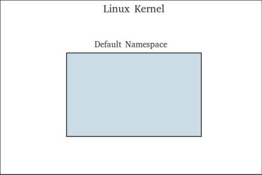

\- Khi bắt đầu Linux, bạn sẽ có 1 namespaces mặc định trên hệ thống gọi là root namespaces. Vì vậy mọi quy trình kế thừa network namespaces được sử dụng bởi init (PID 1).  
\- List namespaces  
```
ip netns 
```

Đầu ra có thể là empty do namespaes mặc định ko bao gồm trong đầu ra câu lệnh `ip netns`.  
\- Add namespaces  
```
ip netns add <namespaces_name>
```

\- Ví dụ:  
```
ip netns add mario
ip netns add luigi
```

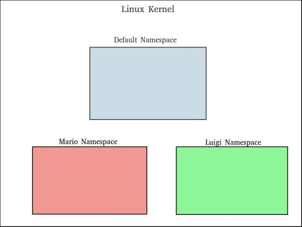

Với mỗi namespace được thêm bào, một file mới sẽ được tạo ra trong thư mục `/var/run/netns`.  
Sau khi restart lại host, namespaces sẽ mất.  
\- Xóa 1 namespaces:  
```
ip netns delete <namespaces_name>
```

\- Thực thi command trong namespace:  
```
ip netns exec <namespaces_name> <command>
```

Thực thi command trong tất cả các namespaces:  
```
ip -all netns exec <namespaces_name> <command>
```

\- Truy cập 1 namespaces:  
```
ip netns exec <namespaces_name> bash
```

\- Set 1 NIC đến 1 namespaces:  
```
ip link set <NIC> netns <namespaces_name>
```

VD: Set 1 NIC đến namespaces root (default namepsaces):  
```
ip link set ens38 netns 1
```

<a name="3"></a>
# 3.LAB
<a name="3.1"></a>
## 3.1.veth pair
\- Dùng 1 veth pair để kết nối 2 network namespaces.  
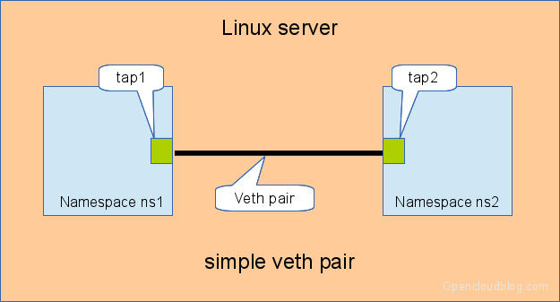

\- Tạo 2 namespaces ns1 và ns2  
```
ip netns add ns1
ip netns add ns2
```

\- Tạo veth pair tap1 và tap2  
```
ip link add tap1 type veth peer name tap2
```

\- Di chuyển interface tap1 đến namespaces ns1 và interface tap2 đến namespaces ns2  
```
ip link set tap1 netns ns1
ip link set tap2 netns ns2
```

\- bring up tap1 và tap2  
```
ip netns exec ns1 ip link set dev tap1 up
ip netns exec ns2 ip link set dev tap2 up
```

\- Gắn địa chỉ IP cho tap1 và tap2  
```
ip netns exec ns1 ip a add 10.0.0.1/24 dev tap1
ip netns exec ns2 ip a add 10.0.0.2/24 dev tap2
```

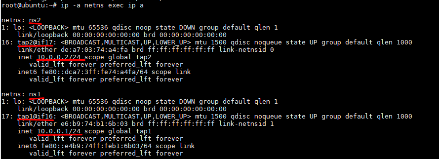

\- Ping thử giữa tap1 và tap2 interface  
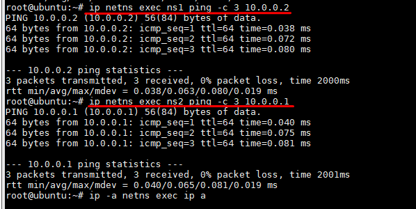

=> Thành công!

<a name="3.2"></a>
## 3.2.Linux bridge và 2 veth pairs
\- Dùng 2 veth pair và 1 switch để kết nối 2 namespaces.  
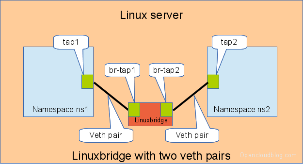

\- Tạo 2 namespaces ns1 và ns2  
```
ip netns add ns1
ip netns add ns2
```

\- Tạo switch sử dụng linux bridge  
```
brctl addbr br-test
ip link set dev br-test up
```

\- Tạo port pair thứ nhất  
```
ip link add tap1 type veth peer name br-tap1
```

\- Gắn 1 phía đến linuxbridge  
```
brctl addif br-test br-tap1 
```

\- Gắn 1 phía đến namespace  
```
ip link set tap1 netns ns1
```

\- Set ports đến up  
```
ip netns exec ns1 ip link set dev tap1 up
ip link set dev br-tap1 up
```

\- Tạo port pair thứ hai  
```
ip link add tap2 type veth peer name br-tap2
```

\- Gắn 1 phía đến linuxbridge  
```
brctl addif br-test br-tap2
```

\- Gắn 1 phía đến namespace  
```
ip link set tap2 netns ns2
```

\- Set ports đến up  
```
ip netns exec ns2 ip link set dev tap2 up
ip link set dev br-tap2 up
```

\- Gắn địa chỉ IP vào tap1 và tap 2 interface  
```
ip netns exec ns1 ip a add 10.0.0.1/24 dev tap1
ip netns exec ns2 ip a add 10.0.0.2/24 dev tap2
```

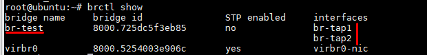

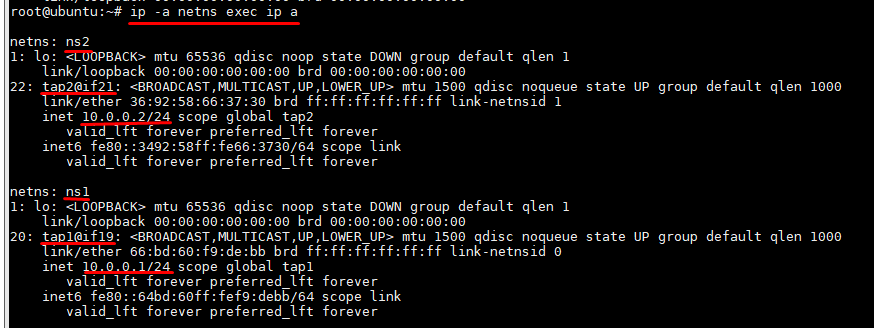

- Ping thử giữa tap1 và tap2 interface  
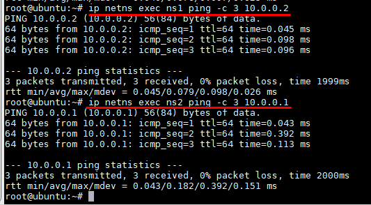

<a name="3.3"></a>
## 3.3.Openvswitch và 2 veth pairs
\- Dùng 2 veth pair và 1 switch để kết nối 2 namespaces.  
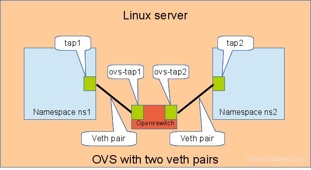

\- Làm tương tự như đối với bài lab "Linux bridge và 2 veth pairs".  

<a name="3.4"></a>
## 3.4.Openvswitch và 2 openvswitch ports

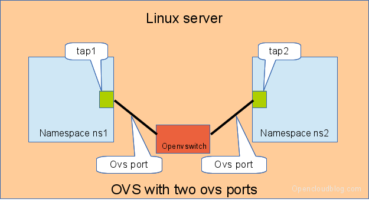

\- Tạo 2 namespaces ns1 và ns2  
```
ip netns add ns1
ip netns add ns2
```

\- Tạo switch sử dụng openvswitch  
```
ovs-vsctl add-br ovstest
ip link set dev ovstest up
```

\- Tạo internal ovs port tap1:  
```
ovs-vsctl add-port ovstest tap1 -- set Interface tap1 type=internal
```

Gắn vào namespaces ns1:  
```
ip link set tap1 netns ns1
```

Set ports đến up  
```
ip netns exec ns1 ip link set dev tap1 up
```

\- Set thêm lo interface (loopback)  
```
ip netns exec ns1 ip link set dev lo up
```

\- Tạo internal ovs port tap2:  
```
ovs-vsctl add-port ovstest tap2 -- set Interface tap2 type=internal
```

Gắn vào namespaces ns1:  
```
ip link set tap2 netns ns2
```

Set ports đến up  
```
ip netns exec ns2 ip link set dev tap2 up
```

\- Set thêm lo interface (loopback)  
```
ip netns exec ns2 ip link set dev lo up
```

\- Gắn địa chỉ IP cho 2 tap1 và tap2 interface:  
```
ip netns exec ns1 ip a add 10.0.0.1/24 dev tap1
ip netns exec ns2 ip a add 10.0.0.2/24 dev tap2
```

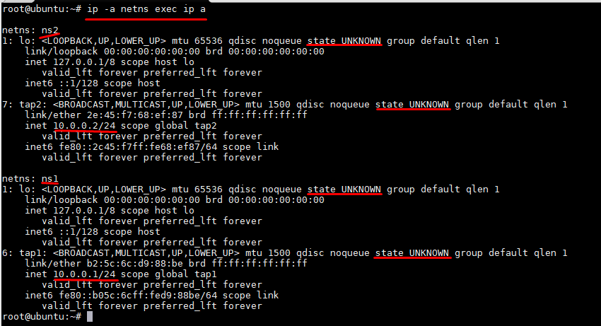

\- Ping thử giữa 2 namespaces:  
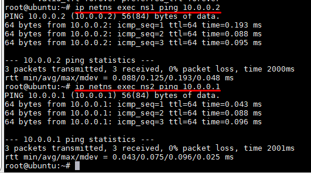

=> Thành công!


