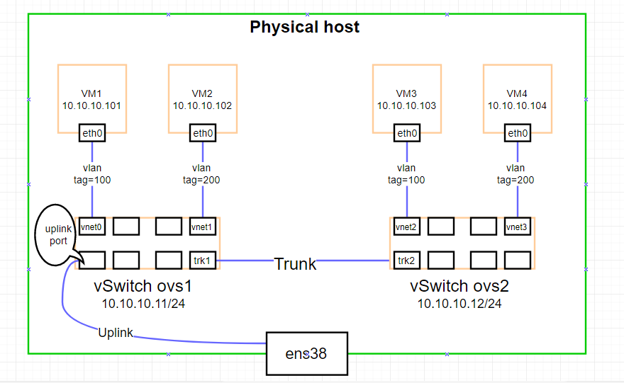
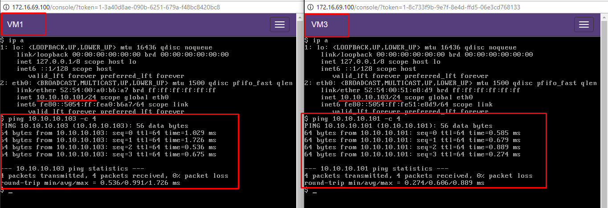
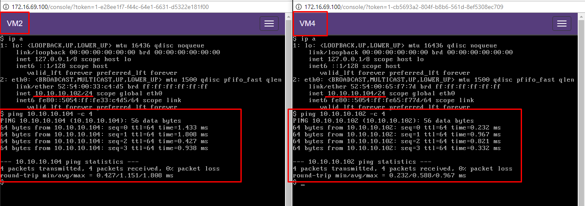
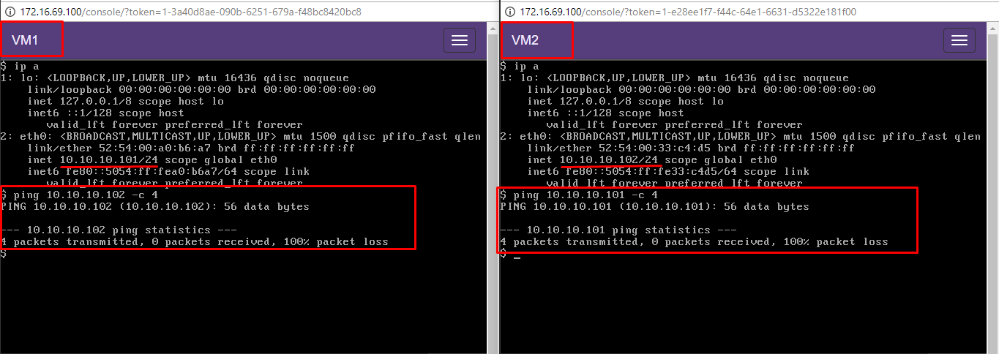
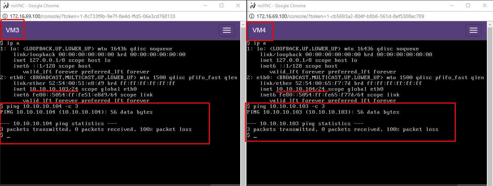
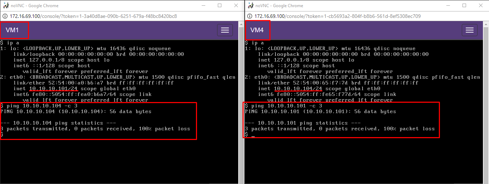

# Lab VLAN với Open vSwitch


# MỤC LỤC
- [1.Topology](#1)
- [2.Cài đặt và cấu hình](#2)
- [3.Kiểm tra kết nối các virtual machine](#3)

<a name="1"></a>
# 1.Topology


\- Physical host chạy hệ điều hành Ubuntu 16.04, có card mạng ens38 thuộc dải mạng 10.10.10.0/24. Trên physical host cài các phần mềm KVM-QEMU, Openvswitch, libvirt.  
\- Tạo 2 vswitch ovs1 và ovs2, tạo port trk1 trên vswitch ovs1 và trk2 trên vswitch ovs2.  
\- Cấu hình chế độ bridged giữa vswitch ovs1 và card mạng ens38.  
\- Tạo mạng chế độ bridge bằng file .xml đối với 2 vswitch, mạng network-ovs1 cho vswitch ovs1 và mạng network-ovs2 cho vswitch ovs2. Cả 2 mạng đều có 2 VLAN có id là 100 và 200.  
\- Tạo 2 virtual machine VM1 và VM2 gắn vào vswitch ovs1, trong đó VM1 thuộc VLAN 100, VM2 thuộc VLAN 200.  
Tạo 2 virtual machine VM3 và VM4 gắn vào vswitch ovs2, trong đó VM3 thuộc VLAN 100, VM4 thuộc VLAN 200.  
\- Cấu hình địa chỉ của vswitch, virtual machine như trên hình.  
\- Tiến hình ping thử giữa các virtual machine để kiểm tra hoạt động của VLAN.  

<a name="2"></a>
# 2.Cài đặt và cấu hình
\- Cài các phần mềm kvm-qemu, openvswitch, libvirt bằng cách thực hiện command sau:  
```
# apt-get install qemu-kvm openvswitch-switch libvirt-bin
```

\- Tạo 2 vswitch `ovs1` và `ovs2`:  
```
ovs-vsctl add-br ovs1
ovs-vsctl add-br ovs2
```

\- Tạo port trk1 và trk2 trên vswitch `ovs1` và `ovs2`:  
```
ovs-vsctl add-port ovs1 trk1
ovs-vsctl add-port ovs2 trk2
```

\- Tạo đường trunking giữa 2 vswitch:  
```
ovs-vsctl set interface trk1 type=patch options:peer=trk2
ovs-vsctl set interface trk2 type=patch options:peer=trk1
```

\- Cấu hình chế dộ bridge giữa vswitch và card mạng `ens38`:  
```
ovs-vsctl add-port ovs1 ens38
ip a flush dev ens38
ip a add 10.10.10.11/24 dev ovs1
```

- Cấu hình địa chỉ IP cho vswitch `ovs2`:  
```
ip a add 10.10.10.12/24 dev ovs2
```

\- Tạo mạng cho 2 vswitch `ovs1` và `ovs2`:  
- File tạo mạng cho `ovs1`. Tạo file `network-ovs1.xml` với nội dung như sau:  
```
<network>
  <name>network-ovs1</name>
  <forward mode='bridge'/>
  <bridge name='ovs1'/>
  <virtualport type='openvswitch' />
  <portgroup name='vlan-00' default='yes'>
  </portgroup>
  <portgroup name='vlan-100'>
    <vlan>
      <tag id='100'/>
    </vlan>
  </portgroup>
  <portgroup name='vlan-200'>
    <vlan>
      <tag id='200'/>
    </vlan>
  </portgroup>
  <portgroup name='vlan-all'>
    <vlan trunk='yes'>
      <tag id='100'/>
      <tag id='200'/>
    </vlan>
  </portgroup>
</network>
```

- File tạo mạng cho `ovs2`. Tạo file `network-ovs2.xml` với nội dung như sau:  
```
<network>
  <name>network-ovs2</name>
  <forward mode='bridge'/>
  <bridge name='ovs2'/>
  <virtualport type='openvswitch' />
  <portgroup name='vlan-00' default='yes'>
  </portgroup>
  <portgroup name='vlan-100'>
    <vlan>
      <tag id='100'/>
    </vlan>
  </portgroup>
  <portgroup name='vlan-200'>
    <vlan>
      <tag id='200'/>
    </vlan>
  </portgroup>
  <portgroup name='vlan-all'>
    <vlan trunk='yes'>
      <tag id='100'/>
      <tag id='200'/>
    </vlan>
  </portgroup>
</network>
```

- Thực hiện các command sau:  
```
# Định nghĩa 2 mạng
virsh net-define network-ovs1.xml
virsh net-define network-ovs2.xml

# Start 2 mạng
virsh net-start network-ovs1
virsh net-start network-ovs2

# Auto start 2 mạng khi khởi động
virsh net-autostart network-ovs1
virsh net-autostart network-ovs2
```

\- Tạo 4 virtual machine và cấu hình mạng cho chúng. Ví dụ, đối với **VM1**, ở đây mình tạo virtual machine bằng Webvirt, sau khi tạo xong, ta sửa file cấu hình VM1 bằng lệnh sau:  
```
virsh edit VM1
```

Thiết lập cho VM1 gắn vào vswitch `ovs1` (tương ứng với `network-ovs1`) và thuộc `vlan-100`, ta chỉnh sửa section `interface` như sau:  
```
<interface type='network'>
  <source network='network-ovs1' portgroup='vlan-100'/>
</interface>
```

Tiến hành cấu hình tương tự với các **VM2**,**VM3** và **VM4**.

<a name="3"></a>
# 3.Kiểm tra kết nối các virtual machine
\- Tiến hành cấu hình tĩnh địa chỉ IP cho các virtual machine như trên topology.  
\- Ping thử giữa 2 VM cùng VLAN, cụ thể ở đây là VM1 và VM3, VM2 và VM4.  
- Ping giữa VM1 và VM3:  


=> Thành công!  
- Ping giữa VM2 và VM4:  


=> Thành công!  

\- Ping thử giữa 2 VM khác VLAN, cụ thể ở đây là VM1 và VM2, VM3 và VM4, VM1 và VM4.
- Ping giữa VM1 và VM2:  


=> Không thành công!  
- Ping giữa VM3 và VM4:  


=> Không thành công!  
- Ping giữa VM1 và VM4:  


=> Không thành công!

\- Từ bài lab trên ta thấy kết quả thực nghiệm đúng với lí thuyết!  


