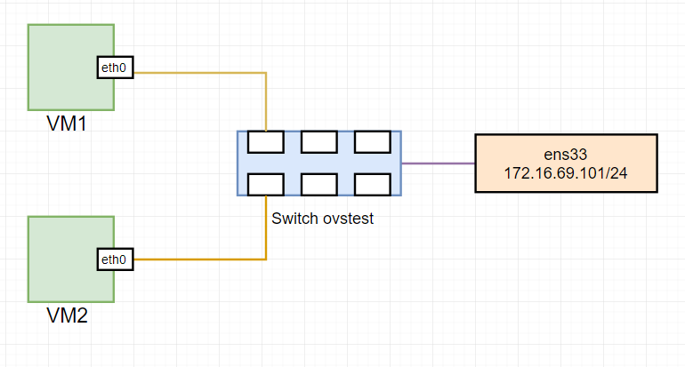

# Lab tính năng forward packet của Open vSwitch


# MỤC LỤC
- [1.Lab tính năng forward packet của Open vSwitch](#1)
	- [1.1.Topology](#1.1)
	- [1.2.Cài đặt và cấu hình](#1.2)


<a name="1"></a>
# 1.Lab tính năng forward packet của Open vSwitch
<a name="1.1"></a>
## 1.1.Topology


\- Một host với 1 card ens33 (có thể sử dụng virtual machine), cài Ubuntu Server 16.04 và software – open vswitch, libvirt, KVM-QEMU.  
\- LAB: Tạo một vswitch và gán interface ens33 vào vswitch đó. Tạo 2 VM trên host, xin cấp phát IP address và ping giữa 2 VM.  

<a name="1.2"></a>
## 1.2.Cài đặt và cấu hình
\- Cài các package cần thiết:  
```
apt-get install qemu-kvm openvswitch-switch
```

\- Tạo vswitch:  
```
# ovs-vsctl add-br ovstest
```

\- Gắn card `ens33` vào vswitch `ovstest`:  
```
ifconfig ens33 0
ovs-vsctl add-port ovstest ens33
ifconfig ovstest 172.16.69.101/24
```


\- Tạo mạng chế độ `bridge` với vswitch `ovstest`:  
- Tạo file `bridged.xml` với nội dung như sau:  
```
<network>
  <name>ovs-bridge</name>
  <forward mode="bridge"/>
  <bridge name="ovstest"/>
  <virtualport type='openvswitch' />
</network>
```

- Dùng command sau để tạo mạng:  
```
virsh net-define bridge.xml
```

- Bật mạng đó:  
```
virsh net-start ovs-bridge
virsh net-autostart ovs-bridge
```

\- Tạo 2 VM là `VM1` và `VM2` với công nghệ kvm-qemu và gắn vào mạng `ovs-bridge`.  
Để gắn vào mạng `ovs-bridge`, ví dụ với `VM1`, ta dùng command:  
```
virsh edit VM1
```

Tìm đến section **interface** và sửa lại như sau:  
```
<interface type='network'>
    <source network='ovs-bridge'/>
</interface>
```

- Ping giữa 2 VM:  


=> Thành công!

