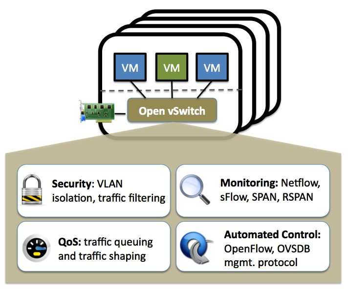
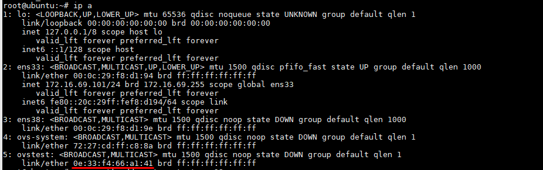
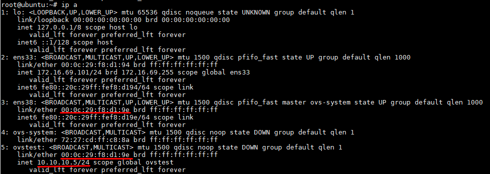
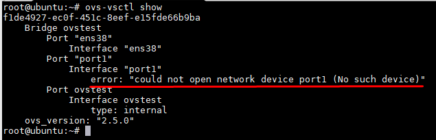
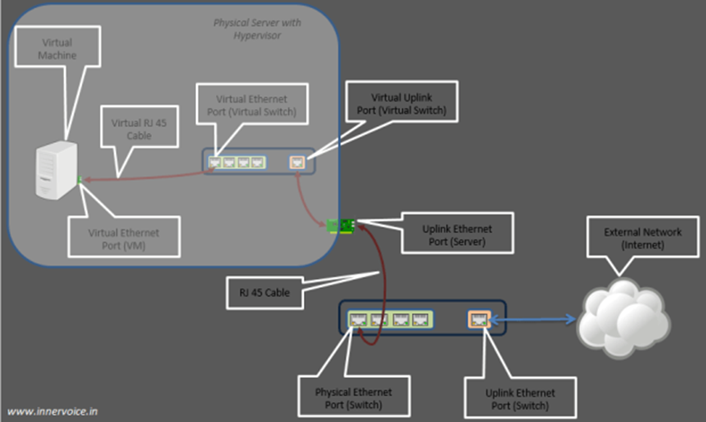
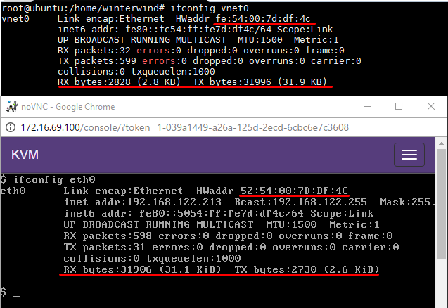
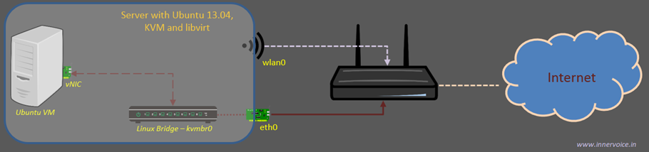

# Cơ bản về Open vSwitch

# MỤC LỤC


<a name="1"></a>
# 1.Tổng quan


\- Open vSwitch là một soft-switch, một trong ba công nghệ cung cấp switch ảo trong hệ thống Linux (bên cạnh macvlan và Linux bridge), giải quyết vấn đề ảo hóa network bên trong các máy vật lý.  
\- Open vSwitch là phần mềm mã nguồn mở , giấy phép của Apache2.  
\- Openvswitch hỗ trợ nhiều công nghệ ảo hóa trên Linux bao gồm Xen/XenServer, KVM, and VirtualBox.  
\- Mã nguồn chủ yếu được viết bằng C, độc lập với các nền tảng và dễ dàng di chuyển giữa các môi trường.  

<a name="2"></a>
# 2.Open vSwitch architecture

\- Các thành phần chính bao gồm:  
- ovs-vswitchd: 1 daemon thực thi switch, cùng với Linux kernel module phục vụ cho flow-based switching.
- ovsdb-server: 1 lightweight database server mà ovs-vswitchd truy vấn  để thu được cấu hình cần thiết.
- ovs-dpctl: 1 tool cho việc cấu hình switch kernel module.
- Scripts and specs for building RPMs for Citrix XenServer and Red Hat Enterprise Linux. The XenServer RPMs allow Open vSwitch to be installed on a Citrix XenServer host as a drop-in replacement for its switch, with additional functionality.
- ovs-vsctl: 1 tiện ích để querying và updating cấu hình của ovs-vswitchd.
- ovs-appctl: 1 tiện ích  gửi commands để running Open vSwitch daemons.

\- Open vSwitch cung cấp thêm các tools:  
- ovs-ofctl: 1 tiện ích  cho việc querying và controlling OpenFlow switches và controllers.
- ovs-pki: 1 tiện ích để tạo và quản lý public-key infrastructure cho OpenFlow switches.
- ovs-testcontroller: 1 OpenFlow controller đơn giản hữu ích.

<a name="3"></a>
# 3.Install openvswitch on Ubuntu Server 16.04
\- Run command sau:  
```
apt-get install openvswitch-switch
```

<a name="4"></a>
# 4.openvswitch command
\- Tham khảo:  
http://manpages.ubuntu.com/manpages/xenial/man8/ovs-vsctl.8.html  

<a name="4.1"></a>
## 4.1.Switch
\- Show tất cả các virtual switch hiện tại:  
```
ovs-vsctl show
```

or  
```
ovs-vsctl list-br
```

\- Thêm, xóa virtual switch :  
```
ovs-vsctl add-br <switch_name>
ovs-vsctl del-br <switch_name>
```

<a name="4.2"></a>
## 4.2.Ports
\- List thông tin về các port trên vswitch :  
```
ovs-vsctl list-ports <switch_name>
```

\- Add , delete port :  
```
ovs-vsctl add-port <brname> <ifname>
ovs-vsctl del-port <brname> <ifname>
```

\- In ra tên của vswitch chứa port:  
```
ovs-vsctl port-to-br <port_name>
```

<a name="4.3"></a>
## 4.3.STP
\- Turn { on | off } giao thức STP :  
```
ovs-vsctl set Bridge <vswitch> stp_enable=<{true|flase}>
```

\- Thiết lập bridge priority để chọn root bridge :  
```
ovs-vsctl set Bridge <vswitch> other_config:stp-priority=<prio>
```

- VD:  
```
ovs-vsctl set Bridge br0 other_config:stp-priority=0x7800
```

\- Thiết lập port priority để chọn root port :  
```
ovs-vsctl set Port <vswitch> other_config:stp-path-cost=<prio>
```

<a name="5"></a>
# 5.Note quan trọng với Open vSwitch technology

<a name="5.1"></a>
## 5.1.Create vswitch

<a name="5.1.1"></a>
### 5.1.1.Create vswitch bằng command ovs-vsctl add-br
\- Tạo vswitch bằng command `ovs-vsctl add-br` thì vswitch là persistent vswitch.  
\- Khi create vswitch bằng command, ví dụ :  
```
ovs-vsctl add-br ovstest
ovstest sẽ có MAC address như sau :
```



Đây là MAC addess mặc định của ovstest, nhưng khi ta add virtual network card gắn vào vswitch thì vswitch sẽ hiện MAC address của virtual network card đó.  
Ta có thể add IP address cho `ovstest` :  
```
ip a add 10.10.10.5/24 dev ovstest
```



<a name="5.1.2"></a>
### 5.1.2.Create vswitch bằng file .xml
\- Với công nghệ Open vSwitch, ta chỉ có thể tạo network ở chế độ bridge, với vswitch đã tồn tại sẵn.  
\- Vi dụ:  
```
<network>
  <name>ovs-net</name>
  <forward mode='bridge'/>
  <bridge name='ovsbr0'/>
  <virtualport type='openvswitch' />
</network>
```

<a name="5.2"></a>
## 5.2.Port
<a name="5.2.1"></a>
### 5.2.1.Port
\- Khi vNIC hoặc pNIC được gắn vào vport on vswitch , vport sẽ show ra như interface của host.  
\- Với câu lệnh :  
```
ovs-vsctl add-port <vswitch> <port>
```

thì ( chính là NIC ) phải là đã có trong host , câu lệnh này chính là gắn NIC vào vswitch. Nếu NIC chưa có, sẽ có thông báo như sau:  


<a name="5.2.2"></a>
### 5.2.2.tap interface and uplink port
- Note1 : VM connected vswitch thì Port của Virtual Switch gọi là tap interface , khi VM power on thì host sẽ hiện lện là vnet -> gọi là vnet tap inteface.  
>- Note 2 : Virtual switch để chế độ bridging network với physical network card ( eth0 ) thì port trên vswitch gọi là virtual uplink port

<a name="5.2.2.1"></a>
#### 5.2.2.1.tap interface
\- tap interface có MAC address khác vNIC on VM.  
\- Chú ý: RX và TX trên vNIC và vnet tap internet xấp xỉ = nhau .  


<a name="5.2.2.2"></a>
5.2.2.2.uplink port
- Khi gắn 1 pNIC on host với vswitch thì chính là chế độ bridged.

<a name="6"></a>
# 6.Network mode
<a name="6.1"></a>
## 6.1.Giới thiệu về chế độ bridge với Open vSwitch
\- Với libvirt API, Open vSwitch chỉ có chế bridge, không có 3 chế độ NAT, Routed, Isolated như đối với linux brdige.  
\- 1 bridge network chia sẻ 1 thiết bị Ethernet thực với virtual machines . Mỗi VM có thể có 1 địa chỉ IPv4 hoặc IPv6 sẵn có trên mạng LAN như 1 máy physical computer . Bridging là tốt hơn về performace and đỡ rắc rối hơn các loại network trong libvirt.  
\- Hạn chế:  
Libvirt server buộc phải được kết nối LAN qua Ethernet .  


<a name="6.2"></a>
## 6.2.Cấu hình bridged network trên Ubuntu server 16.04
<a name="6.2.a"></a>
### a.Sử dụng command
Sau đây là ví dụ:  
```
ovs-vsctl add-br ovstest # tạo vswitch mới
brctl add-port ovstest ens33 # Gắn port ens33 vào vswitch ovstest
ovs-vsctl set Bridge ovstest stp_enable=true # nếu cần
ifconfig ens33 0 # có thể dụng command : ip address flush ens33 
# xin cấp phát ip cho br0 
dhclient ovstest
# or tự cấu hình
ifconfig ovstest 172.16.69.10
```

<a name="6.2.b"></a>
### b.Cấu hình trong file /etc/network/interfaces
\- Tham khảo : https://github.com/openvswitch/ovs/blob/master/debian/openvswitch-switch.README.Debian 
http://www.opencloudblog.com/?p=240  
Sau đây là ví dụ:  
\- VD1: 1 bridge.  
```
auto br0
allow-ovs br0
iface br0 inet static
    address 192.168.1.1
    netmask 255.255.255.0
    ovs_type OVSBridge
```

\- VD2: 1 bridge với 1 port.  
```
auto br0
allow-ovs br0
iface br0 inet dhcp
    ovs_type OVSBridge
    ovs_ports eth0

allow-br0 eth0
iface eth0 inet manual
    ovs_bridge br0
    ovs_type OVSPort
```

\- VD3:  1 bridge với nhiều physical ports.  
```
auto br0
allow-ovs br0
iface br0 inet dhcp
    ovs_type OVSBridge
    ovs_ports eth0 eth1

allow-br0 eth0
iface eth0 inet manual
    ovs_bridge br0
    ovs_type OVSPort

allow-br0 eth1
iface eth1 inet manual
    ovs_bridge br0
    ovs_type OVSPort
```


